# Java
1. JAVA中的几种基本数据类型是什么，各自占用多少字节。  
    -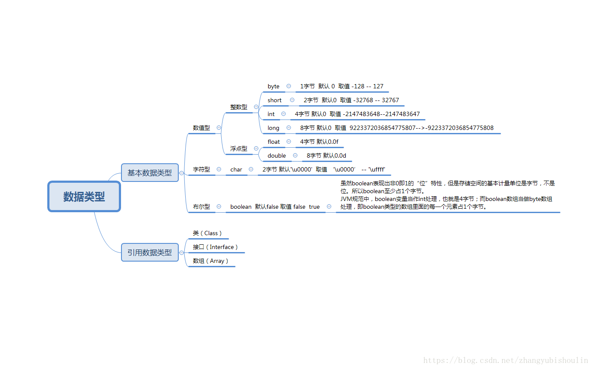  

2. String类能被继承吗，为什么?  
    -String 类是不能被继承的，因为他是被final关键字修饰的。  
    ```java     
    public final class String
        implements java.io.Serializable, Comparable<String>, CharSequence {
        /** The value is used for character storage. */
        private final char value[];  
    }
    ```

3. String，Stringbuffer，StringBuilder的区别。  
    * String   
       * String是不可变的类，即final 类，String底层使用final Char[] 来实现，不可变的字符数组。
       当我们进行字符串拼接的时候，如下:   `String str = "a" + "b";`  
       这个时候会在堆上创建三个String对象，分别是str1="a"，str2="b"，str="ab".因此如果有大量的这种字符串拼接等操作的话，会影响程序的运行速度。
         
    * StringBuffer   
      * 因此我们引入了StringBuffer类，它的底层实现是可变的字符串数组，当我们执行append方法的时候，操作的对象是StringBuffer对象本身，而不会像String那样产生多个中间对象。但是有个问题，StringBuffer在执行某些方法的时候，比如append方法，会对方法体加锁（synchronized）保证线程安全。但是我们知道加锁和释放锁是需要耗费资源的，因此在进行大量的、业务不需要线程安全的情况下使用StringBuffer就显得效率低下，因此就有了后面的StringBuilder类。定义了一些字符串的基本操作，如append、、indexOf等公共方法StringBuffer对方法加了同步锁(synchronized) ，所以是线程安全的。
         
    * StringBuilder   
       * StringBuilder类的绝大部分功能和StringBuffer都一样，但是StringBuiler类是线程不安全的，因此，相比与StringBuffer类来说，StringBuilder类在执行字符串拼接等操作的时候速度更快。

    * StringBuffer和StringBuilder的公共点
       * StringBuffer和StringBuilder有公共父类AbstractStringBuilder(抽象类)。  
         StringBuffer、StringBuilder的方法都会调用AbstractStringBuilder中的公共方法，如上面的两段源码中都调用了super.append(str); 只是StringBuffer会在方法上加synchronized关键字，进行同步。  

4. ArrayList和linkedList的区别。
    * List—是一个有序的集合，可以包含重复的元素，提供了按索引访问的方式，它继承Collection。List有两个重要的实现类：ArrayList和LinkedList。  
    List是一个接口，不可以实例化, 不能写成如下：  
    `List<Integer> list = new List<Integer>();//错误`
       
    *  ArrayList
        * ArrayList可以看作是能够自动增长容量的数组,  ArrayList的toArray方法返回一个数组, ArrayList的asList方法返回一个列表,ArrayList底层的实现是Array, 数组扩容实现.
            1. 新增数据空间判断新增数据的时候需要判断当前是否有空闲空间存储  
            2. 扩容需要申请新的连续空间   
            3. 把老的数组复制过去
            4. 新加的内容
            5. 回收老的数组空间
            6. 注意: 长度尽量使用2的幂作为长度, 计算机分配空间大都使用次幂去分配, 减少碎片空间  
            7. ArrayList在初始化的时候指定长度肯定是要比不指定长度的性能好很多, 这样不用重复的申请空间, 复制数组, 销毁老的分配空间了   
    * LinkList
        * LinkList是一个双链表,在添加和删除元素时具有比ArrayList更好的性能.但在get与set方面弱于ArrayList.当然,这些对比都是指数据量很大或者操作很频繁。
            1. 链表不需要连续的空间, 大小不确定
    * 小结   
        1. 同样查找, 时间复杂度都是O(N), 但是数组要比链表快。   
        因为数组的连续内存, 会有一部分或者全部数据一起进入到CPU缓存, 而链表还需要在去内存中根据上下游标查找, CPU缓存比内存块太多   
        2. 数据大小固定, 不适合动态存储, 动态添加, 内存为一连续的地址, 可随机访问, 查询速度快   
        3. 链表代销可变, 扩展性强, 只能顺着指针的方向查询, 速度较慢   

5. 类的实例化顺序，比如父类静态数据，构造函数，字段，子类静态数据，构造函数，字段，当new的时候，他们的执行顺序。   
    1. 父类静态成员和静态初始化块 ，按在代码中出现的顺序依次执行   
    2. 子类静态成员和静态初始化块 ，按在代码中出现的顺序依次执行   
    3. 父类实例成员和实例初始化块 ，按在代码中出现的顺序依次执行
    4. 父类构造方法   
    5. 子类实例成员和实例初始化块 ，按在代码中出现的顺序依次执行   
    6. 子类构造方法   
      
6. 用过哪些Map类，都有什么区别，HashMap是线程安全的吗,并发下使用的Map是什么，他们内部原理分别是什么，比如存储方式，hashcode，扩容，默认容量等。   
    * -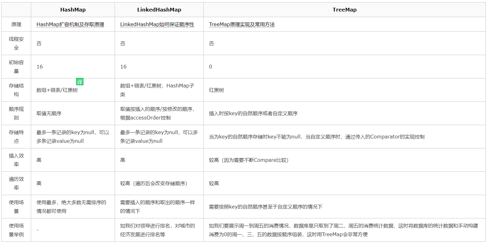    
    * hashMap   
        * 实现方式：Jdk1.8以后使用 数组+ 单向链表 + 红黑树 节点数 >=8 时使用数组加红黑树。 
        * 主要说一下table，entrySet，capacity, size，threshold，loadFactor，我们我们简单解释一下它们的作用。   
            * table 变量为HashMap的底层数据结构,是Node类的实体数组，用于存储添加到HashMap中的Key-value对，是一个Node数组，Node是一个静态内部类（实现Map.Entry<K,V>接口），一种数组和链表相结合的复合结构。   
            * entrySet变量为EntrySet实体，定义为变量可保证不重复多次创建，是一个Map.Entry的集合，Map.Entry<K,V>是一个接口，Node类就实现了该接口，因此EntrySet中方法需要操作的数据就是HashMap的Node实体。   
            * capacity 并不是一个成员变量，但HashMap中很多地方都会使用到这个概念，意思是容量，很好理解，在前面的文中提到了两个常量都与之相关，同时HashMap还具有扩容机制，容量的规则为2的幂次，即capacity可以是1，2，4，8，16，32...，怎么实现这种容量规则呢？
            ```java
                * Returns a power of two size for the given target capacity.
                */
                static final int tableSizeFor(int cap) {
                    int n = cap - 1;
                    n |= n >>> 1;
                    n |= n >>> 2;
                    n |= n >>> 4;
                    n |= n >>> 8;
                    n |= n >>> 16;
                    return (n < 0) ? 1 : (n >= MAXIMUM_CAPACITY) ? MAXIMUM_CAPACITY : n + 1;
                }
            
            ```   
            * size 变量记录了Map中的key-value对的数量，在调用putValue()方法以及removeNode()方法时，都会对其造成改变，和capacity区分一下即可。   
            * threshold变量和loadFactor变量. threshold为临界值，顾名思义，当过了临界值就需要做一些操作了，在HashMap中临界值“threshold = capacity * loadFactor”，当超过临界值时，HashMap就该扩容了。loadFactor为装载因子，就是用来衡量HashMap满的程度，默认值为DEFAULT_LOAD_FACTOR，即0.75f，可通过构造器传递参数调整（0.75f已经很合理了，基本没人会去调整它）   
            -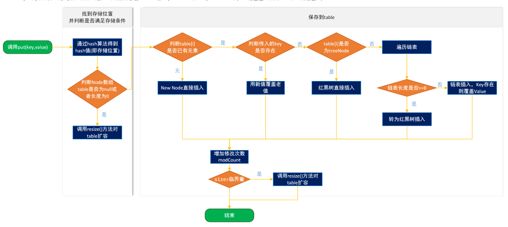   
    * treeMap  
        * TreeMap 是一个有序的key-value集合，它是通过红黑树实现的。   
        * TreeMap 继承于AbstractMap，所以它是一个Map，即一个key-value集合。
        * TreeMap 实现了NavigableMap接口，意味着它支持一系列的导航方法。比如返回有序的key集合。   
        * TreeMap 实现了Cloneable接口，意味着它能被克隆。   
        * TreeMap 实现了java.io.Serializable接口，意味着它支持序列化。 
        * TreeMap基于红黑树（Red-Black tree）实现。该映射根据其键的自然顺序进行排序，或者根据创建映射时提供的 Comparator 进行排序，具体取决于使用的构造方法。TreeMap的基本操作 containsKey、get、put 和 remove 的时间复杂度是 log(n) 。另外，TreeMap是非同步的。   
    * ConcurrentHashMap   
        *   Hashtable容器使用synchronized来保证线程安全，但在线程竞争激烈的情况下Hashtable的效率非常低下。因为当一个线程访问Hashtable的同步方法时，其他线程访问Hashtable的同步方法时，可能会进入阻塞或轮询状态。如线程1使用put进行添加元素，线程2不但不能使用put方法添加元素，并且也不能使用get方法来获取元素，所以竞争越激烈效率越低。   
        *   分段锁   
            * HashTable容器在竞争激烈的并发环境下表现出效率低下的原因，是因为所有访问HashTable的线程都必须竞争同一把锁，那假如容器里有多把锁，每一把锁用于锁容器其中一部分数据，那么当多线程访问容器里不同数据段的数据时，线程间就不会存在锁竞争，从而可以有效的提高并发访问效率，这就是ConcurrentHashMap所使用的锁分段技术，首先将数据分成一段一段的存储，然后给每一段数据配一把锁，当一个线程占用锁访问其中一个段数据的时候，其他段的数据也能被其他线程访问。有些方法需要跨段，比如size()和containsValue()，它们可能需要锁定整个表而而不仅仅是某个段，这需要按顺序锁定所有段，操作完毕后，又按顺序释放所有段的锁。这里“按顺序”是很重要的，否则极有可能出现死锁，在ConcurrentHashMap内部，段数组是final的，并且其成员变量实际上也是final的，但是，仅仅是将数组声明为final的并不保证数组成员也是final的，这需要实现上的保证。这可以确保不会出现死锁，因为获得锁的顺序是固定的。ConcurrentHashMap是由Segment数组结构和HashEntry数组结构组成。Segment是一种可重入锁ReentrantLock，在ConcurrentHashMap里扮演锁的角色，HashEntry则用于存储键值对数据。一个ConcurrentHashMap里包含一个Segment数组，Segment的结构和HashMap类似，是一种数组和链表结构， 一个Segment里包含一个HashEntry数组，每个HashEntry是一个链表结构的元素， 每个Segment守护者一个HashEntry数组里的元素,当对HashEntry数组的数据进行修改时，必须首先获得它对应的Segment锁。   
        * JDK1.8的实现已经抛弃了Segment分段锁机制，利用CAS+Synchronized来保证并发更新的安全。数据结构采用：数组+链表+红黑树。

7. JAVA8的ConcurrentHashMap为什么放弃了分段锁，有什么问题吗，如果你来设计，你如何设计。   
    * 弃用的原因   
        1. 加入多个分段锁浪费内存空间   
        2. 生产环境中， map 在放入时竞争同一个锁的概率非常小，分段锁反而会造成更新等操作的长时间等待。   
        3. 为了提高 GC 的效率   
    * 新方案是怎么样的   
        1. 把数组中的每个元素看成一个桶。可以看到大部分都是CAS操作，加锁的部分是对桶的头节点进行加锁（使用synchronized），锁粒度很小。    
        2. 首先通过 hash 找到对应链表过后， 查看是否是第一个object， 如果是， 直接用cas原则插入，无需加锁。   
        3. 然后， 如果不是链表第一个object， 则直接用链表第一个object加锁，这里加的锁是synchronized，虽然效率不如 ReentrantLock， 但节约了空间，这里会一直用第一个object为锁， 直到重新计算map大小， 比如扩容或者操作了第一个object为止。   
    * 为什么不用ReentrantLock而用synchronized ?
        * 减少内存开销:如果使用ReentrantLock则需要节点继承AQS来获得同步支持，增加内存开销，而1.8中只有头节点需要进行同步。
        * 内部优化:synchronized则是JVM直接支持的，JVM能够在运行时作出相应的优化措施：锁粗化、锁消除、锁自旋等等。
  
8. 有没有有顺序的Map实现类，如果有，他们是怎么保证有序的。
    * TreeMap和LinkedHashmap都是有序的。（TreeMap默认是key升序，LinkedHashmap默认是数据插入顺序）
    * TreeMap是基于比较器Comparator来实现有序的。  
    * LinkedHashmap是基于链表来实现数据插入有序的。
    * TreeMap   
        * TreeMap实现SortMap接口，能够把它保存的记录根据键排序。默认是按键的升序排序，也可以指定排序的比较器，当用Iterator 遍历TreeMap时，得到的记录是排过序的。
    * LinkedHashMap   
        * LinkedHashMap保存了记录的插入顺序，在用Iterator遍历LinkedHashMap时，先得到的记录肯定是先插入的。   
        * 在遍历的时候会比HashMap慢，不过有种情况例外：当HashMap容量很大，实际数据较少时，遍历起来可能会比LinkedHashMap慢。因为LinkedHashMap的遍历速度只和实际数据有关，和容量无关，而HashMap的遍历速度和它的容量有关。
        * LinkedHashMap是继承于HashMap，是基于HashMap和双向链表来实现的。   
        * HashMap无序；LinkedHashMap有序，可分为插入顺序和访问顺序两种。如果是访问顺序，那put和get操作已存在的Entry时，都会把Entry移动到双向链表的表尾(其实是先删除再插入)。  
        * LinkedHashMap存取数据，还是跟HashMap一样使用的Entry[]的方式，双向链表只是为了保证顺序

9. 抽象类和接口的区别，类可以继承多个类么，接口可以继承多个接口么,类可以实现多个接口么?     
    1. 抽象类和接口都不能直接实例化，如果要实例化，抽象类变量必须指向实现所有抽象方法的子类对象，接口变量必须指向实现所有接口方法的类对象   
    2. 抽象类要被子类继承，接口要被类实现。   
    3. 接口只能做方法申明，抽象类中可以做方法申明，也可以做方法实现   
    4. 接口里定义的变量只能是公共的静态的常量，抽象类中的变量是普通变量。   
    5. 抽象类里的抽象方法必须全部被子类所实现，如果子类不能全部实现父类抽象方法，那么该子类只能是抽象类。同样，一个实现接口的时候，如不能全部实现接口方法，那么该类也只能为抽象类。   
    6. 抽象方法只能申明，不能实现。abstract void abc();不能写成abstract void abc(){}。   
    7. 抽象类里可以没有抽象方法   
    8. 如果一个类里有抽象方法，那么这个类只能是抽象类   
    9. 抽象方法要被实现，所以不能是静态的，也不能是私有的。   
    10. 接口可继承接口，并可多继承接口，但类只能单根继承。 类可以实现多个接口
            
10. 继承和聚合的区别在哪。   
    * 继承：他是is-a的关系，指一个类继承另外一个类的功能
　　  例如：`public class A extends B {}`
    * 聚合  他是has-a　public class A { B b} A一定有b  

11. IO模型有哪些，讲讲你理解的nio ，他和bio，aio的区别是啥，谈谈reactor模型。
    * JAVA BIO：同步并阻塞，服务器实现模式为一个连接一个线程，即客户端有连接请求时服务器端就需要启动一个线程并处理，如果这个连接不做任何事情会造成不必要的开销，当然可以通过线程池机制改善.
    * JAVA NIO：同步非阻塞，服务器实现模式为一个请求一个线程，即客户端发送的连接请求都会注册到多路复用器上，多路复用器轮询到连接有IO请求时才启动一个线程进行处理
    * JAVA AIO(NIO2)：异步非阻塞，服务器实现模式为一个有效请求一个线程，客户端的I/O请求都是由OS先完成了再通知服务器应用去启动线程进行处理
    * 使用场景
        1. BIO方式适用于连接数目比较小且固定的架构，这种方式对服务器资源要求比较高，并发局限于应用中，JDK1.4以前的唯一选择，但程序直观简单易理解。
        2. NIO方式适用于连接数目多且连接比较短（轻操作）的架构，比如聊天服务器，并发局限于应用中，编程比较复杂，JDK1.4开始支持。
        3. AIO方式使用于连接数目多且连接比较长（重操作）的架构，比如相册服务器，充分调用OS参与并发操作，编程比较复杂，JDK7开始支持。
    * BIO 同步并阻塞   
        + tomcat采用的传统的BIO（同步阻塞IO模型）+线程池模式，对于十万甚至百万连接的时候，传统BIO模型是无能为力的：   
            1. ①线程的创建和销毁成本很高，在linux中，线程本质就是一个进程，创建销毁都是重量级的系统函数
            2. 线程本身占用较大的内存，像java的线程栈一般至少分配512K-1M的空间，如果系统线程过高，内存占用是个问题
            3. 线程的切换成本高，操作系统发生线程切换的时候，需要保留线程的上下文，然后执行系统调用，如果线程数过高可能执行线程切换的时间甚至大于线程执行的时间，这时候带来的表现是系统load偏高，CPUsy使用率很高.
            4. 容易造成锯齿状的系统负载。系统负载是用活动线程数或CPU核心数，一旦线程数量高但外部网络环境不是很稳定，就很容易造成大量请求的结果同时返回，激活大量阻塞线程从而使系统负载压力过大。
    * NIO同步非阻塞
        * NIO基于Reactor，当socket有流可读或可写入socket，操作系统会相应的通知引用程序进行处理，应用再将流读取到缓冲区或写入操作系统。也就是，不是一个链接就要对应一个处理线程，而是一个有效请求对应一个线程，当连接没有数据时，是没有工作线程来处理的Reactor模型.
        -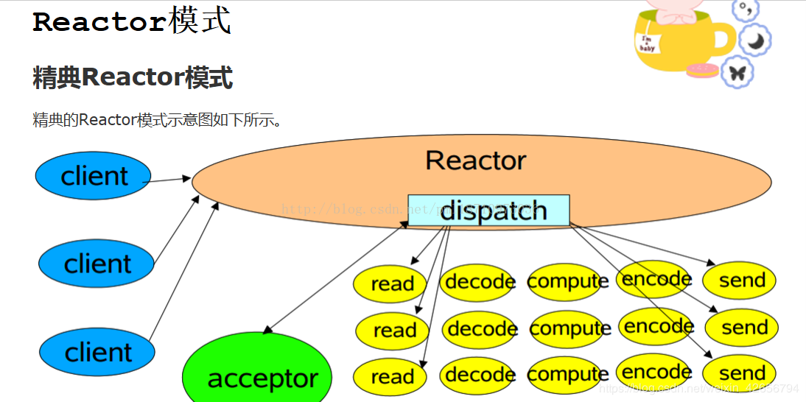    
        nio只有acceptor的服务线程是堵塞进行的，其他读写线程是通过注册事件的方式，有读写事件激活时才调用线程资源区执行，不会一直堵塞等着读写操作，Reactor的瓶颈主要在于acceptor的执行，读写事件也是在这一块分发
    * AIO异步非堵塞IO
        *AIO需要一个链接注册读写事件和回调方法，当进行读写操作时，只须直接调用API的read或write方法即可，这两种方法均为异步，对于读操作而言，当有流可读取时，操作系统会将可读的流传入read方法的缓冲区，并通知应用程序；对于写操作而言，当操作系统将write方法传递的流写入完毕时，操作系统主动通知应用程序.即，read/write方法都是异步的，完成后会主动调用回调函数

12. 反射的原理，反射创建类实例的三种方式是什么。
    * Java的反射机制的实现要借助于4个类：class，Constructor，Field，Method；其中class代表的时类对 象，Constructor－类的构造器对象，Field－类的属性对象，Method－类的方法对象。通过这四个对象我们可以粗略的看到一个类的各个组 成部分。
    ```java
    public class ClassDemo1 {
    public static void main(String[] args) {
    
        //Foo的实例对象如何表示
        Foo foo1 = new Foo();//foo1就表示出来了
        //Foo这个类，也是一个实例对象，Class类的实例对象，如何表示呢、
        //任何一个类都是Class的实例对象，这个实例对象那个有三个表示方式
        //第一种表示方式--》实际在告诉我们任何一个类都有一个隐含的静态成员变量class
        Class class1 = Foo.class;
    
        //第二种表示方式  已经知道该类的对象通过getClass方法
        Class class2 = foo1.getClass();
    
        /*
         * 官网class1 ,class2表示了Foo类的类类型(class type)
         * 万事万物 都是对象
         * 类也是对象，是Class类的实例对象
         * 这个对象我们称为该类的类类型
         */
        //不管class1  or class2都代表了Foo类的类类型，一个类只可能是Class；类的一个实例对象
         System.out.println(class1==class2);//true'
    
        //第三种表达方式
        Class class3 = null;
        try {
            class3 = Class.forName("com.imooc.reflect.Foo");
        } catch (ClassNotFoundException e) {
            e.printStackTrace();
        }
        //
        System.out.println(class2==class3);//true

        //我们完全尅通过类的类类型创建该类的对象实例--》通过class1  or class2 or class3
        //创建Foo类的实例对象
        try {
            //需要有无参数的构造方法
            Foo foo = (Foo) class1.newInstance();//需要强转
            foo.print();
        } catch (Exception e) {
            e.printStackTrace();
        }
        }
    }
    //
    class Foo{
        public void print(){
        System.out.println("foo");
        }
    }
    ```

13. 反射中，Class.forName和ClassLoader区别 。
    1. Class.forName除了将类的.class文件加载到jvm中之外，还会对类进行解释，执行类中的static块。
    2. 而classloader只干一件事情，就是将.class文件加载到jvm中，不会执行static中的内容，只有在newInstance才会去执行static块。
    3. Class.forName(name,initialize,loader)带参数也可控制是否加载static块。并且只有调用了newInstance()方法采用调用构造函数，创建类的对象。
    4. ClassLoader就是遵循双亲委派模型最终调用启动类加载器的类加载器，实现的功能是“通过一个类的全限定名来获取描述此类的二进制字节流”，获取到二进制流后放到JVM中。Class.forName()方法实际上也是调用的CLassLoader来实现的。

    * Java类装载过程    
        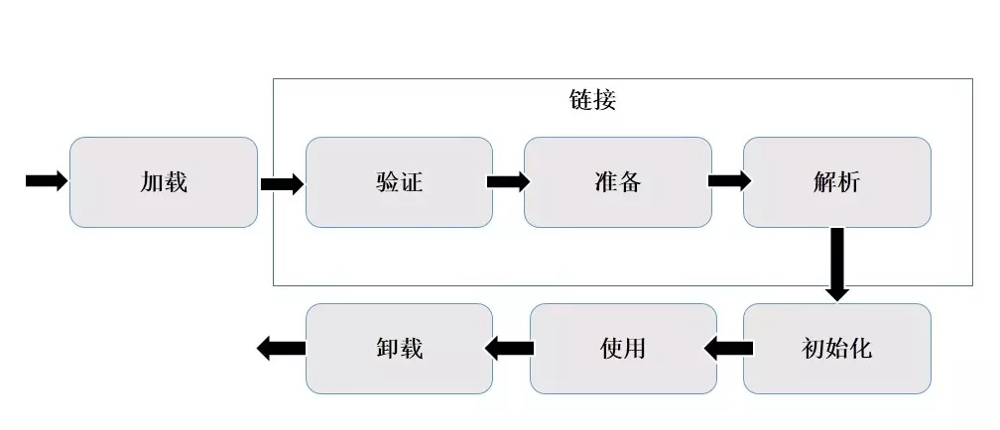   
        1. 装载：通过类的全限定名（com.codetop.***.User）获取二进制字节流，将二进制字节流转换成方法区中的运行时数据结构，在内存中生成Java.lang.class对象；
        2. 链接：执行下面的校验、准备和解析步骤，其中解析步骤是可以选择的；   
            1. 校验：检查导入类或接口的二进制数据的正确性；（文件格式验证，元数据验证，字节码验证，符号引用验证）
            2. 准备：给类的静态变量分配并初始化存储空间；
            3. 解析：将常量池中的符号引用转成直接引用；   
        3. 初始化：激活类的静态变量的初始化Java代码和静态Java代码块，并初始化程序员设置的变量值。

14. 描述动态代理的几种实现方式，分别说出相应的优缺点。   
    * AOP的源码中用到了两种动态代理来实现拦截切入功能：jdk动态代理和cglib动态代理。两种方法同时存在，各有优劣。   
    * jdk动态代理是由java内部的反射机制来实现的，cglib动态代理底层则是借助asm来实现的。   
    * 反射机制在生成类的过程中比较高效，而asm在生成类之后的相关执行过程中比较高效（可以通过将asm生成的类进行缓存，这样解决asm生成类过程低效问题）。还有一点必须注意：jdk动态代理的应用前提，必须是目标类基于统一的接口。如果没有上述前提，jdk动态代理不能应用。由此可以看出，jdk动态代理有一定的局限性，cglib这种第三方类库实现的动态代理应用更加广泛，且在效率上更有优势。
    1. 定义接口和实现   
        ```java   
        package com.proxy;
        public interface UserService {
            public String getName(int id);
            public Integer getAge(int id);
        }
        ```  
        ```java   
        package com.proxy;

        public class UserServiceImpl implements UserService {
            @Override
            public String getName(int id) {
                System.out.println("------getName------");
                return "riemann";
            }

            @Override
            public Integer getAge(int id) {
                System.out.println("------getAge------");
                return 26;
            }
        }
        ````    
    2. jdk动态代理实现   
        * jdk动态代理是jdk原生就支持的一种代理方式，JDK动态代理主要涉及两个类：java.lang.reflect.Proxy 和 java.lang.reflect.InvocationHandler，我们仍然通过案例来学习。编写一个调用逻辑处理器 LogHandler 类，提供日志增强功能，并实现 InvocationHandler 接口；在 LogHandler 中维护一个目标对象，这个对象是被代理的对象（真实主题角色）；在 invoke 方法中编写方法调用的逻辑处理。
        ```java  
        package com.proxy;

        import java.lang.reflect.InvocationHandler;
        import java.lang.reflect.Method;

        public class MyInvocationHandler implements InvocationHandler {

            public Object target;

            MyInvocationHandler() {
                super();
            }

            MyInvocationHandler(Object target) {
                super();
                this.target = target;
            }

            @Override
            public Object invoke(Object proxy, Method method, Object[] args) throws Throwable {
                if ("getName".equals(method.getName())) {
                    System.out.println("++++++before " + method.getName() + "++++++");
                    Object result = method.invoke(target, args);
                    System.out.println("++++++after " + method.getName() + "++++++");
                    return result;
                } else {
                    Object result = method.invoke(target, args);
                    return result;
                }
            }
        }
        ```
        ```java
        package com.proxy;

        import java.lang.reflect.InvocationHandler;
        import java.lang.reflect.Proxy;

        public class Main1 {
            public static void main(String[] args) {
                UserService userService = new UserServiceImpl();
                InvocationHandler invocationHandler = new MyInvocationHandler(userService);
                UserService userServiceProxy = (UserService)Proxy.newProxyInstance(userService.getClass().getClassLoader(),userService.getClass().getInterfaces()，invocationHandler);
                System.out.println(userServiceProxy.getName(1));
                System.out.println(userServiceProxy.getAge(1));
            }
        }
        ```
        输出结果：
        ```java
        ++++++before getName++++++
        ------getName------
        ++++++after getName++++++
        riemann
        ------getAge------
        26
        ```
    3. cglib动态代理实现   
        * Cglib是一个优秀的动态代理框架，它的底层使用ASM在内存中动态的生成被代理类的子类，使用CGLIB即使代理类没有实现任何接口也可以实现动态代理功能。CGLIB具有简单易用，它的运行速度要远远快于JDK的Proxy动态代理：
        * cglib有两种可选方式，继承和引用。第一种是基于继承实现的动态代理，所以可以直接通过super调用target方法，但是这种方式在spring中是不支持的，因为这样的话，这个target对象就不能被spring所管理，所以cglib还是才用类似jdk的方式，通过持有target对象来达到拦截方法的效果。
        * CGLIB的核心类：
            1. net.sf.cglib.proxy.Enhancer – 主要的增强类
            2. net.sf.cglib.proxy.MethodInterceptor – 主要的方法拦截类，它是Callback接口的子接口，需要用户实现
            3. net.sf.cglib.proxy.MethodProxy – JDK的java.lang.reflect.Method类的代理类，可以方便的实现对源对象方法的调用,如使用：   
                `Object o = methodProxy.invokeSuper(proxy, args);////虽然第一个参数是被代理对象，也不会出现死循环的问题。`   
            4. net.sf.cglib.proxy.MethodInterceptor接口是最通用的回调（callback）类型，它经常被基于代理的AOP用来实现拦截（intercept）方法的调用。这个接口只定义了一个方法:
                `public Object intercept(Object object, java.lang.reflect.Method method,Object[] args, MethodProxy proxy) throws Throwable;`   
            第一个参数是代理对像，第二和第三个参数分别是拦截的方法和方法的参数。原来的方法可能通过使用java.lang.reflect.Method对象的一般反射调用，或者使用 net.sf.cglib.proxy.MethodProxy对象调用。net.sf.cglib.proxy.MethodProxy通常被首选使用，因为它更快。
            ```java
            package com.proxy.cglib;

            import net.sf.cglib.proxy.MethodInterceptor;
            import net.sf.cglib.proxy.MethodProxy;
            import java.lang.reflect.Method;
 
            public class CglibProxy implements MethodInterceptor {
                @Override
                public Object intercept(Object o, Method method, Object[] args, MethodProxy methodProxy) throws Throwable {
                    System.out.println("++++++before " + methodProxy.getSuperName() + "++++++");
                    System.out.println(method.getName());
                    Object o1 = methodProxy.invokeSuper(o, args);
                    System.out.println("++++++before " + methodProxy.getSuperName() + "++++++");
                    return o1;
                }
            }
            ```
            ```java
            package com.proxy.cglib;
 
            import com.meituan.hyt.test3.service.UserService;
            import com.meituan.hyt.test3.service.impl.UserServiceImpl;
            import net.sf.cglib.proxy.Enhancer;
 
            public class Main2 {
                public static void main(String[] args) {
                    CglibProxy cglibProxy = new CglibProxy();
            
                    Enhancer enhancer = new Enhancer();
                    enhancer.setSuperclass(UserServiceImpl.class);
                    enhancer.setCallback(cglibProxy);
            
                    UserService o = (UserService)enhancer.create();
                    o.getName(1);
                    o.getAge(1);
                }
            }
            ```
            输出结果：
            ```
            ++++++before CGLIB$getName$0++++++
            getName
            ------getName------
            ++++++before CGLIB$getName$0++++++
            ++++++before CGLIB$getAge$1++++++
            getAge
            ------getAge------
            ++++++before CGLIB$getAge$1++++++
            ```
    4. 因为通过上面的分析我们知道，在spring中，无论通过jdk的形式还是cglib的形式，代理类对target对象的方法进行拦截，其实都是通过让代理类持有target对象的引用，当外部引用aop包围的方法时，调用的其实是代理类对应的方法，代理类持有target对象，便可以控制target方法执行时的全方位拦截。
    * 小结：   
        * JDK 动态代理：
            为了解决静态代理中，生成大量的代理类造成的冗余；   
            JDK 动态代理只需要实现 InvocationHandler 接口，重写 invoke 方法便可以完成代理的实现，   
            jdk的代理是利用反射生成代理类 Proxyxx.class 代理类字节码，并生成对象   
            jdk动态代理之所以只能代理接口是因为代理类本身已经extends了Proxy，而java是不允许多重继承的，但是允许实现多个接口   

            优点：解决了静态代理中冗余的代理实现类问题。   
            缺点：JDK 动态代理是基于接口设计实现的，如果没有接口，会抛异常。  
        *  CGLIB 代理    
            由于 JDK 动态代理限制了只能基于接口设计，而对于没有接口的情况，JDK方式解决不了；
            CGLib 采用了非常底层的字节码技术，其原理是通过字节码技术为一个类创建子类，并在子类中采用方法拦截的技术拦截所有父类方法的调用，顺势织入横切逻辑，来完成动态代理的实现。
            实现方式实现 MethodInterceptor 接口，重写 intercept 方法，通过 Enhancer 类的回调方法来实现。
            但是CGLib在创建代理对象时所花费的时间却比JDK多得多，所以对于单例的对象，因为无需频繁创建对象，用CGLib合适，反之，使用JDK方式要更为合适一些。
            同时，由于CGLib由于是采用动态创建子类的方法，对于final方法，无法进行代理。

            优点：没有接口也能实现动态代理，而且采用字节码增强技术，性能也不错。
            缺点：技术实现相对难理解些。

15. 动态代理与cglib实现的区别。
    1. Java动态代理只能够对接口进行代理，不能对普通的类进行代理（因为所有生成的代理类的父类为Proxy，Java类继承机制不允许多重继承）；CGLIB能够代理普通类；
    2. Java动态代理使用Java原生的反射API进行操作，在生成类上比较高效；CGLIB使用ASM框架直接对字节码进行操作，在类的执行过程中比较高效

16. 为什么CGlib方式可以对接口实现代理。

17. final的用途。
    1. 被final修饰的类不可以被继承

    2. 被final修饰的方法不可以被重写

    3. 被final修饰的变量不可以被改变

    * 重点就是第三句。被final修饰的变量不可以被改变，什么不可以被改变呢，是变量的引用？还是变量里面的内容？还是两者都不可以被改变？   
    * 被final修饰不可变的是变量的引用，而不是引用指向的内容，引用指向的内容是可以改变的。
        1. 被final修饰的方法，JVM会尝试为之寻求内联，这对于提升Java的效率是非常重要的。因此，假如能确定方法不会被继承，那么尽量将方法定义为final的，具体参见运行期优化技术的方法内联部分.
        2. 被final修饰的常量，在编译阶段会存入调用类的常量池中，具体参见类加载机制最后部分和Java内存区域.

18. 写出三种单例模式实现 。
    * 饿汉模式   
        ```java
        public class Hungry {
            private Hungry() { }//单例模式都要注意隐藏构造器
            private  static Hungry singleTon = new Hungry();
        
            public static Hungry getSingleTon(){
                return singleTon;
            }
        
            /*测试*/
            public static void main(String[] args){
                for(int i=0;i<10;i++){
                    new Thread(new Runnable() {
                        @Override
                        public void run() {
                            System.out.println(Hungry.getSingleTon());
                        }
                    }).start();
                }
            }
        }
        点评：是线程安全的，但是系统启动，在类加载时，会直接new出一个对象，导致系统启动变慢。
        ```
    * 懒汉模式
        ```java
        public class SynDoubleCheckLazy {
            private SynDoubleCheckLazy(){}
            private static SynDoubleCheckLazy singleTon=null;
            public static SynDoubleCheckLazy getSingleTon(){
                if(singleTon==null){
                    //这个Thread.sleep仅仅为测试多线程，制造障碍，使用时删去
                    try{
                        Thread.sleep(200);
                    }catch (Exception e){
                        e.printStackTrace();
                    }
                    synchronized (SynDoubleCheckLazy.class){
                        if(singleTon==null){
                            singleTon=new SynDoubleCheckLazy();
                        }
                    }
                }
                return singleTon;
            }
        
            /*以下为测试*/
            public static void main(String[] args){
                for(int i=0;i<5;i++){
                    new Thread(new Runnable() {
                        @Override
                        public void run() {
                            System.out.println(SynDoubleCheckLazy.getSingleTon());
                        }
                    }).start();
                }
            }
        }
        ```
        点评：线程安全，且效率优良，值得推荐。两次判断getSingleTon 返回对象是否为空，第一次是效率需要，如果非空，直接返回，不用进入下面的同步模块损失效率，第二次是安全需要。   
    * 私有静态内部类模式
        ```java
        package com.bee.sample.ch1.practice;
 
        public class PrivateStaticInner {
            private PrivateStaticInner(){}
            private static class PrivateStaticInnerHolder{
                private static PrivateStaticInner singleTon = new PrivateStaticInner();
            }
            public static PrivateStaticInner getSingleTon(){
                return PrivateStaticInnerHolder.singleTon;
            }
        
            /*测试*/
            public static void main(String[] args){
                for(int i=0;i<5;i++){
                    new Thread(new Runnable() {
                        @Override
                        public void run() {
                            System.out.println(PrivateStaticInner.getSingleTon());
                        }
                    }).start();
                }
            }
        }
        ```
        点评:线程安全，外貌和饿汉模式相似，两者都是利用类加载的方式来实现初始化时只有一个线程，区别在于PrivateStaticInner 加载时，不会立刻实例化，而是调用getSingelTon方法时，才会装载内部类PrivateStaticInnerHolder，从而完成父类PrivateStaticInner 的实例化，值得推荐。

19. 如何在父类中为子类自动完成所有的hashcode和equals实现？这么做有何优劣。    
    * 同时复写hashcode和equals方法，优势可以添加自定义逻辑，且不必调用超类的实现。
    * equals 和 hashCode解析
        * 覆盖equals时需要遵守的通用约定：   
            覆盖equals方法看起来似乎很简单，但是如果覆盖不当会导致错误，并且后果相当严重。《Effective Java》一书中提到“最容易避免这类问题的办法就是不覆盖equals方法”，这句话貌似很搞笑，其实想想也不无道理，其实在这种情况下，类的每个实例都只与它自身相等。如果满足了以下任何一个条件，这就正是所期望的结果：  

            1. **类的每个实例本质上都是唯一的**：对于代表活动实体而不是值的类来说却是如此，例如Thread。Object提供的equals实现对于这些类来说正是正确的行为。  
            2. **不关心类是否提供了“逻辑相等”的测试功能**：假如Random覆盖了equals，以检查两个Random实例是否产生相同的随机数序列，但是设计者并不认为客户需要或者期望这样的功能。在这样的情况下，从Object继承得到的equals实现已经足够了。
            3. **超类已经覆盖了equals，从超类继承过来的行为对于子类也是合适**：。大多数的Set实现都从AbstractSet继承equals实现，List实现从AbstractList继承equals实现，Map实现从AbstractMap继承equals实现。  
            4. 类是私有的或者是包级私有的，可以确定它的equals方法永远不会被调用。在这种情况下，无疑是应该覆盖equals方法的，以防止它被意外调用：
                ```java
                @Override
                public boolean equals(Object o){
                    throw new AssertionError(); //Method is never called
                }
                ```
        *  结合以上要求，得出了以下实现高质量equals方法的诀窍：  
            1. 使用==符号检查“参数是否为这个对象的引用”。如果是，则返回true。这只不过是一种性能优化，如果比较操作有可能很昂贵，就值得这么做。
            2. 使用instanceof操作符检查“参数是否为正确的类型”。如果不是，则返回false。一般来说，所谓“正确的类型”是指equals方法所在的那个类。
            3. 把参数转换成正确的类型。因为转换之前进行过instanceof测试，所以确保会成功。
            4. 对于该类中的每个“关键”域，检查参数中的域是否与该对象中对应的域相匹配。如果这些测试全部成功，则返回true;否则返回false。
            5. 当编写完成了equals方法之后，检查“对称性”、“传递性”、“一致性”。   
            注意：
            覆盖equals时总要覆盖hashCode 《Effective Java》作者说的 不要企图让equals方法过于只能。不要将equals声明中的Object对象替换为其他的类型（因为这样我们并没有覆盖Object中的equals方法哦）
        * 覆盖equals时总要覆盖hashCode   
            * 一个很常见的错误根源在于没有覆盖hashCode方法。在每个覆盖了equals方法的类中，也必须覆盖hashCode方法。如果不这样做的话，就会违反Object.hashCode的通用约定，从而导致该类无法结合所有基于散列的集合一起正常运作，这样的集合包括HashMap、HashSet和Hashtable。   
                1. 在应用程序的执行期间，只要对象的equals方法的比较操作所用到的信息没有被修改，那么对这同一个对象调用多次，hashCode方法都必须始终如一地返回同一个整数。在同一个应用程序的多次执行过程中，每次执行所返回的整数可以不一致。
                2. 如果两个对象根据equals()方法比较是相等的，那么调用这两个对象中任意一个对象的hashCode方法都必须产生同样的整数结果。   
                3. 如果两个对象根据equals()方法比较是不相等的，那么调用这两个对象中任意一个对象的hashCode方法，则不一定要产生相同的整数结果。但是程序员应该知道，给不相等的对象产生截然不同的整数结果，有可能提高散列表的性能。

20. 请结合OO设计理念，谈谈访问修饰符public、private、protected、default在应用设计中的作用。
    * 访问修饰符，主要标示修饰块的作用域，方便隔离防护   
           
        1. public： Java语言中访问限制最宽的修饰符，一般称之为“公共的”。被其修饰的类、属性以及方法不仅可以跨类访问，而且允许跨包（package）访问。
        2. private: Java语言中对访问权限限制的最窄的修饰符，一般称之为“私有的”。被其修饰的类、属性以及方法只能被该类的对象访问，其子类不能访问，更不能允许跨包访问。
        3. protect: 介于public 和 private 之间的一种访问修饰符，一般称之为“保护形”。被其修饰的类、属性以及方法只能被类本身的方法及子类访问，即使子类在不同的包中也可以访问。
        4. default：即不加任何访问修饰符，通常称为“默认访问模式“。该模式下，只允许在同一个包中进行访问。

21. 深拷贝和浅拷贝区别。
    * 引用拷贝   
        正如它的名称所表述的意思, 就是创建一个指向对象的引用变量的拷贝。如果我们有一个 Car 对象，而且让 myCar 变量指向这个变量，这时候当我们做引用拷贝，那么现在就会有两个 myCar 变量，但是对象仍然只存在一个。
        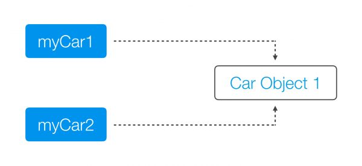
    * 对象拷贝   
        会创建对象本身的一个副本。因此如果我们再一次服务我们 car 对象，就会创建这个对象本身的一个副本, 同时还会有第二个引用变量指向这个被复制出来的对象。
        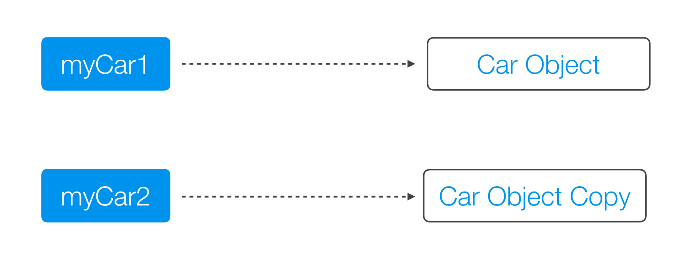  
    * 什么是对象  
        比方说我们有一个 Person 对象。这个 Person 对象实际上是由其它的对象组合而成的。如下图所示， Person 对象包含了一个 Name 对象和一个 Address 对象。Name 对象又包含了一个 FirstName 对象和一个 LastName 对象；Address 对象又是由一个 Street 对象以及一个 City 对象组合而成的。那么当我们讨论本文中的这个 Person 时，实际上我是在讨论这些个对象所组成的整个的对象联系网络。 
        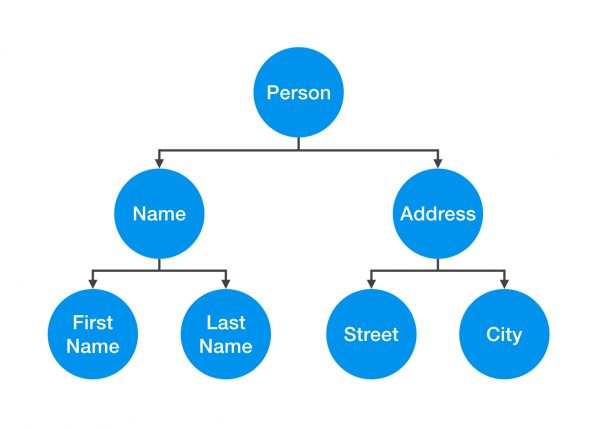
    * 浅拷贝   
        首先让我们来说说浅拷贝。对象的浅拷贝会对“主”对象进行拷贝，但不会复制主对象里面的对象。"里面的对象“会在原来的对象和它的副本之间共享。例如，我们会为一个 Person对象创建第二个 Person 对象, 而两个 Person 会共享相同的 Name 和 Address 对象。
        ```java
        public class Person {
            private Name name;
            private Address address;

            public Person(Person originalPerson) {
                this.name = originalPerson.name;
                this.address = originalPerson.address;
            }
        […]
        }
        ```
        浅拷贝的问题就是两个对象并非独立的。如果你修改了其中一个 Person 对象的 Name 对象，那么这次修改也会影响奥另外一个 Person 对象。   
        假如说我们有一个 Person 对象，然后也会有一个引用变量 monther 来指向它；然后当我们对 mother 进行拷贝时，创建第二个 Person 对象 son。如果在此后的代码中， son 尝试用 moveOut() 来修改他的 Address 对象, 那么 mother 也会跟着他一起搬走!   
        ```java
        Person mother = new Person(new Name(…), new Address(…));
        […]
        Person son  = new Person(mother);
        […]
        son.moveOut(new Street(…), new City(…));
        ```
        这种现象之所以会发生，是因为 mother 和son 对象共享了相同的 Address 对象，如你在示例 7 中所看到的描述。当我们在一个对象中修改了 Address 对象，那么也就表示两个对象总的 Address 都被修改了。
        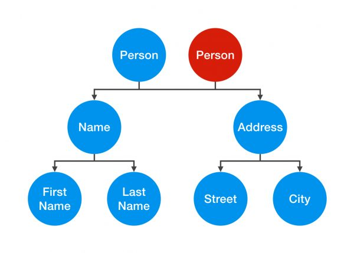

    * 深拷贝   
        不同于浅拷贝，深拷贝是一个整个独立的对象拷贝。如果我们对整个 Person对象进行深拷贝，我们会对整个对象的结构都进行拷贝。
        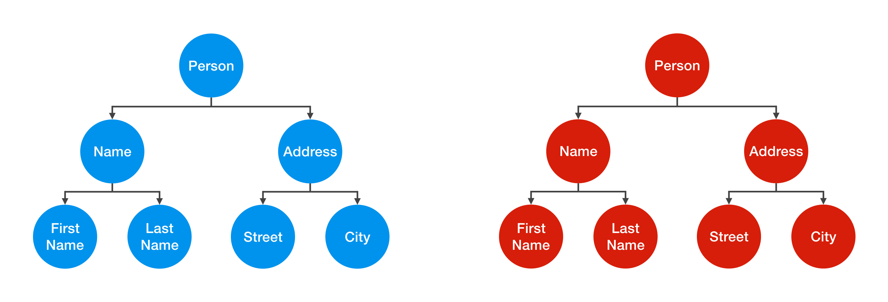  
        对一个 Person 的Address对象进行了修改并不会对另外一个对象造成影响。当我们观察示例 9 中的代码，会发现我们不单单对 Person 对象使用了拷贝构造器，同时也会对里面的对象使用拷贝构造器。 
        ```java
        public class Person {
            private Name name;
            private Address address;

            public Person(Person otherPerson) {
                this.name    =  new Name(otherPerson.name);
                this.address =  new Address(otherPerson.address);
            }
        […]
        }
        ```
        要创建一个真正的深拷贝，就需要我们一直这样拷贝下去，一直覆盖到 Person 对象所有的内部元素, 最后只剩下原始的类型以及“不可变对象（Immutables）”。让我们观察下如下这个 Street 类以获得更好的理解:  
        ```java
        public class Street {
            private String name;
            private int number;

            public Street(Street otherStreet){
                this.name = otherStreet.name;
                this.number = otherStreet.number;
            }
        […]
        }
        ```  
22. 数组和链表数据结构描述，各自的时间复杂度  
    1. 存取方式上，数组可以顺序存取或者随机存取，而链表只能顺序存取；　

    2. 存储位置上，数组逻辑上相邻的元素在物理存储位置上也相邻，而链表不一定；　

    3. 存储空间上，链表由于带有指针域，存储密度不如数组大；　

    4. 按序号查找时，数组可以随机访问，时间复杂度为O(1)，而链表不支持随机访问，平均需要O(n)；　

    5. 按值查找时，若数组无序，数组和链表时间复杂度均为O(1)，但是当数组有序时，可以采用折半查找将时间复杂度降为O(logn)；　

    6. 插入和删除时，数组平均需要移动n/2个元素，而链表只需修改指针即可；　

    7. 空间分配方面：    
    　　数组在静态存储分配情形下，存储元素数量受限制，动态存储分配情形下，虽然存储空间可以扩充，但需要移动大量元素，导致操作效率降低而且如果内存中没有更大块连续存储空间将导致分配失败；    
    链表存储的节点空间只在需要的时候申请分配，只要内存中有空间就可以分配，操作比较灵活高效；

23. error和exception的区别，CheckedException，RuntimeException的区别。
    *  一般分为Checked异常和Runtime异常，所有RuntimeException类及其子类的实例被称为Runtime异常，不属于该范畴的异常则被称为CheckedException。
    * Checked异常（编译时）
        * 只有java语言提供了Checked异常，Java认为Checked异常都是可以被处理的异常，所以Java程序必须显示处理Checked异常。如果程序没有处理Checked异常，该程序在编译时就会发生错误无法编译。这体现了Java的设计哲学：没有完善错误处理的代码根本没有机会被执行。对Checked异常处理方法有两种：
        1. 当前方法知道如何处理该异常，则用try...catch块来处理该异常。
        2. 当前方法不知道如何处理，则在定义该方法是声明抛出该异常。
        3. 我们比较熟悉的Checked异常有:   
            Java.lang.ClassNotFoundException   
            Java.lang.NoSuchMetodException   
            java.io.IOException   
    * RuntimeException（运行时）
        * Runtime如除数是0和数组下标越界等，其产生频繁，处理麻烦，若显示申明或者捕获将会对程序的可读性和运行效率影响很大。所以由系统自动检测并将它们交给缺省的异常处理程序。当然如果你有处理要求也可以显示捕获它们。
        我们比较熟悉的RumtimeException子类：   
        Java.lang.ArithmeticException   
        Java.lang.ArrayStoreExcetpion   
        Java.lang.ClassCastException   
        Java.lang.IndexOutOfBoundsException   
        Java.lang.NullPointerException   
    * error
        当程序发生不可控的错误时，通常做法是通知用户并中止程序的执行。与异常不同的是Error及其子类的对象不应被抛出。   
        Error是throwable的子类，代表编译时间和系统错误，用于指示合理的应用程序不应该试图捕获的严重问题。   
        Error由Java虚拟机生成并抛出，包括动态链接失败，虚拟机错误等。程序对其不做处理。

25. 在自己的代码中，如果创建一个java.lang.String类，这个类是否可以被类加载器加载？为什么。
    * 类加载无须等到“首次使用该类”时加载，jvm允许预加载某些类
    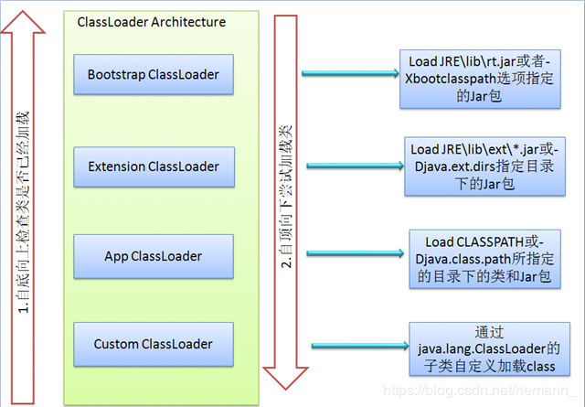
    1. 双亲委派模型   
        + 类加载器可分为两类：一是启动类加载器(Bootstrap ClassLoader)，是C++实现的，是JVM的一部分；另一种是其它的类加载器，是Java实现的，独立于JVM，全部都继承自抽象类java.lang.ClassLoader。jdk自带了三种类加载器，分别是启动类加载器（Bootstrap ClassLoader），扩展类加载器（Extension ClassLoader），应用程序类加载器（Application ClassLoader）。后两种加载器是继承自抽象类java.lang.ClassLoader。   
        一般是： 自定义类加载器 >> 应用程序类加载器 >> 扩展类加载器 >> 启动类加载器    
        上面的层次关系被称为双亲委派模型(Parents Delegation Model)。除了最顶层的启动类加载器外，其余的类加载器都有对应的父类加载器。  

        + 再简单说下双亲委托机制：如果一个类加载器收到了类加载的请求，它首先不会自己尝试去加载这个类，而是把这个请求委派给父类加载器，每一个层次的类加载器都是加此，因此所有的加载请求最终到达顶层的启动类加载器，只有当父类加载器反馈自己无法完成加载请求时（指它的搜索范围没有找到所需的类），子类加载器才会尝试自己去加载。
           
        + 各个类加载器之间是组合关系，并非继承关系。   
        当一个类加载器收到类加载的请求，它将这个加载请求委派给父类加载器进行加载，每一层加载器都是如此，最终，所有的请求都会传送到启动类加载器中。只有当父类加载器自己无法完成加载请求时，子类加载器才会尝试自己加载。

        + 双亲委派模型可以确保安全性，可以保证所有的Java类库都是由启动类加载器加载。如用户编写的java.lang.Object，加载请求传递到启动类加载器，启动类加载的是系统中的Object对象，而用户编写的java.lang.Object不会被加载。如用户编写的java.lang.virus类，加载请求传递到启动类加载器，启动类加载器发现virus类并不是核心Java类，无法进行加载，将会由具体的子类加载器进行加载，而经过不同加载器进行加载的类是无法访问彼此的。由不同加载器加载的类处于不同的运行时包。所有的访问权限都是基于同一个运行时包而言的。

    * 为什么要使用这种双亲委托模式呢？   
        * 因为这样可以避免重复加载，当父亲已经加载了该类的时候，就没有必要子ClassLoader再加载一次。
        * 如果不使用这种委托模式，那我们就可以随时使用自定义的String来动态替代java核心api中定义类型，这样会存在非常大的安全隐患，而双亲委托的方式，就可以避免这种情况，因为String已经在启动时被加载，所以用户自定义类是无法加载一个自定义的ClassLoader。
        * 假如我们自己写了一个java.lang.String的类，我们是否可以替换调JDK本身的类？
            * 否定的。我们不能实现。为什么呢？我看很多网上解释是说双亲委托机制解决这个问题，其实不是非常的准确。因为双亲委托机制是可以打破的，你完全可以自己写一个classLoader来加载自己写的java.lang.String类，但是你会发现也不会加载成功，具体就是因为针对java.*开头的类，jvm的实现中已经保证了必须由bootstrp来加载。
            因加载某个类时，优先使用父类加载器加载需要使用的类。如果我们自定义了java.lang.String这个类， 加载该自定义的String类，该自定义String类使用的加载器是AppClassLoader，根据优先使用父类加载器原理， AppClassLoader加载器的父类为ExtClassLoader，所以这时加载String使用的类加载器是ExtClassLoader， 但是类加载器ExtClassLoader在jre/lib/ext目录下没有找到String.class类。然后使用ExtClassLoader父类的加载器BootStrap， 父类加载器BootStrap在JRE/lib目录的rt.jar找到了String.class，将其加载到内存中。这就是类加载器的委托机制。

    * 为什么还要定义自已的类加载器呢？   
        * 因为Java中提供的默认ClassLoader，只加载指定目录下的jar和class，如果我们想加载其它位置的类或jar时，比如：我要加载网络上的一个class文件，通过动态加载到内存之后，要调用这个类中的方法实现我的业务逻辑。在这样的情况下，默认的ClassLoader就不能满足我们的需求了，所以需要定义自己的ClassLoader。   
        定义自已的类加载器分为两步：

        1. 继承java.lang.ClassLoader

        2. 重写父类的findClass方法   
        父类有那么多方法，为什么偏偏只重写findClass方法？
        因为JDK已经在loadClass方法中帮我们实现了ClassLoader搜索类的算法，当在loadClass方法中搜索不到类时，loadClass方法就会调用findClass方法来搜索类，所以我们只需重写该方法即可。如没有特殊的要求，一般不建议重写loadClass搜索类的算法。

26. 在jdk1.5中，引入了泛型，泛型的存在是用来解决什么问题。   
    * 泛型的本质是参数化类型，也就是说所操作的数据类型被指定为一个参数，泛型的好处是在编译的时候检查类型安全，并且所有的强制转换都是自动和隐式的，以提高代码的重用率
    * 我们在编写程序时，经常遇到两个模块的功能非常相似，只是一个是处理int型数据，另一个是处理String类型数据，或者其它自定义类型数据，但是我们没有办法，只能分别写多个方法处理每种数据类型，因为方法的参数类型不同。有没有一种办法，在方法中传入通用的数据类型，这样不就可以合并代码了吗？泛型的出现就是专门解决这个问题的。
    * 用一个通用的数据类型Object来实现这个栈, 当Stack处理值类型时，会出现装箱、拆箱操作，但将用到的数据类型的强制转换操作，增加处理器的负担。在数据类型的强制转换上还有更严重的问题  
    * 泛型和使用object区别
        1. 它是类型安全的。实例化了int类型的栈，就不能处理String类型的数据，其他的数据类型也一样。
        2. 无需装箱和拆箱。这个类在实例化时，按照所传入的数据类型生成本地代码，本地代码数据类型已确定，所以无需装箱和拆箱。
        3. 无需类型转换。

27. 这样的a.hashcode() 有什么用，与a.equals(b)有什么关系。
    * hashCode
        1. hashcode（）方法提供了对象的hashCode值，是一个native方法，返回的默认值与System.identityHashCode(obj)一致。
        2. hashcode只能说是标识对象，在hash算法中可以将对象相对离散开，这样就可以在查找数据的时候根据这个key快速缩小数据的范围，但hashcode不一定是唯一的，所以hash算法中定位到具体的链表后，需要循环链表，然后通过equals方法来对比Key是否是一样的。

    * equals相等两个对象，则hashcode一定要相等。但是hashcode相等的两个对象不一定equals相等。
    * hashcode是为了算法快速定位数据而存在的，而equals是为了对比真实值而存在的。
    * 2 个不相等的对象可能有相同的 hashcode。  

28. Java中的HashSet内部是如何工作的。
    * 底层是基于hashmap实现的  
        对于 HashSet 而言，它是基于 HashMap 实现的，HashSet 底层使用 HashMap 来保存所有元素，因此 HashSet 的实现比较简单，相关 HashSet 的操作，基本上都是直接调用底层 HashMap 的相关方法来完成，我们应该为保存到 HashSet 中的对象覆盖 hashCode() 和 equals()   
    
29. 什么是序列化，怎么序列化，为什么序列化，反序列化会遇到什么问题，如何解决。 
    * 什么是序列化和反序列化？
        * 序列化：将对象的状态信息转换成可以存储或者传输的二进制格式的过程，在这个过程中二进制格式通常以文件形式来体现。
        * 反序列化：反之，将二级制存储形式转换成对象的过程，就是反序列化了。
    * 为什么要序列化和反序列化？
        * 在很多应用场景中都需要用到序列化和反序列化，以保存当前对象的状态信息或者用于传输，例如，在常见的web服务中的持久化session就是一个很好的例子，一般session都是入驻内存的，当服务器异常宕机，内存里的session因为掉电而搽除，当我们设置了session持久化特性时，就会把session保存在硬盘上，这就是序列化，等服务器重启后有可以读取硬盘上这个session文件，还原session对象，这就是反序列化。   
        * 另一个需要序列化的场景就是进程间的远程通信，远程通信是以二进制字节流传输的，当需要传输对象的时候，首先在发送端需要将对象序列化为二进制形式方便网络传输，然后在接收端将二进制形式反序列化为java对象。比如早期的RMI，甚至现在流行的RPC通信都用到了序列化和反序列化。
    * 如何序列化和反序列化一个对象？
        * java提供了一套API方便用户序列化和反序列化。其中需要用到以下几个接口
            ```
            java.io.Serializable
            java.io.Externalizable
            ObjectOutputStream
            ObjectInputStream
            ```
        1. Serializable接口  
            * 一个对象想要被序列化和反序列化必须实现Serializable接口，父类具备了序列化和反序列化能力，子类会继承这种能力。
            * 序列化运行时使用一个称为 serialVersionUID 的版本号与每个可序列化类相关联，在实现Serializable接口后，我们需要生成这么一串版本号该序列号在反序列化过程中用于验证序列化对象的发送者和接收者是否为该对象加载了与序列化兼容的类。如果接收者加载的该对象的类的 serialVersionUID 与对应的发送者的类的版本号不同，则反序列化将会抛出InvalidClassException。例如：
            ```java
            public class User implements Serializable{
                private final long serialVersionUID = 1L;
            }
            ```
            如果实现了该接口但未显示申明serialVersionUID，则序列化运行时将基于该类的各个方面计算该类的默认 serialVersionUID 值。但是强烈建议显示的去申明serialVersionUID，因为编译的实现和计算serialVersionUID的千差万别有可能在跨编译器编译时生成了不同的serialVersionUID，导致反序列化的时候抛出InvalidClassException。
            ```java
            public class Car implements Serializable{
                private static final long serialVersionUID = -6784979447075466710L;
                private String name;
                private String trade;

                public String getName() {
                    return name;
                }

                public void setName(String name) {
                    this.name = name;
                }

                public String getTrade() {
                    return trade;
                }

                public void setTrade(String trade) {
                    this.trade = trade;
                }
                
            }
            ```
            ```java
            public class CarTest {
                public static void main(String[] args){
                    Car car = new Car();
                    car.setName("BMW");
                    car.setTrade("toyota");

                    ObjectOutputStream objectOutputStream = null;
                    try{
                        objectOutputStream = new ObjectOutputStream(new FileOutputStream("carFile"));
                        objectOutputStream.writeObject(car);
                    } catch (FileNotFoundException e){
                        e.printStackTrace();
                    } catch (IOException e){
                        e.printStackTrace();
                    } finally {
                        IOUtils.closeQuietly(objectOutputStream);
                    }

                    ObjectInputStream objectInputStream = null;
                    try{
                        objectInputStream = new ObjectInputStream(new FileInputStream("carFile"));
                        Car newCar  = (Car) objectInputStream.readObject();
                    } catch (ClassNotFoundException e){
                        e.printStackTrace();
                    } catch (FileNotFoundException e){
                        e.printStackTrace();
                    } catch (IOException e){
                        e.printStackTrace();
                    } finally {
                        IOUtils.closeQuietly(objectOutputStream);
                    }
                }
            }

            //output result
            Car{name=BMW, trade=toyota}
            Car{name=BMW, trade=toyota}
            ```
            里面我们没有显示告诉编译器如何去序列化一个对象。如果需要，我们应该在类中实现如下方法：
            ```java
            private void writeObject(java.io.ObjectOutputStream stream)
            private void readObject(java.io.ObjectInputStream stream)
            private void readObjectNoData()
            ```
    * 1）Java序列化就是把对象转换成字节序列，而Java反序列化就是把字节序列还原成Java对象。   
      2）采用Java序列化与反序列化技术，一是可以实现数据的持久化，在MVC模式中很是有用；二是可以对象数据的远程通信

    * 注意事项
        1. 当一个父类实现序列化，子类就会自动实现序列化，不需要显式实现Serializable接口。

        2. 当一个对象的实例变量引用其他对象，序列化该对象时也把引用对象进行序列化。

        3. 并非所有的对象都可以进行序列化，比如：   
        安全方面的原因，比如一个对象拥有private，public等成员变量，对于一个要传输的对象，比如写到文件，或者进行RMI传输等等，在序列化进行传输的过程中，这个对象的private等域是不受保护的;
        资源分配方面的原因，比如socket，thread类，如果可以序列化，进行传输或者保存，也无法对他们进行重新的资源分配，而且，也是没有必要这样实现。
        4. 声明为static和transient类型的成员变量不能被序列化。因为static代表类的状态，transient代表对象的临时数据。

        5. 序列化运行时会使用一个称为 serialVersionUID 的版本号，并与每个可序列化的类相关联，该序列号在反序列化过程中用于验证序列化对象的发送者和接收者是否为该对象加载了与序列化兼容的类。如果接收者加载的该对象的类的 serialVersionUID 与对应的发送者的类的版本号不同，则反序列化将会导致 InvalidClassException。可序列化类可以通过声明名为 "serialVersionUID" 的字段(该字段必须是静态 (static)、最终 (final) 的 long 型字段)显式声明其自己的 serialVersionUID。    
        如果序列化的类未显式的声明 serialVersionUID，则序列化运行时将基于该类的各个方面计算该类的默认 serialVersionUID 值，如“Java(TM) 对象序列化规范”中所述。不过，强烈建议 所有可序列化类都显式声明 serialVersionUID 值，原因是计算默认的 serialVersionUID 对类的详细信息具有较高的敏感性，根据编译器实现的不同可能千差万别，这样在反序列化过程中可能会导致意外的 InvalidClassException。因此，为保证 serialVersionUID 值跨不同 java 编译器实现的一致性，序列化类必须声明一个明确的 serialVersionUID 值。还强烈建议使用 private 修饰符显示声明 serialVersionUID(如果可能)，原因是这种声明仅应用于直接声明类 -- serialVersionUID 字段作为继承成员没有用处。数组类不能声明一个明确的 serialVersionUID，因此它们总是具有默认的计算值，但是数组类没有匹配 serialVersionUID 值的要求。

        6. Java有很多基础类已经实现了serializable接口，比如String，Vector等。但是也有一些没有实现serializable接口的。

        7. 如果一个对象的成员变量是一个对象，那么这个对象的数据成员也会被保存!这是能用序列化解决深拷贝的重要原因。