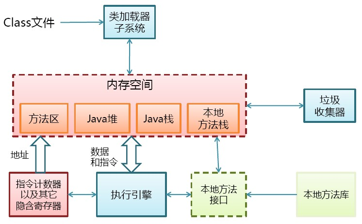
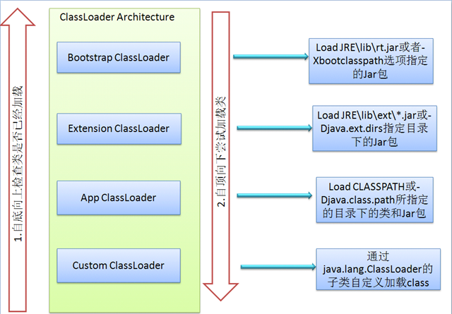

# JVM 面试笔记
1. 什么情况下会发生栈内存溢出。   
    * 如果线程请求的栈深度大于虚拟机所允许的深度，将抛出StackOverflowError异常。 如果虚拟机在动态扩展栈时无法申请到足够的内存空间，则抛出OutOfMemoryError异常。
    * 内存区域
        * java虚拟机咋执行java程序的过程中会把他所管理的内存划分为若干个不同数据区域。java虚拟机规范剪JVM所管理的内存分为以下几个运行时区域：程序计数器、java虚拟机栈、本地方法栈、java堆、方法区。下面详细阐述各数据区域的数据类型。
    
    * 程序计数器
        * 一块较小的内存，他是当前线程所执行的字节码的行号指示器，字节码解释器工作时通过改变该计数器的值来选择下一条需求执行的字节码指令，分支、跳转、循环等基础功能都要以来它来实现。每条线程都有一个独立的程序计数器，各线程间的计数器互不影响，因此该区域时线程私有的。
           
        * 当线程在执行一个java方法时，该计数器记录的是正在执行虚拟机字节码指令的地址，当线程是在执行的是Native方法（调用本地操作系统方法）时，该计数器的值为空，另外，该内存区域时唯一一个在java虚拟机规范中没有规定任何OOM（OutOfMemoryError）情况的区域。
           
    * java虚拟机栈
        * 该区域时线程私有的，它的生命周期也和像线程相同。虚拟机栈描述的是java方法执行的内存模型：每个方法被执行的时候都会创建一个栈帧，栈他是用与支持虚拟机进行方法调用和方法执行的数据结构。对于执行引擎来讲，活动线程中，只有栈顶的栈帧是有效的，它称为当前栈帧，这个栈帧所关联的方法称为当前方法，执行引擎所运行的所有字节码指令都是针对当前栈帧进行操作。栈帧用于存储局部变量、操作数栈、动态链接、方法返回地址和一些额外的附加信息。在编译程序代码时，栈帧中需要多大的局部变量表、多深的操作数栈都已经完全确定了，并且写入方法表的Code属性中。因此，一个栈帧需要分配多少内存，不会受程序运行期变量数据的影响，而仅仅取决于具体的虚拟机实现。
        在Java虚拟机规范中，对这个区域规定了两种异常情况：   
        1. 如果线程所申请的栈的深度大于虚拟机所允许的深度，将抛出StackOverflowError异常。
        2. 如果虚拟机在动态扩展栈时无法申请到足够的内存空间，则抛出OutOfMemoryError异常。   
        * 这两种情况存在着一些互相重叠的地方：当栈空间无法继续分配时，到底是内存太小，还是已使用的栈空间太大，其本质上只是对同一件事情的两种描述而已。在单线程的操作中，无论是由于栈帧太大，还是虚拟机栈空间太小，当栈空间无法分配时，虚拟机抛出的都是 StackOverflowError 异常，而不会得到 OutOfMemoryError 异常。而在多线程环境下，则会抛出 OutOfMemoryError 异常。
        * 下面详细说明栈帧中所存放的各部分信息的作用和数据结构。
            * 局部变量表
                * 局部变量表是一组变量值存储空间，用于存放方法参数和方法内部定义的局部变量，其中存放的数据的类型是编译期可知的各种基本数据类型、对象引用（reference）和 returnAddress 类型（它指向了一条字节码指令的地址）。局部变量表所需的内存空间在编译期间完成分配，即在 Java 程序被编译成 Class 文件时，就确定了所需分配的最大局部变量表的容量。当进入一个方法时，这个方法需要在栈中分配多大的局部变量空间是完全确定的，在方法运行期间不会改变局部变量表的大小。
                * 局部变量表的容量以变量槽（Slot）为最小单位。在虚拟机规范中并没有明确指明一个 Slot 应占用的内存空间大小（允许其随着处理器、操作系统或虚拟机的不同而发生变化），一个 Slot 可以存放一个32位以内的数据类型：boolean、byte、char、short、int、float、reference 和 returnAddresss。reference 是对象的引用类型，returnAddress 是为字节指令服务的，它执行了一条字节码指令的地址。对于 64 位的数据类型（long和double），虚拟机会以高位在前的方式为其分配两个连续的 Slot 空间。
                * 虚拟机通过索引定位的方式使用局部变量表，索引值的范围是从 0 开始到局部变量表最大的 Slot 数量，对于 32 位数据类型的变量，索引 n 代表第 n 个 Slot，对于 64 位的，索引 n 代表第 n 和第 n+1 两个 Slot。
                * 在方法执行时，虚拟机是使用局部变量表来完成参数值到参数变量列表的传递过程的，如果是实例方法（非static），则局部变量表中的第 0 位索引的 Slot 默认是用于传递方法所属对象实例的引用，在方法中可以通过关键字“this”来访问这个隐含的参数。其余参数则按照参数表的顺序来排列，占用从1开始的局部变量 Slot，参数表分配完毕后，再根据方法体内部定义的变量顺序和作用域分配其余的 Slot。
                * 局部变量表中的 Slot 是可重用的，方法体中定义的变量，作用域并不一定会覆盖整个方法体，如果当前字节码PC计数器的值已经超过了某个变量的作用域，那么这个变量对应的 Slot 就可以交给其他变量使用。这样的设计不仅仅是为了节省空间，在某些情况下 Slot 的复用会直接影响到系统的而垃圾收集行为。
            * 操作数栈
                * 操作数栈又常被称为操作栈，操作数栈的最大深度也是在编译的时候就确定了。32 位数据类型所占的栈容量为 1,64 位数据类型所占的栈容量为 2。当一个方法开始执行时，它的操作栈是空的，在方法的执行过程中，会有各种字节码指令（比如：加操作、赋值元算等）向操作栈中写入和提取内容，也就是入栈和出栈操作。
                * Java 虚拟机的解释执行引擎称为“基于栈的执行引擎”，其中所指的“栈”就是操作数栈。因此我们也称 Java 虚拟机是基于栈的，这点不同于 Android 虚拟机，Android 虚拟机是基于寄存器的。
                * 基于栈的指令集最主要的优点是可移植性强，主要的缺点是执行速度相对会慢些；而由于寄存器由硬件直接提供，所以基于寄存器指令集最主要的优点是执行速度快，主要的缺点是可移植性差。
            * 动态链接
                * 每个栈帧都包含一个指向运行时常量池（在方法区中，后面介绍）中该栈帧所属方法的引用，持有这个引用是为了支持方法调用过程中的动态连接。Class 文件的常量池中存在有大量的符号引用，字节码中的方法调用指令就以常量池中指向方法的符号引用为参数。这些符号引用，一部分会在类加载阶段或第一次使用的时候转化为直接引用（如 final、static 域等），称为静态解析，另一部分将在每一次的运行期间转化为直接引用，这部分称为动态连接。
            * 方法返回地址
                * 当一个方法被执行后，有两种方式退出该方法：执行引擎遇到了任意一个方法返回的字节码指令或遇到了异常，并且该异常没有在方法体内得到处理。无论采用何种退出方式，在方法退出之后，都需要返回到方法被调用的位置，程序才能继续执行。方法返回时可能需要在栈帧中保存一些信息，用来帮助恢复它的上层方法的执行状态。一般来说，方法正常退出时，调用者的 PC 计数器的值就可以作为返回地址，栈帧中很可能保存了这个计数器值，而方法异常退出时，返回地址是要通过异常处理器来确定的，栈帧中一般不会保存这部分信息。
                * 方法退出的过程实际上等同于把当前栈帧出站，因此退出时可能执行的操作有：恢复上层方法的局部变量表和操作数栈，如果有返回值，则把它压入调用者栈帧的操作数栈中，调整 PC 计数器的值以指向方法调用指令后面的一条指令。
    * 本地方法栈
        * 该区域与虚拟机栈所发挥的作用非常相似，只是虚拟机栈为虚拟机执行 Java 方法服务，而本地方法栈则为使用到的本地操作系统（Native）方法服务。
    * Java堆
        * Java Heap 是 Java 虚拟机所管理的内存中最大的一块，它是所有线程共享的一块内存区域。几乎所有的对象实例和数组都在这类分配内存。Java Heap 是垃圾收集器管理的主要区域，因此很多时候也被称为“GC堆”。
        * 根据 Java 虚拟机规范的规定，Java 堆可以处在物理上不连续的内存空间中，只要逻辑上是连续的即可。如果在堆中没有内存可分配时，并且堆也无法扩展时，将会抛出 OutOfMemoryError 异常。
    * 方法区
        * 方法区也是各个线程共享的内存区域，它用于存储已经被虚拟机加载的类信息、常量、静态变量、即时编译器编译后的代码等数据。方法区域又被称为“永久代”，但这仅仅对于 Sun HotSpot 来讲，JRockit 和 IBM J9 虚拟机中并不存在永久代的概念。Java 虚拟机规范把方法区描述为 Java 堆的一个逻辑部分，而且它和 Java Heap 一样不需要连续的内存，可以选择固定大小或可扩展，另外，虚拟机规范允许该区域可以选择不实现垃圾回收。相对而言，垃圾收集行为在这个区域比较少出现。该区域的内存回收目标主要针是对废弃常量的和无用类的回收。运行时常量池是方法区的一部分，Class 文件中除了有类的版本、字段、方法、接口等描述信息外，还有一项信息是常量池（Class文件常量池），用于存放编译器生成的各种字面量和符号引用，这部分内容将在类加载后存放到方法区的运行时常量池中。运行时常量池相对于 Class 文件常量池的另一个重要特征是具备动态性，Java 语言并不要求常量一定只能在编译期产生，也就是并非预置入 Class 文件中的常量池的内容才能进入方法区的运行时常量池，运行期间也可能将新的常量放入池中，这种特性被开发人员利用比较多的是 String 类的 intern（）方法。
        * 根据 Java 虚拟机规范的规定，当方法区无法满足内存分配需求时，将抛出 OutOfMemoryError 异常。
    * 直接内存
        * 直接内存并不是虚拟机运行时数据区的一部分，也不是 Java 虚拟机规范中定义的内存区域，它直接从操作系统中分配，因此不受 Java 堆大小的限制，但是会受到本机总内存的大小及处理器寻址空间的限制，因此它也可能导致 OutOfMemoryError 异常出现。在 JDK1.4 中新引入了 NIO 机制，它是一种基于通道与缓冲区的新 I/O 方式，可以直接从操作系统中分配直接内存，即在堆外分配内存，这样能在一些场景中提高性能，因为避免了在 Java 堆和 Native 堆中来回复制数据。
    * 内存溢出
        * 内存溢出测试方法   
        
        * 这里有一点要重点说明，在多线程情况下，给每个线程的栈分配的内存越大，反而越容易产生内存溢出异常。操作系统为每个进程分配的内存是有限制的，虚拟机提供了参数来控制 Java 堆和方法区这两部分内存的最大值，忽略掉程序计数器消耗的内存（很小），以及进程本身消耗的内存，剩下的内存便给了虚拟机栈和本地方法栈，每个线程分配到的栈容量越大，可以建立的线程数量自然就越少。因此，如果是建立过多的线程导致的内存溢出，在不能减少线程数的情况下，就只能通过减少最大堆和每个线程的栈容量来换取更多的线程。
        * 另外，由于 Java 堆内也可能发生内存泄露（Memory Leak），这里简要说明一下内存泄露和内存溢出的区别：
            1. 内存泄露是指分配出去的内存没有被回收回来，由于失去了对该内存区域的控制，因而造成了资源的浪费。Java 中一般不会产生内存泄露，因为有垃圾回收器自动回收垃圾，但这也不绝对，当我们 new 了对象，并保存了其引用，但是后面一直没用它，而垃圾回收器又不会去回收它，这边会造成内存泄露，
            2. 内存溢出是指程序所需要的内存超出了系统所能分配的内存（包括动态扩展）的上限。
    * 对象实例化分析
        * `Object obj = new Object();`   
        段代码的执行会涉及 Java 栈、Java 堆、方法区三个最重要的内存区域。假设该语句出现在方法体中，及时对 JVM 虚拟机不了解的 Java 使用这，应该也知道 obj 会作为引用类型（reference）的数据保存在 Java 栈的本地变量表中，而会在 Java 堆中保存该引用的实例化对象，但可能并不知道，Java 堆中还必须包含能查找到此对象类型数据的地址信息（如对象类型、父类、实现的接口、方法等），这些类型数据则保存在方法区中。   
        另外，由于 reference 类型在 Java 虚拟机规范里面只规定了一个指向对象的引用，并没有定义这个引用应该通过哪种方式去定位，以及访问到 Java 堆中的对象的具体位置，因此不同虚拟机实现的对象访问方式会有所不同，主流的访问方式有两种：使用句柄池和直接使用指针。  
        * 通过句柄池访问方式：   
        
        * 直接指针访问：   
        
        * 这两种对象的访问方式各有优势，使用句柄访问方式的最大好处就是 reference 中存放的是稳定的句柄地址，在对象被移动（垃圾收集时移动对象是非常普遍的行为）时只会改变句柄中的实例数据指针，而 reference 本身不需要修改。使用直接指针访问方式的最大好处是速度快，它节省了一次指针定位的时间开销。目前 Java 默认使用的 HotSpot 虚拟机采用的便是是第二种方式进行对象访问的。

2. JVM 的内存结构，Eden 和 Survivor 比例。
    *    
    eden 和 survior 是按8比1分配的
    1. 为什么会有年轻代
        * 我们先来屡屡，为什么需要把堆分代？不分代不能完成他所做的事情么？其实不分代完全可以，分代的唯一理由就是优化GC性能。你先想想，如果没有分代，那我们所有的对象都在一块，GC的时候我们要找到哪些对象没用，这样就会对堆的所有区域进行扫描。而我们的很多对象都是朝生夕死的，如果分代的话，我们把新创建的对象放到某一地方，当GC的时候先把这块存“朝生夕死”对象的区域进行回收，这样就会腾出很大的空间出来。
    2. 年轻代中的GC
        *  HotSpot JVM把年轻代分为了三部分：1个Eden区和2个Survivor区（分别叫from和to）。默认比例为8：1,为啥默认会是这个比例，接下来我们会聊到。一般情况下，新创建的对象都会被分配到Eden区(一些大对象特殊处理),这些对象经过第一次Minor GC后，如果仍然存活，将会被移到Survivor区。对象在Survivor区中每熬过一次Minor GC，年龄就会增加1岁，当它的年龄增加到一定程度时，就会被移动到年老代中。
        * 因为年轻代中的对象基本都是朝生夕死的(80%以上)，所以在年轻代的垃圾回收算法使用的是复制算法，复制算法的基本思想就是将内存分为两块，每次只用其中一块，当这一块内存用完，就将还活着的对象复制到另外一块上面。复制算法不会产生内存碎片。
        * 在GC开始的时候，对象只会存在于Eden区和名为“From”的Survivor区，Survivor区“To”是空的。紧接着进行GC，Eden区中所有存活的对象都会被复制到“To”，而在“From”区中，仍存活的对象会根据他们的年龄值来决定去向。年龄达到一定值(年龄阈值，可以通过-XX:MaxTenuringThreshold来设置)的对象会被移动到年老代中，没有达到阈值的对象会被复制到“To”区域。经过这次GC后，Eden区和From区已经被清空。这个时候，“From”和“To”会交换他们的角色，也就是新的“To”就是上次GC前的“From”，新的“From”就是上次GC前的“To”。不管怎样，都会保证名为To的Survivor区域是空的。Minor GC会一直重复这样的过程，直到“To”区被填满，“To”区被填满之后，会将所有对象移动到年老代中。
        
    3. 一个对象的一辈子
        * 我是一个普通的java对象，我出生在Eden区，在Eden区我还看到和我长的很像的小兄弟，我们在Eden区中玩了挺长时间。有一天Eden区中的人实在是太多了，我就被迫去了Survivor区的“From”区，自从去了Survivor区，我就开始漂了，有时候在Survivor的“From”区，有时候在Survivor的“To”区，居无定所。直到我18岁的时候，爸爸说我成人了，该去社会上闯闯了。于是我就去了年老代那边，年老代里，人很多，并且年龄都挺大的，我在这里也认识了很多人。在年老代里，我生活了20年(每次GC加一岁)，然后被回收。

    4. 有关年轻代的JVM参数
        1. -XX:NewSize和-XX:MaxNewSize   
        用于设置年轻代的大小，建议设为整个堆大小的1/3或者1/4,两个值设为一样大。
        2. -XX:SurvivorRatio   
        用于设置Eden和其中一个Survivor的比值，这个值也比较重要。
        3. -XX:+PrintTenuringDistribution   
        这个参数用于显示每次Minor GC时Survivor区中各个年龄段的对象的大小。
        4. -XX:InitialTenuringThreshol和-XX:MaxTenuringThreshold   
        用于设置晋升到老年代的对象年龄的最小值和最大值，每个对象在坚持过一次Minor GC之后，年龄就加1。
       
3. jvm 中一次完整的 GC 流程是怎样的，对象如何晋升到老年代，说说你知道的几种主要的jvm 参数
    * 对象诞生即新生代->eden，在进行minor gc过程中，如果依旧存活，移动到from，变成Survivor，进行标记代数，如此检查一定次数后，晋升为老年代
    * jvm参数详解
        * 内存相关   

            选项 | 参数详解 |  默认值
            -|-|-
            -Xms | 初始堆大小 | -- |
            -Xmx | 最大堆大小 | -- |
            -Xmn | 年轻代大小(1.4or lator)整个JVM内存大小=年轻代大小 + 年老代大小 + 持久代大小。持久代一般固定大小为64m，所以增大年轻代后，将会减小年老代大小。此值对系统性能影响较大，Sun官方推荐配置为整个堆的3/8 | -- |
            -XX:newSize | 表示新生代初始内存的大小，应该小于 -Xms的值 | -- |
            -XX:NewRatio | 设置年轻代和年老代的比值。如:为3，表示年轻代与年老代比值为1：3，年轻代占整个年轻代年老代和的1/4 | -- |
            -XX:MaxNewSize | 年轻代最大值(for 1.3/1.4) | -- |
            -XX:PermSize | 设置持久代(perm gen)初始值 | -- |
            -XX:MaxPermSize | 设置持久代最大值 | -- |
            -Xss | 每个线程的堆栈大小 | -- |
            -XX:ThreadStackSize | -- | -- |
            -XX:SurvivorRatio | Eden区与Survivor区的大小比值， 设置为8,则两个Survivor区与一个Eden区的比值为2:8,一个Survivor区占整个年轻代的1/10 | -- |
            -XX:LargePageSizeInBytes | 内存页的大小不可设置过大， 会影响Perm的大小，基本没用过 | -- |
            -XX:+UseFastAccessorMethods | 原始类型的快速优化 1.7以后不建议使用，1.6之前默认打开的 | -- |
            -XX:+UseFastEmptyMethods | 优化空方法，1.7以后不建议使用，1.6之前默认打开的  | -- |
            -XX:+DisableExplicitGC | 关闭System.gc() | -- |
            -XX:MaxTenuringThreshold |设置垃圾最大年龄。如果设置为0的话，则年轻代对象不经过Survivor区，直接进入年老代。对于年老代比较多的应用，可以提高效率。如果将此值设置为一个较大值，则年轻代对象会在Survivor区进行多次复制，这样可以增加对象再年轻代的存活时间，增加在年轻代即被回收的概率 | -- |
            -XX:+AggressiveOpts | 加快编译 | -- |
            -XX:+UseBiasedLocking | 锁机制的性能改善， 有偏见的锁是使得锁更偏爱上次使用到它线程。在非竞争锁的场景下，即只有一个线程会锁定对象，可以实现近乎无锁的开销。 | 默认开启|
            -Xnoclassgc | 禁用类垃圾回收 | -- |
            -XX:SoftRefLRUPolicyMSPerMB | 每兆堆空闲空间中SoftReference的存活时间 | 默认是1S|
            -XX:PretenureSizeThreshold | 对象超过多大是直接在旧生代分配，单位字节 新生代采用Parallel Scavenge GC时无效另一种直接在旧生代分配的情况是大的数组对象,且数组中无外部引用对象. | -- |
            -XX:+CollectGen0First | FullGC时是否先YGC | false |
        * 收集器相关 

             选项 | 参数详解 |  默认值
            -|-|-
            -XX:+UseParallelGC | 选择垃圾收集器为并行收集器。此配置仅对年轻代有效。可以同时并行多个垃圾收集线程，但此时用户线程必须停止。 | -- |
            -XX:+UseParNewGC | 设置年轻代收集器ParNew | -- |  
            -XX:ParallelGCThreads | Parallel并行收集器的线程数 | -- |  
            -XX:+UseParallelOldGC | 设置老年代的并行收集器是ParallelOld | -- |  
            -XX:+UseG1GC | 使用G1收集器 | -- |  
            -XX:MaxGCPauseMillis | 每次年轻代垃圾回收的最长时间(最大暂停时间) | -- |  
            -XX:+UseAdaptiveSizePolicy | 设置此选项后,并行收集器会自动选择年轻代区大小和相应的Survivor区比例,以达到目标系统规定的最低相应时间或者收集频率等,此值建议使用并行收集器时,一直打开. | -- |  
            -XX:GCTimeRatio | 设置垃圾回收时间占程序运行时间的，百分比公式为1/(1+n) | -- |  
            -XX:+ScavengeBeforeFullGC | Full GC前调用YGC | true |  
            -XX:+UseConcMarkSweepGC | 使用CMS内存收集 | -- |  
            -XX:+AggressiveHeap | 试图是使用大量的物理内存长时间大内存使用的优化，能检查计算资源（内存， 处理器数量）至少需要256MB内存大量的CPU／内存， （在1.4.1在4CPU的机器上已经显示有提升） | -- |  
            -XX:CMSFullGCsBeforeCompaction | 由于并发收集器不对内存空间进行压缩,整理,所以运行一段时间以后会产生"碎片",使得运行效率降低.此值设置运行多少次GC以后对内存空间进行压缩,整理 | -- |  
            -XX:+CMSParallelRemarkEnabled | 降低CMS标记停顿 | -- |  
            -XX+UseCMSCompactAtFullCollection | 在FULL GC的时候， 对年老代的压缩，CMS是不会移动内存的， 因此， 这个非常容易产生碎片， 导致内存不够用， 因此， 内存的压缩这个时候就会被启用。 增加这个参数是个好习惯。可能会影响性能,但是可以消除碎片 | -- |  
            -XX:+UseCMSInitiatingOccupancyOnly | 使用手动定义初始化定义开始CMS收集，禁止hostspot自行触发CMS GC | -- |  
            -XX:CMSInitiatingOccupancyFraction=70 | 使用cms作为垃圾回收使用70％后开始CMS收集 | -- |  
            -XX:CMSInitiatingPermOccupancyFraction | 设置Perm Gen使用到达多少比率时触发 | -- |  
            -XX:+CMSIncrementalMode | 设置为增量模式 | -- |  
            -XX:CMSTriggerRatio | CMSInitiatingOccupancyFraction = (100 - MinHeapFreeRatio) + (CMSTriggerRatio * MinHeapFreeRatio / 100) 处罚cms收集的比例 | -- |  
            -XX:MinHeapFreeRatio | java堆中空闲量占的最小比例 | -- |  
            -XX:+CMSClassUnloadingEnabled | 如果你启用了CMSClassUnloadingEnabled ，垃圾回收会清理持久代，移除不再使用的classes。这个参数只有在 UseConcMarkSweepGC 也启用的情况下才有用。参数如下： | -- |  
        * 辅助信息
            选项 | 参数详解 |  默认值
            -|-|-
            -XX:+PrintGC | 输出形式:[GC 118250K->113543K(130112K), 0.0094143 secs]Full GC 121376K->10414K(130112K), 0.0650971 secs] | -- |
            -XX:+PrintGCDetails | -- | -- |
            -XX:+PrintGCTimeStamps | -- | -- |
            -XX:+PrintGC:PrintGCTimeStamps | -- | -- |
            -XX:+PrintGCApplicationStoppedTime | 打印垃圾回收期间程序暂停的时间.可与上面混合使用 | -- |
            -XX:+PrintGCApplicationConcurrentTime | 打印每次垃圾回收前,程序未中断的执行时间.可与上面混合使用 | -- |
            -XX:+PrintHeapAtGC | 打印GC前后的详细堆栈信息 | -- |
            -Xloggc:filename | 把相关日志信息记录到文件以便分析.与上面几个配合使用 | -- |
            -XX:+PrintClassHistogram | 遇到Ctrl-Break后打印类实例的柱状信息，与jmap -histo功能相同 | -- |
            -XX:+PrintTenuringDistribution | 查看每次minor GC后新的存活周期的阈值 | -- |
            -XX:PrintHeapAtGC | 打印GC前后的详细堆栈信息 | -- |

4. 你知道哪几种垃圾收集器，各自的优缺点，重点讲下 cms，包括原理，流程，优缺点
    * Serial、parNew、ParallelScavenge、SerialOld、ParallelOld、CMS、G1
    
    * 收集器
        1. Serial收集器
            * Serial收集器是一个新生代收集器，单线程执行，使用复制算法。它在进行垃圾收集时，必须暂停其他所有的工作线程(用户线程)也就是传说中的Stop The World。是Jvm client模式下默认的新生代收集器。对于限定单个CPU的环境来说，Serial收集器由于没有线程交互的开销，专心做垃圾收集自然可以获得最高的单线程收集效率。
        2. ParNew收集器
            * ParNew收集器其实就是serial收集器的多线程版本，除了使用多条线程进行垃圾收集之外，其余行为与Serial收集器一样。 使用方式可以使用-XX:+UseConcMarkSweepGC，或者是使用-XX:+UseParNewGC来强制开启，可以通过-XX:ParallelGCThreads 来调整或者限制垃圾收集的线程数量。
        3. Parallel Scavenge收集器
            * Parallel Scavenge收集器也是一个新生代收集器，它也是使用复制算法的收集器，又是并行多线程收集器。parallel Scavenge收集器的特点是它的关注点与其他收集器不同，CMS等收集器的关注点是尽可能地缩短垃圾收集时用户线程的停顿时间，而parallel Scavenge收集器的目标则是达到一个可控制的吞吐量。吞吐量= 程序运行时间/(程序运行时间 + 垃圾收集时间)，虚拟机总共运行了100分钟。其中垃圾收集花掉1分钟，那吞吐量就是99%。
            * Parallel Scavenge提供了两个参数用来精确控制，分别是控制最大垃圾收集停顿时间的-XX:MaxGCPauseMillis参数以及直接设置吞吐量大小的-XX:GCTimeRatio参数
            * MaxGCPauseMillis参数允许的值是一个大于0的毫秒数，收集器将尽可能地保证内存回收花费的时间不超过设定值。不过大家不要认为如果把这个参数的值设置得稍小一点就能使得系统的垃圾收集速度变得更快，GC停顿时间缩短是以牺牲吞吐量和新生代空间来换取的：系统把新生代调小一些，收集300MB新生代肯定比收集500MB快吧，这也直接导致垃圾收集发生得更频繁一些，原来10秒收集一次、每次停顿100毫秒，现在变成5秒收集一次、每次停顿70毫秒。停顿时间的确在下降，但吞吐量也降下来了。
            * GCTimeRatio参数的值应当是一个大于0且小于100的整数，也就是垃圾收集时间占总时间的比率，相当于是吞吐量的倒数。如果把此参数设置为19，那允许的最大GC时间就占总时间的5%（即1 /（1+19）），默认值为99，就是允许最大1%（即1 /（1+99））的垃圾收集时间
            * Parallel Scavenge收集器也经常称为“吞吐量优先”收集器。除上述两个参数之外，Parallel Scavenge收集器还有一个参数-XX:+UseAdaptiveSizePolicy值得关注。这是一个开关参数，当这个参数打开之后，就不需要手工指定新生代的大小（-Xmn）、Eden与Survivor区的比例（-XX:SurvivorRatio）、晋升老年代对象年龄（-XX:PretenureSizeThreshold）等细节参数了，虚拟机会根据当前系统的运行情况收集性能监控信息，动态调整这些参数以提供最合适的停顿时间或者最大的吞吐量，这种调节方式称为GC自适应的调节策略（GC Ergonomics）
        4. Serial Old收集器
            * Serial Old是Serial收集器的老年代版本，它同样是一个单线程收集器，使用“标记－整理”算法。这个收集器的主要意义也是在于给Client模式下的虚拟机使用。如果在Server模式下，那么它主要还有两大用途：一种用途是在JDK 1.5以及之前的版本中与Parallel Scavenge收集器搭配使用，另一种用途就是作为CMS收集器的后备预案，在并发收集发生Concurrent Mode Failure时使用。这两点都将在后面的内容中详细讲解。
        5. Parallel Old 收集器
            * Parallel Old是Parallel Scavenge收集器的老年代版本，使用多线程和“标记－整理”算法。这个收集器是在JDK 1.6中才开始提供的，在此之前，新生代的Parallel Scavenge收集器一直处于比较尴尬的状态。原因是，如果新生代选择了Parallel Scavenge收集器，老年代除了Serial Old（PS MarkSweep）收集器外别无选择（还记得上面说过Parallel Scavenge收集器无法与CMS收集器配合工作吗？）。由于老年代Serial Old收集器在服务端应用性能上的“拖累”，使用了Parallel Scavenge收集器也未必能在整体应用上获得吞吐量最大化的效果，由于单线程的老年代收集中无法充分利用服务器多CPU的处理能力，在老年代很大而且硬件比较高级的环境中，这种组合的吞吐量甚至还不一定有ParNew加CMS的组合“给力”。
            * 直到Parallel Old收集器出现后，“吞吐量优先”收集器终于有了比较名副其实的应用组合，在注重吞吐量以及CPU资源敏感的场合，都可以优先考虑Parallel Scavenge加Parallel Old收集器。
        6. CMS 收集器
            * CMS（Concurrent Mark Sweep）收集器是一种以获取最短回收停顿时间为目标的收集器。目前很大一部分的Java应用集中在互联网站或者B/S系统的服务端上，这类应用尤其重视服务的响应速度，希望系统停顿时间最短，以给用户带来较好的体验。CMS收集器就非常符合这类应用的需求。
            * 从名字（包含“Mark Sweep”）上就可以看出，CMS收集器是基于“标记—清除”算法实现的，它的运作过程相对于前面几种收集器来说更复杂一些，整个过程分为4个步骤，包括：
                1. 初始标记（CMS initial mark）
                2. 并发标记（CMS concurrent mark）
                3. 重新标记（CMS remark）
                4. 并发清除（CMS concurrent sweep）
            * 其中，初始标记、重新标记这两个步骤仍然需要“Stop The World”。初始标记仅仅只是标记一下GC Roots能直接关联到的对象，速度很快，并发标记阶段就是进行GC Roots Tracing的过程，而重新标记阶段则是为了修正并发标记期间因用户程序继续运作而导致标记产生变动的那一部分对象的标记记录，这个阶段的停顿时间一般会比初始标记阶段稍长一些，但远比并发标记的时间短。
            * CMS收集器无法处理浮动垃圾（Floating Garbage），可能出现“Concurrent Mode Failure”失败而导致另一次Full GC的产生。由于CMS并发清理阶段用户线程还在运行着，伴随程序运行自然就还会有新的垃圾不断产生，这一部分垃圾出现在标记过程之后，CMS无法在当次收集中处理掉它们，只好留待下一次GC时再清理掉。这一部分垃圾就称为“浮动垃圾”。也是由于在垃圾收集阶段用户线程还需要运行，那也就还需要预留有足够的内存空间给用户线程使用，因此CMS收集器不能像其他收集器那样等到老年代几乎完全被填满了再进行收集，需要预留一部分空间提供并发收集时的程序运作使用。在JDK 1.5的默认设置下，CMS收集器当老年代使用了68%的空间后就会被激活，这是一个偏保守的设置，如果在应用中老年代增长不是太快，可以适当调高参数-XX:CMSInitiatingOccupancyFraction的值来提高触发百分比，以便降低内存回收次数从而获取更好的性能，在JDK 1.6中，CMS收集器的启动阈值已经提升至92%。要是CMS运行期间预留的内存无法满足程序需要，就会出现一次“Concurrent Mode Failure”失败，这时虚拟机将启动后备预案：临时启用Serial Old收集器来重新进行老年代的垃圾收集，这样停顿时间就很长了。所以说参数-XX:CMSInitiatingOccupancyFraction设置得太高很容易导致大量“Concurrent Mode Failure”失败，性能反而降低。
            * CMS是一款基于“标记—清除”算法实现的收集器，如果读者对前面这种算法介绍还有印象的话，就可能想到这意味着收集结束时会有大量空间碎片产生。空间碎片过多时，将会给大对象分配带来很大麻烦，往往会出现老年代还有很大空间剩余，但是无法找到足够大的连续空间来分配当前对象，不得不提前触发一次Full GC。为了解决这个问题，CMS收集器提供了一个-XX:+UseCMSCompactAtFullCollection开关参数（默认就是开启的），用于在CMS收集器顶不住要进行FullGC时开启内存碎片的合并整理过程，内存整理的过程是无法并发的，空间碎片问题没有了，但停顿时间不得不变长。虚拟机设计者还提供了另外一个参数-XX:CMSFullGCsBeforeCompaction，这个参数是用于设置执行多少次不压缩的Full GC后，跟着来一次带压缩的（默认值为0，表示每次进入Full GC时都进行碎片整理）。
        7. G1收集器
            * G1是一款面向服务端应用的垃圾收集器。HotSpot开发团队赋予它的使命是（在比较长期的）未来可以替换掉JDK 1.5中发布的CMS收集器。与其他GC收集器相比，G1具备如下特点。
            * 并行与并发：G1能充分利用多CPU、多核环境下的硬件优势，使用多个CPU（CPU或者CPU核心）来缩短Stop-The-World停顿的时间，部分其他收集器原本需要停顿Java线程执行的GC动作，G1收集器仍然可以通过并发的方式让Java程序继续执行。
            * 分代收集：与其他收集器一样，分代概念在G1中依然得以保留。虽然G1可以不需要其他收集器配合就能独立管理整个GC堆，但它能够采用不同的方式去处理新创建的对象和已经存活了一段时间、熬过多次GC的旧对象以获取更好的收集效果。
            * 空间整合：与CMS的“标记—清理”算法不同，G1从整体来看是基于“标记—整理”算法实现的收集器，从局部（两个Region之间）上来看是基于“复制”算法实现的，但无论如何，这两种算法都意味着G1运作期间不会产生内存空间碎片，收集后能提供规整的可用内存。这种特性有利于程序长时间运行，分配大对象时不会因为无法找到连续内存空间而提前触发下一次GC。
            * 可预测的停顿：这是G1相对于CMS的另一大优势，降低停顿时间是G1和CMS共同的关注点，但G1除了追求低停顿外，还能建立可预测的停顿时间模型，能让使用者明确指定在一个长度为M毫秒的时间片段内，消耗在垃圾收集上的时间不得超过N毫秒，这几乎已经是实时Java（RTSJ）的垃圾收集器的特征了。
            * 在G1之前的其他收集器进行收集的范围都是整个新生代或者老年代，而G1不再是这样。使用G1收集器时，Java堆的内存布局就与其他收集器有很大差别，它将整个Java堆划分为多个大小相等的独立区域（Region），虽然还保留有新生代和老年代的概念，但新生代和老年代不再是物理隔离的了，它们都是一部分Region（不需要连续）的集合。
    * 总结
        * 各个收集器都有自己适应的业务场景，一般来说在生产中都会使用ParNew＋CMS的方式分代收集回收。针对于新生代来说，根据其特性，总的来说还是使用复制算法。而针对于老年代来说算法一般会使用两种，标记－清除和标记－整理，每一种都有自己适用的场景。但是在目前我遇到的生产中还是使用CMS 标记清除的这种比较多，也是比较常用的，虽然标记－清除这种算法会导致大量的内存碎片，但是也是可以通过一种暴力的方式解决，就是FULL GC，G1收集器是比较完美的一种收集器，但是在目前的生产中依旧用得很少。
   
5. 垃圾回收算法的实现原理。
    * 推内存可以分为三块： 新生带、老年代和永久代
    * 分代收集算法：标记清楚、 复制、 标记整理算法。
        * 新生代的存活周期比较短，适合使用复制算法。
        * 新生代：eden区域和survive0和survive1（比例是8:1:1），其中eden区域存放刚建立的对象，当eden区域内存用完时会发生GC，存活的对象存入survive0，清空eden区域。当survive0的内存也用完时，继续进行GC，保留eden和survive0区域的存活对象，将其复制到survive1区域，清空eden和survive0区域。交换survive0和survive1的角色，一直循环，直到某个survive区域不足以存放另一个survive和eden区域的存活对象时，将这个survive的对象转移到老年代区域。由于新生代对象存活时间短，需要复制的对象少，所以适合使用复制算法；
        * 老年代：老年代的区域和新生代的区域为2:1。当老年代内存也满了，进行一次全局回收（fullGC）。老年代对象存活率高，使用的回收方法是标记整理算法，标记存活的对象，将其移动到一端（与标记清除算法的区别），回收不存活对象。
        * 永久代：存放静态文件，如静态类和静态方法。但是JDK1.8用元空间取代了永久代。储存在永久代的数据（方法区的数据）一直在转移，转移到堆中。Jdk1.6出现永久代益处，jdk1.7和jdk1.8出现堆溢出
    * 内存分配策略
        * 对象优先分配在eden区域；
        * 大对象直接进入老年代；
        * 通过引用计数算法，长期存活对象进入老年代（如对象在新生代中经历15次回收依然存在）；
    * 场景:
        * 使用hashmap、vector等集合类。假设初始化vector，在vector中添加对象，将对象置为null之后，创建的对象仍然不能被回收，因为此时对象有vector引用。
        * 各种资源链接后没有关闭。
        * 监听器的使用

6. 当出现了内存溢出，你怎么排错（JVM调优）。
    * 首先分析是什么类型的内存溢出，对应的调整参数或者优化代码。
    1. 常见问题
        * 内存泄漏
            * 内存泄漏一般可以理解为系统资源（各方面的资源，堆、栈、线程等）在错误使用的情况下，导致使用完毕的资源无法回收（或没有回收），从而导致新的资源分配请求无法完成，引起系统错误。整个JVM内存大小=年轻代大小 + 年老代大小 + 持久代大小,目前来说，常遇到的泄漏问题如下：
            1. 年老代堆空间被占满 
                ```java
                年老代堆空间被占满
                异常： java.lang.OutOfMemoryError: Java heap space
                ```
                * 这是最典型的内存泄漏方式，简单说就是所有堆空间都被无法回收的垃圾对象占满，虚拟机无法再在分配新空间。这种情况一般来说是因为内存泄漏或者内存不足造成的。某些情况因为长期的无法释放对象，运行时间长了以后导致对象数量增多，从而导致的内存泄漏。另外一种就是因为系统的原因，大并发加上大对象，Survivor Space区域内存不够，大量的对象进入到了老年代,然而老年代的内存也不足时，从而产生了Full GC，但是这个时候Full GC也无发回收。这个时候就会产生`java.lang.OutOfMemoryError: Java heap space`
                * 解决方案如下：
                    1. 代码内的内存泄漏可以通过一些分析工具进行分析，然后找出泄漏点进行改善。
                    2. 第二种原因导致的OutOfMemoryError可以通过，优化代码和增加Survivor Space等方式去优化。
            2. 持久代被占满
                ```java
                持久代被占满
                异常：java.lang.OutOfMemoryError: PermGen space
                ```
                * Perm空间被占满。无法为新的class分配存储空间而引发的异常。这个异常以前是没有的，但是在Java反射大量使用的今天这个异常比较常见了。主要原因就是大量动态反射生成的类不断被加载，最终导致Perm区被占满。 
                * 解决方案
                    1. 增加持久代的空间 -XX:MaxPermSize=100M。
                    2. 如果有自定义类加载的需要排查下自己的代码问题。
            3. 堆栈溢出
                ```java
                堆栈溢出
                异常：java.lang.StackOverflowError
                ```
                * 一般就是递归没返回，或者循环调用造成
            4. 线程堆栈满
                ```java
                线程堆栈满
                异常：Fatal: Stack size too small
                ```
                * java中一个线程的空间大小是有限制的。JDK5.0以后这个值是1M。与这个线程相关的数据将会保存在其中。但是当线程空间满了以后，将会出现上面异常。 解决：增加线程栈大小。-Xss2m。但这个配置无法解决根本问题，还要看代码部分是否有造成泄漏的部分。
            5. 系统内存被占满
                ```java
                系统内存被占满
                异常：java.lang.OutOfMemoryError: unable to create new native thread
                ```
                * 这个异常是由于操作系统没有足够的资源来产生这个线程造成的。系统创建线程时，除了要在Java堆中分配内存外，操作系统本身也需要分配资源来创建线程。因此，当线程数量大到一定程度以后，堆中或许还有空间，但是操作系统分配不出资源来了，就出现这个异常了。 分配给Java虚拟机的内存愈多，系统剩余的资源就越少，因此，当系统内存固定时，分配给Java虚拟机的内存越多，那么，系统总共能够产生的线程也就越少，两者成反比的关系。同时，可以通过修改-Xss来减少分配给单个线程的空间，也可以增加系统总共内生产的线程数。 解决：
                    1. 重新设计系统减少线程数量。
                    2. 线程数量不能减少的情况下，通过-Xss减小单个线程大小。以便能生产更多的线程。
    2. 优化方法
        1. 优化目标
            * 优化jvm其实是为了满足高吞吐，低延迟需求来优化GC，之前遇到的情况中，其实不优化GC也是可以正常于行的，只不过偶尔会因为高并发给压垮，但是也可以通过其他方式来解决这个问题。
        2. 优化GC步骤
            1. 首先需要观察目前垃圾回收的情况，分析出老年代和年轻代回收的情况，适当的去调整内存大小和`-XX:SurvivorRatio`的比例。
            2. 根据垃圾收集器的特性，选择适合自己业务的垃圾收集器，一般来说现在的WEB服务都是CMS＋ParNew收集器。根据CMS收集器一般来说就会产生大量碎片，根据自己的需求选择相应的压缩频率即可。
            3. 不断的调整jvm内存比例，老年代、年轻代、以及持久代的比例，直到测试出一个比较满意的值。
        3. 优化总结
            * 总的来说GC优化不仅仅是加大内存可以解决的。需要综合下业务特征和GC的时间，减少新生代大小可以缩短新生代GC停顿时间，因为这样被复制到survivor区域或者被提升的数据更少，但是这样一来yangGC的频率就会很高，而且会有更多的垃圾进入到了老年代。如果增加新生代大小又会导致回收的时间和复制的时间变高，所以一般来说需要在这个中间进行折中。
            * 像是针对大部分数据都在Eden区域被回收，并且几乎没有对象在survivor区域死亡的场景，完全可以减少`-XX:MaxTenuringThreshold`这个参数，让数据提早进入Old，减少survivor区域的复制，来提高效率。

    3. 案例分析
        * 公司系统参数
        ```java
        -server 
        -Xms2g 
        -Xmx2g
        -Xmn768m 
        -XX:+UseConcMarkSweepGC 
        -XX:+UseParNewGC 
        -XX:CMSInitiatingOccupancyFraction=60 
        -XX:CMSTriggerRatio=70 
        -Xloggc:/data/bpm.coffee.session/logs/gc_20160704_110306.log 
        -XX:+PrintGCDateStamps 
        -XX:+PrintGCDetails 
        -XX:+HeapDumpOnOutOfMemoryError 
        -XX:HeapDumpPath=/data/bpm.coffee.session/tmp/heapdump_20160704_110306.hprof
        ```
        * 网上给的配置参数
        ```java
        -server
        -Xms6000M
        -Xmx6000M
        -Xmn500M
        -XX:PermSize=500M
        -XX:MaxPermSize=500M
        -XX:SurvivorRatio=65536
        -XX:MaxTenuringThreshold=0
        -Xnoclassgc
        -XX:+DisableExplicitGC
        -XX:+UseParNewGC
        -XX:+UseConcMarkSweepGC
        -XX:+UseCMSCompactAtFullCollection
        -XX:CMSFullGCsBeforeCompaction=0
        -XX:+CMSClassUnloadingEnabled
        -XX:-CMSParallelRemarkEnabled
        -XX:CMSInitiatingOccupancyFraction=90
        -XX:SoftRefLRUPolicyMSPerMB=0
        -XX:+PrintClassHistogram
        -XX:+PrintGCDetails
        -XX:+PrintGCTimeStamps
        -XX:+PrintHeapAtGC
        -Xloggc:log/gc.log
        ```
        * Intellij IDEA 2016 默认参数
        ```java
        -Xms158m
        -Xmx750m
        -XX:MaxPermSize=350m
        -XX:ReservedCodeCacheSize=240m
        -XX:+UseCompressedOops
        ```
        * 情景分析
            1. `ms2g -Xmx2g` 这两个主要是设置初始堆大小和最大堆的大小，对比目前公司系统，网上参数和Intellij IDEA默认参数,总的来说在于场景问题，-Xms初始堆针对于服务器端的来说一般会设置跟最大堆一样大，为什么呢？因为对于服务器来说启动时间并不是最重要的，如果不够了再去申请，这个对于大并发的场景来说是不合适的。而针对于客户端Intellij IDEA来说，重点是启动时间，所以初始堆设置比较小，这样启动的时间比较快。
            2. `-server` 这个参数主要是用来指定运行模式的，指定了－server那么启动的速度就会慢一些，所以针对于IDEA这种编辑器来说一般都使用默认的client模式
            3. `-XX:+UseCompressedOops` 使用compressed pointers。这个参数默认在64bit的环境下默认启动，但是如果JVM的内存达到32G后，这个参数就会默认为不启动，因为32G内存后，压缩就没有多大必要了，要管理那么大的内存指针也需要很大的宽度了
            4. `X:ReservedCodeCacheSize=240m` 这个主要是用来编译代码的，针对server来说用处不是很大.
            5. 对于服务端来说`-XX:+UseConcMarkSweepGC` 老年代基本都是使用cms收集器，而年轻代都是使用`-XX:+UseParNewGC`进行收集的。
            6. `-XX:CMSInitiatingOccupancyFraction=60` 这个参数主要是告诉cms收集器，内存到60%的时候进行回收，这个比例主要还是针对系统业务来决定的，太低容易内存溢出，太高容易内存浪费，而且老年代垃圾回收频率高。一般来说都是在70到90之间，60过低了。
            7. `-Xloggc` 这个参数一般都会打开，能够很好的排查jvm的内存溢出.
            8. `-Xnoclassgc` 这个针对一般业务来说都会打开，不让class进行gc.
            9. `-XX:+DisableExplicitGC` web业务来说，由于大家开发水平不一致，难保有人会使用System.gc(),高并发的场景这个肯定会是一个很大的影响，所以一般都关掉
            10. `-XX+UseCMSCompactAtFullCollection`消除cms碎片
            11. `-XX:CMSFullGCsBeforeCompaction` 这个上面填的0，如果没有特殊场景，最好设置成1或者2.
            12. `-XX:-CMSParallelRemarkEnabled` 主要用来降低cms标记的停顿，但是这个参数会增加碎片化
            13. `SoftRefLRUPolicyMSPerMB` 这个参数指定了软引用停留的时间，一般来说设置为0就好了，感觉生产中这个参数影响并不大，如果是针对单机内存使用缓存比较多的场景，这个值可以设置到1s左右，增加加吞吐量。
        * 总结
            * jvm的调优需要根据自己的业务场景进行调整，没有万能的参数，但是总的来说，在生产环境中都会打开这几个必须的参数
            ```java
            verbose: gc
            Xloggc:<pathtofile>
            XX:+PrintGCDetails
            XX:+PrintTenuringDistribution
            ```
7. JVM 内存模型的相关知识了解多少，比如重排序，内存屏障，happen-before，主内存，工作内存等。
    * 内存屏障：为了保障执行顺序和可见性的一条cpu指令
    * 重排序：为了提高性能，编译器和处理器会对执行进行重排
    * happen-before：操作间执行的顺序关系。有些操作先发生。
    * 主内存：共享变量存储的区域即是主内存
    * 工作内存：每个线程copy的本地内存，存储了该线程以读/写共享变量的副本
    * java内存模型的抽象
        * 在java中，所有实例域、静态域和数组元素存储在堆内存中，堆内存在线程之间共享（本文使用“共享变量”这个术语代指实例域，静态域和数组元素）。局部变量（Local variables），方法定义参数（java语言规范称之为formal method parameters）和异常处理器参数（exception handler parameters）不会在线程之间共享，它们不会有内存可见性问题，也不受内存模型的影响。
        * Java线程之间的通信由Java内存模型（本文简称为JMM）控制，JMM决定一个线程对共享变量的写入何时对另一个线程可见。从抽象的角度来看，JMM定义了线程和主内存之间的抽象关系：线程之间的共享变量存储在主内存（main memory）中，每个线程都有一个私有的本地内存（local memory），本地内存中存储了该线程以读/写共享变量的副本。本地内存是JMM的一个抽象概念，并不真实存在。它涵盖了缓存，写缓冲区，寄存器以及其他的硬件和编译器优化。Java内存模型的抽象示意图如下：
        
        * 从上图来看，线程A与线程B之间如要通信的话，必须要经历下面2个步骤：
            1. 首先，线程A把本地内存A中更新过的共享变量刷新到主内存中去。
            2. 然后，线程B到主内存中去读取线程A之前已更新过的共享变量。
            
            * 如上图所示，本地内存A和B有主内存中共享变量x的副本。假设初始时，这三个内存中的x值都为0。线程A在执行时，把更新后的x值（假设值为1）临时存放在自己的本地内存A中。当线程A和线程B需要通信时，线程A首先会把自己本地内存中修改后的x值刷新到主内存中，此时主内存中的x值变为了1。随后，线程B到主内存中去读取线程A更新后的x值，此时线程B的本地内存的x值也变为了1。
            * 从整体来看，这两个步骤实质上是线程A在向线程B发送消息，而且这个通信过程必须要经过主内存。JMM通过控制主内存与每个线程的本地内存之间的交互，来为java程序员提供内存可见性保证。
    * 重排序
        * 在执行程序时为了提高性能，编译器和处理器常常会对指令做重排序。重排序分三种类型：
            1. 编译器优化的重排序。编译器在不改变单线程程序语义的前提下，可以重新安排语句的执行顺序。
            2. 指令级并行的重排序。现代处理器采用了指令级并行技术（Instruction-Level Parallelism， ILP）来将多条指令重叠执行。如果不存在数据依赖性，处理器可以改变语句对应机器指令的执行顺序。
            3. 内存系统的重排序。由于处理器使用缓存和读/写缓冲区，这使得加载和存储操作看上去可能是在乱序执行。
        * 从java源代码到最终实际执行的指令序列，会分别经历下面三种重排序：
        
        * 上述的1属于编译器重排序，2和3属于处理器重排序。这些重排序都可能会导致多线程程序出现内存可见性问题。对于编译器，JMM的编译器重排序规则会禁止特定类型的编译器重排序（不是所有的编译器重排序都要禁止）。对于处理器重排序，JMM的处理器重排序规则会要求java编译器在生成指令序列时，插入特定类型的内存屏障（memory barriers，intel称之为memory fence）指令，通过内存屏障指令来禁止特定类型的处理器重排序（不是所有的处理器重排序都要禁止）。
        * JMM属于语言级的内存模型，它确保在不同的编译器和不同的处理器平台之上，通过禁止特定类型的编译器重排序和处理器重排序，为程序员提供一致的内存可见性保证。
    * 处理器重排序与内存屏障指令
        * 现代的处理器使用写缓冲区来临时保存向内存写入的数据。写缓冲区可以保证指令流水线持续运行，它可以避免由于处理器停顿下来等待向内存写入数据而产生的延迟。同时，通过以批处理的方式刷新写缓冲区，以及合并写缓冲区中对同一内存地址的多次写，可以减少对内存总线的占用。虽然写缓冲区有这么多好处，但每个处理器上的写缓冲区，仅仅对它所在的处理器可见。这个特性会对内存操作的执行顺序产生重要的影响：处理器对内存的读/写操作的执行顺序，不一定与内存实际发生的读/写操作顺序一致！为了具体说明，请看下面示例：  
        *  Processor A | Processor B |  
            -|-|-
            a = 1; //A1  x = b; //A2 | b = 2; //B1  y = a; //B2 | 
            |初始状态：a = b = 0处理器允许执行后得到结果：x = y = 0|
        * 假设处理器A和处理器B按程序的顺序并行执行内存访问，最终却可能得到x = y = 0的结果。具体的原因如下图所示：
        
        * 这里处理器A和处理器B可以同时把共享变量写入自己的写缓冲区（A1，B1），然后从内存中读取另一个共享变量（A2，B2），最后才把自己写缓存区中保存的脏数据刷新到内存中（A3，B3）。当以这种时序执行时，程序就可以得到x = y = 0的结果。
        * 从内存操作实际发生的顺序来看，直到处理器A执行A3来刷新自己的写缓存区，写操作A1才算真正执行了。虽然处理器A执行内存操作的顺序为：A1->A2，但内存操作实际发生的顺序却是：A2->A1。此时，处理器A的内存操作顺序被重排序了（处理器B的情况和处理器A一样，这里就不赘述了）。
        * 这里的关键是，由于写缓冲区仅对自己的处理器可见，它会导致处理器执行内存操作的顺序可能会与内存实际的操作执行顺序不一致。由于现代的处理器都会使用写缓冲区，因此现代的处理器都会允许对写-读操作重排序。
        * 下面是常见处理器允许的重排序类型的列表：
        * -- | Load-Load | Load-Store | Store-Store | Store-Load | 数据依赖
          -|-|-|-|-|-|
          sparc-TSO | N | N | N | Y | N |
          x86	| N	| N	| N	| Y	| N |
          ia64	| Y | Y |Y | Y | N |
          PowerPC | Y | Y | Y | Y | N
          * 上表单元格中的“N”表示处理器不允许两个操作重排序，“Y”表示允许重排序。
          * 从上表我们可以看出：常见的处理器都允许Store-Load重排序；常见的处理器都不允许对存在数据依赖的操作做重排序。sparc-TSO和x86拥有相对较强的处理器内存模型，它们仅允许对写-读操作做重排序（因为它们都使用了写缓冲区）。
          为了保证内存可见性，java编译器在生成指令序列的适当位置会插入内存屏障指令来禁止特定类型的处理器重排序。JMM把内存屏障指令分为下列四类：
          * 屏障类型 | 指令示例 | 说明
            -|-|-|
            LoadLoad Barriers |	Load1; LoadLoad; Load2 | 确保Load1数据的装载，之前于Load2及所有后续装载指令的装载。
            StoreStore Barriers	| Store1; StoreStore; Store2 | 确保Store1数据对其他处理器可见（刷新到内存），之前于Store2及所有后续存储指令的存储。
            LoadStore Barriers | Load1; LoadStore; Store2 | 确保Load1数据装载，之前于Store2及所有后续的存储指令刷新到内存。
            StoreLoad Barriers | Store1; StoreLoad; Load2 | 确保Store1数据对其他处理器变得可见（指刷新到内存），之前于Load2及所有后续装载指令的装载。StoreLoad Barriers会使该屏障之前的所有内存访问指令（存储和装载指令）完成之后，才执行该屏障之后的内存访问指令。
        * StoreLoad Barriers是一个“全能型”的屏障，它同时具有其他三个屏障的效果。现代的多处理器大都支持该屏障（其他类型的屏障不一定被所有处理器支持）。执行该屏障开销会很昂贵，因为当前处理器通常要把写缓冲区中的数据全部刷新到内存中（buffer fully flush）。
    * happens-before
        * 从JDK5开始，java使用新的JSR -133内存模型（本文除非特别说明，针对的都是JSR- 133内存模型）。JSR-133使用happens-before的概念来阐述操作之间的内存可见性。在JMM中，如果一个操作执行的结果需要对另一个操作可见，那么这两个操作之间必须要存在happens-before关系。这里提到的两个操作既可以是在一个线程之内，也可以是在不同线程之间。
        * 与程序员密切相关的happens-before规则如下：
            1. 程序顺序规则：一个线程中的每个操作，happens- before 于该线程中的任意后续操作。
            2. 监视器锁规则：对一个监视器锁的解锁，happens- before 于随后对这个监视器锁的加锁。
            3. volatile变量规则：对一个volatile域的写，happens- before 于任意后续对这个volatile域的读。
            4. 传递性：如果A happens- before B，且B happens- before C，那么A happens- before C。
        * 注意，两个操作之间具有happens-before关系，并不意味着前一个操作必须要在后一个操作之前执行！happens-before仅仅要求前一个操作（执行的结果）对后一个操作可见，且前一个操作按顺序排在第二个操作之前（the first is visible to and ordered before the second）。happens- before的定义很微妙，后文会具体说明happens-before为什么要这么定义。happens-before与JMM的关系如下图所示：
        
        * 如上图所示，一个happens-before规则通常对应于多个编译器和处理器重排序规则。对于java程序员来说，happens-before规则简单易懂，它避免java程序员为了理解JMM提供的内存可见性保证而去学习复杂的重排序规则以及这些规则的具体实现。
         
8. 简单说说你了解的类加载器。
    * 类加载过程 
        * JVM将类加载过程分为三个步骤：装载（Load），链接（Link）和初始化(Initialize)链接又分为三个步骤，如下图所示：
        
        1. 装载：查找并加载类的二进制数据；
        2. 链接：
            * 验证：确保被加载类的正确性；
            * 准备：为类的静态变量分配内存，并将其初始化为默认值；
            * 解析：把类中的符号引用转换为直接引用；
        3. 初始化：为类的静态变量赋予正确的初始值；
        *  那为什么我要有验证这一步骤呢？首先如果由编译器生成的class文件，它肯定是符合JVM字节码格式的，但是万一有高手自己写一个class文件，让JVM加载并运行，用于恶意用途，就不妙了，因此这个class文件要先过验证这一关，不符合的话不会让它继续执行的，也是为了安全考虑吧。
        * 准备阶段和初始化阶段看似有点牟盾，其实是不牟盾的，如果类中有语句：private static int a = 10，它的执行过程是这样的，首先字节码文件被加载到内存后，先进行链接的验证这一步骤，验证通过后准备阶段，给a分配内存，因为变量a是static的，所以此时a等于int类型的默认初始值0，即a=0,然后到解析（后面在说），到初始化这一步骤时，才把a的真正的值10赋给a,此时a=10。
    * 类的初始化
        * 类什么时候才被初始化：
            1. 创建类的实例，也就是new一个对象
            2. 访问某个类或接口的静态变量，或者对该静态变量赋值
            3. 调用类的静态方法
            4. 反射（Class.forName("com.lyj.load")）
            5. 初始化一个类的子类（会首先初始化子类的父类）
            6. JVM启动时标明的启动类，即文件名和类名相同的那个类
            * 只有这6中情况才会导致类的类的初始化。
        * 类的初始化步骤：
            1. 如果这个类还没有被加载和链接，那先进行加载和链接
            2. 假如这个类存在直接父类，并且这个类还没有被初始化（注意：在一个类加载器中，类只能初始化一次），那就初始化直接的父类（不适用于接口）
            3. 加入类中存在初始化语句（如static变量和static块），那就依次执行这些初始化语句。
    * 类的加载
        * 类的加载指的是将类的.class文件中的二进制数据读入到内存中，将其放在运行时数据区的方法区内，然后在堆区创建一个这个类的java.lang.Class对象，用来封装类在方法区类的对象。看下面2图
           
        
        * 类的加载的最终产品是位于堆区中的Class对象    
        Class对象封装了类在方法区内的数据结构，并且向Java程序员提供了访问方法区内的数据结构的接口
        * 加载类的方式有以下几种：
            1. 从本地系统直接加载
            2. 通过网络下载.class文件
            3. 从zip，jar等归档文件中加载.class文件
            4. 从专有数据库中提取.class文件
            5. 将Java源文件动态编译为.class文件（服务器）
    * 加载器
        * JVM的类加载是通过ClassLoader及其子类来完成的，类的层次关系和加载顺序可以由下图来描述：
        
        1. Bootstrap ClassLoader
            * 负责加载$JAVA_HOME中jre/lib/rt.jar里所有的class，由C++实现，不是ClassLoader子类
        2. Extension ClassLoader
            * 负责加载java平台中扩展功能的一些jar包，包括$JAVA_HOME中jre/lib/*.jar或-Djava.ext.dirs指定目录下的jar包
        3. App ClassLoader
            * 负责记载classpath中指定的jar包及目录中class
        4. Custom ClassLoader
            * 属于应用程序根据自身需要自定义的ClassLoader，如tomcat、jboss都会根据j2ee规范自行实现ClassLoader
        * 载过程中会先检查类是否被已加载，检查顺序是自底向上，从Custom ClassLoader到BootStrap ClassLoader逐层检查，只要某个classloader已加载就视为已加载此类，保证此类只所有ClassLoader加载一次。而加载的顺序是自顶向下，也就是由上层来逐层尝试加载此类。
9. g1 和 cms 区别,吞吐量优先和响应优先的垃圾收集器选择。
    * Cms是以获取最短回收停顿时间为目标的收集器。基于标记-清除算法实现。比较占用cpu资源，切易造成碎片。
    * G1是面向服务端的垃圾收集器，是jdk9默认的收集器，基于标记-整理算法实现。可利用多核、多cpu，保留分代，实现可预测停顿，可控。

 
        


        
           


