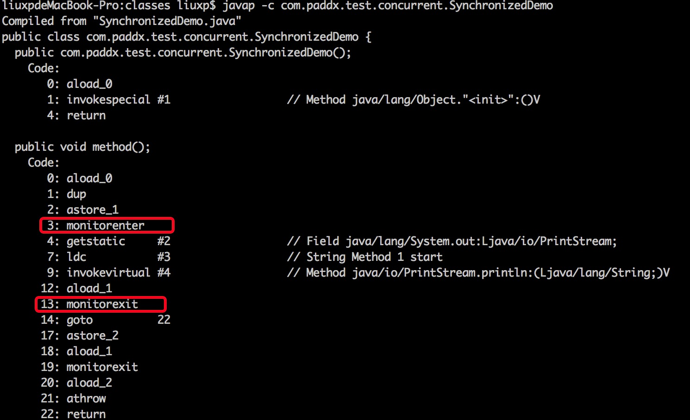

# java 多线程 
1. 多线程的几种实现方式，什么是线程安全。
    * 实现runable接口，继承thread类。
2. volatile 的原理，作用，能代替锁么。
    * Volatile利用内存栅栏机制来保持变量的一致性。不能代替锁，其只具备数据可见性一致性，不具备原子性。
    * Volatile 变量具有 synchronized 的可见性特性，但是不具备原子特性。这就是说线程能够自动发现 volatile 变量的最新值。Volatile 变量可用于提供线程安全，但是只能应用于非常有限的一组用例：多个变量之间或者某个变量的当前值与修改后值之间没有约束。因此，单独使用 volatile 还不足以实现计数器、互斥锁或任何具有与多个变量相关的不变式（Invariants）的类（例如 “start <=end”）。
    * 出于简易性或可伸缩性的考虑，您可能倾向于使用 volatile 变量而不是锁。当使用 volatile 变量而非锁时，某些习惯用法（idiom）更加易于编码和阅读。此外，volatile 变量不会像锁那样造成线程阻塞，因此也很少造成可伸缩性问题。在某些情况下，如果读操作远远大于写操作，volatile 变量还可以提供优于锁的性能优势。
    * 正确使用 volatile 变量的条件
        * 您只能在有限的一些情形下使用 volatile 变量替代锁。要使 volatile 变量提供理想的线程安全，必须同时满足下面两个条件：
            1. 对变量的写操作不依赖于当前值。
            2. 该变量没有包含在具有其他变量的不变式中。
        * 实际上，这些条件表明，可以被写入 volatile 变量的这些有效值独立于任何程序的状态，包括变量的当前状态。
        * 第一个条件的限制使 volatile 变量不能用作线程安全计数器。虽然增量操作（x++）看上去类似一个单独操作，实际上它是一个由读取－修改－写入操作序列组成的组合操作，必须以原子方式执行，而 volatile 不能提供必须的原子特性。实现正确的操作需要使 x 的值在操作期间保持不变，而 volatile 变量无法实现这点。（然而，如果将值调整为只从单个线程写入，那么可以忽略第一个条件。）
3. sleep 和 wait 的区别。
    * Sleep是休眠线程，wait是等待，sleep是thread的静态方法，wait则是object的方法。Sleep依旧持有锁，并在指定时间自动唤醒。wait则释放锁。
4. Lock 与 Synchronized 的区别。
    * 首先两者都保持了并发场景下的原子性和可见性，区别则是synchronized的释放锁机制是交由其自身控制，且互斥性在某些场景下不符合逻辑，无法进行干预，不可人为中断等。
    * 而lock常用的则有ReentrantLock和readwritelock两者，添加了类似锁投票、定时锁等候和可中断锁等候的一些特性。此外，它还提供了在激烈争用情况下更佳的性能。
    1. synchronized
        * 把代码块声明为 synchronized，有两个重要后果，通常是指该代码具有 原子性（atomicity）和 可见性（visibility）。
        1. 原子性
            * 原子性意味着个时刻，只有一个线程能够执行一段代码，这段代码通过一个monitor object保护。从而防止多个线程在更新共享状态时相互冲突。
        2. 可见性
            * 可见性则更为微妙，它要对付内存缓存和编译器优化的各种反常行为。它必须确保释放锁之前对共享数据做出的更改对于随后获得该锁的另一个线程是可见的 。
            * 作用：如果没有同步机制提供的这种可见性保证，线程看到的共享变量可能是修改前的值或不一致的值，这将引发许多严重问题。
            * 原理：当对象获取锁时，它首先使自己的高速缓存无效，这样就可以保证直接从主内存中装入变量。 同样，在对象释放锁之前，它会刷新其高速缓存，强制使已做的任何更改都出现在主内存中。 这样，会保证在同一个锁上同步的两个线程看到在 synchronized 块内修改的变量的相同值。
            * 一般来说，线程以某种不必让其他线程立即可以看到的方式（不管这些线程在寄存器中、在处理器特定的缓存中，还是通过指令重排或者其他编译器优化），不受缓存变量值的约束，但是如果开发人员使用了同步，那么运行库将确保某一线程对变量所做的更新先于对现有synchronized 块所进行的更新，当进入由同一监控器（lock）保护的另一个synchronized 块时，将立刻可以看到这些对变量所做的更新。类似的规则也存在于volatile变量上。   
            ——volatile只保证可见性，不保证原子性！
        3. 何时要同步
            * 可见性同步的基本规则是在以下情况中必须同步：
                1. 读取上一次可能是由另一个线程写入的变量
                2. 写入下一次可能由另一个线程读取的变量
            * 一致性同步：当修改多个相关值时，您想要其它线程原子地看到这组更改—— 要么看到全部更改，要么什么也看不到。
                * 这适用于相关数据项（如粒子的位置和速率）和元数据项（如链表中包含的数据值和列表自身中的数据项的链）。
            * 在某些情况中，您不必用同步来将数据从一个线程传递到另一个，因为 JVM 已经隐含地为您执行同步。这些情况包括：
                1. 由静态初始化器（在静态字段上或 static{} 块中的初始化器）
                2. 初始化数据时
                3. 访问 final 字段时 ——final对象呢？
                4. 在创建线程之前创建对象时
                5. 线程可以看见它将要处理的对象时
        4. synchronize的限制
            * synchronized是不错，但它并不完美。它有一些功能性的限制：
                1. 它无法中断一个正在等候获得锁的线程；
                2. 也无法通过投票得到锁，如果不想等下去，也就没法得到锁；
                3. 同步还要求锁的释放只能在与获得锁所在的堆栈帧相同的堆栈帧中进行，多数情况下，这没问题（而且与异常处理交互得很好），但是，确实存在一些非块结构的锁定更合适的情况。
    2. ReentrantLock
        * java.util.concurrent.lock 中的Lock 框架是锁定的一个抽象，它允许把锁定的实现作为 Java 类，而不是作为语言的特性来实现。这就为Lock 的多种实现留下了空间，各种实现可能有不同的调度算法、性能特性或者锁定语义。
        * ReentrantLock 类实现了Lock ，它拥有与synchronized 相同的并发性和内存语义，但是添加了类似锁投票、定时锁等候和可中断锁等候的一些特性。此外，它还提供了在激烈争用情况下更佳的性能。（换句话说，当许多线程都想访问共享资源时，JVM 可以花更少的时候来调度线程，把更多时间用在执行线程上。）  
        ```java
        class Outputter1 {  
            private Lock lock = new ReentrantLock();// 锁对象  
        
            public void output(String name) {         
                lock.lock();      // 得到锁  
        
                try {  
                    for(int i = 0; i < name.length(); i++) {  
                        System.out.print(name.charAt(i));  
                    }  
                } finally {  
                    lock.unlock();// 释放锁  
                }  
            }  
        } 
        ```   
        * 区别：需要注意的是，用sychronized修饰的方法或者语句块在代码执行完之后锁自动释放，而是用Lock需要我们手动释放锁，所以为了保证锁最终被释放(发生异常情况)，要把互斥区放在try内，释放锁放在finally内！！
    3. 读写锁ReadWriteLock
        * 上例中展示的是和synchronized相同的功能，那Lock的优势在哪里？
        * 例如一个类对其内部共享数据data提供了get()和set()方法，如果用synchronized，则代码如下：   
        ```java
        class syncData {      
            private int data;// 共享数据      
            public synchronized void set(int data) {  
                System.out.println(Thread.currentThread().getName() + "准备写入数据");  
                try {  
                    Thread.sleep(20);  
                } catch (InterruptedException e) {  
                    e.printStackTrace();  
                }  
                this.data = data;  
                System.out.println(Thread.currentThread().getName() + "写入" + this.data);  
            }     
            public synchronized  void get() {  
                System.out.println(Thread.currentThread().getName() + "准备读取数据");  
                try {  
                    Thread.sleep(20);  
                } catch (InterruptedException e) {  
                    e.printStackTrace();  
                }  
                System.out.println(Thread.currentThread().getName() + "读取" + this.data);  
            }  
        }
        ```   
        ```java
        public static void main(String[] args) {  
        //        final Data data = new Data();  
                final syncData data = new syncData();  
        //        final RwLockData data = new RwLockData();  
                
                //写入
                for (int i = 0; i < 3; i++) {  
                    Thread t = new Thread(new Runnable() {  
                        @Override
                public void run() {  
                            for (int j = 0; j < 5; j++) {  
                                data.set(new Random().nextInt(30));  
                            }  
                        }  
                    });
                    t.setName("Thread-W" + i);
                    t.start();
                }  
                //读取
                for (int i = 0; i < 3; i++) {  
                    Thread t = new Thread(new Runnable() {  
                        @Override
                public void run() {  
                            for (int j = 0; j < 5; j++) {  
                                data.get();  
                            }  
                        }  
                    });  
                    t.setName("Thread-R" + i);
                    t.start();
                }  
            }  
        ```
        * 我们可以用读写锁ReadWriteLock实现：
        ```java
        class Data {      
            private int data;// 共享数据  
            private ReadWriteLock rwl = new ReentrantReadWriteLock();     
            public void set(int data) {  
                rwl.writeLock().lock();// 取到写锁  
                try {  
                    System.out.println(Thread.currentThread().getName() + "准备写入数据");  
                    try {  
                        Thread.sleep(20);  
                    } catch (InterruptedException e) {  
                        e.printStackTrace();  
                    }  
                    this.data = data;  
                    System.out.println(Thread.currentThread().getName() + "写入" + this.data);  
                } finally {  
                    rwl.writeLock().unlock();// 释放写锁  
                }  
            }     
    
            public void get() {  
                rwl.readLock().lock();// 取到读锁  
                try {  
                    System.out.println(Thread.currentThread().getName() + "准备读取数据");  
                    try {  
                        Thread.sleep(20);  
                    } catch (InterruptedException e) {  
                        e.printStackTrace();  
                    }  
                    System.out.println(Thread.currentThread().getName() + "读取" + this.data);  
                } finally {  
                    rwl.readLock().unlock();// 释放读锁  
                }  
            }  
        }
        ```
        * 与互斥锁定相比，读-写锁定允许对共享数据进行更高级别的并发访问。虽然一次只有一个线程（writer 线程）可以修改共享数据，但在许多情况下，任何数量的线程可以同时读取共享数据（reader 线程）
        * 从理论上讲，与互斥锁定相比，使用读-写锁定所允许的并发性增强将带来更大的性能提高。
        * 在实践中，只有在多处理器上并且只在访问模式适用于共享数据时，才能完全实现并发性增强。——例如，某个最初用数据填充并且之后不经常对其进行修改的 collection，因为经常对其进行搜索（比如搜索某种目录），所以这样的 collection 是使用读-写锁定的理想候选者。
    4. 线程间通信Condition
        * Condition可以替代传统的线程间通信，用await()替换wait()，用signal()替换notify()，用signalAll()替换notifyAll()。
        * 为什么方法名不直接叫wait()/notify()/nofityAll()？因为Object的这几个方法是final的，不可重写！
        * 传统线程的通信方式，Condition都可以实现。
        * 注意，Condition是被绑定到Lock上的，要创建一个Lock的Condition必须用newCondition()方法。
        * Condition的强大之处在于它可以为多个线程间建立不同的Condition
            * 看JDK文档中的一个例子：假定有一个绑定的缓冲区，它支持 put 和 take 方法。如果试图在空的缓冲区上执行 take 操作，则在某一个项变得可用之前，线程将一直阻塞；如果试图在满的缓冲区上执行 put 操作，则在有空间变得可用之前，线程将一直阻塞。我们喜欢在单独的等待 set 中保存put 线程和take 线程，这样就可以在缓冲区中的项或空间变得可用时利用最佳规划，一次只通知一个线程。可以使用两个Condition 实例来做到这一点。
            * 其实就是java.util.concurrent.ArrayBlockingQueue的功能
            ```java
            class BoundedBuffer {
                final Lock lock = new ReentrantLock();          //锁对象
                final Condition notFull  = lock.newCondition(); //写线程锁
                final Condition notEmpty = lock.newCondition(); //读线程锁
                
                final Object[] items = new Object[100];//缓存队列
                int putptr;  //写索引
                int takeptr; //读索引
                int count;   //队列中数据数目
                
                //写
                public void put(Object x) throws InterruptedException {
                    lock.lock(); //锁定
                    try {
                    // 如果队列满，则阻塞<写线程>
                    while (count == items.length) {
                        notFull.await(); 
                    }
                    // 写入队列，并更新写索引
                    items[putptr] = x; 
                    if (++putptr == items.length) putptr = 0; 
                    ++count;
                
                    // 唤醒<读线程>
                    notEmpty.signal(); 
                    } finally { 
                    lock.unlock();//解除锁定 
                    } 
                }
                
                //读 
                public Object take() throws InterruptedException { 
                    lock.lock(); //锁定 
                    try {
                    // 如果队列空，则阻塞<读线程>
                    while (count == 0) {
                        notEmpty.await();
                    }
                
                    //读取队列，并更新读索引
                    Object x = items[takeptr]; 
                    if (++takeptr == items.length) takeptr = 0;
                    --count;
                
                    // 唤醒<写线程>
                    notFull.signal(); 
                    return x; 
                    } finally { 
                    lock.unlock();//解除锁定 
                    } 
                } 
            }
            ```
            * 假设缓存队列中已经存满，那么阻塞的肯定是写线程，唤醒的肯定是读线程，相反，阻塞的肯定是读线程，唤醒的肯定是写线程。
            * 那么假设只有一个Condition会有什么效果呢？缓存队列中已经存满，这个Lock不知道唤醒的是读线程还是写线程了，如果唤醒的是读线程，皆大欢喜，如果唤醒的是写线程，那么线程刚被唤醒，又被阻塞了，这时又去唤醒，这样就浪费了很多时间。
5. synchronized 的原理是什么，
    * Synchronized底层是通过监视器的enter和exit实现
    * Synchronized及其实现原理 
        * Synchronized是Java中解决并发问题的一种最常用的方法，也是最简单的一种方法。Synchronized的作用主要有三个：（1）确保线程互斥的访问同步代码（2）保证共享变量的修改能够及时可见（3）有效解决重排序问题。从语法上讲，Synchronized总共有三种用法：
            1. 修饰普通方法
            2. 修饰静态方法
            3. 修饰代码块
        1. 没有同步情况
            ```java
            package com.paddx.test.concurrent;

            public class SynchronizedTest {
                public void method1(){
                    System.out.println("Method 1 start");
                    try {
                        System.out.println("Method 1 execute");
                        Thread.sleep(3000);
                    } catch (InterruptedException e) {
                        e.printStackTrace();
                    }
                    System.out.println("Method 1 end");
                }

                public void method2(){
                    System.out.println("Method 2 start");
                    try {
                        System.out.println("Method 2 execute");
                        Thread.sleep(1000);
                    } catch (InterruptedException e) {
                        e.printStackTrace();
                    }
                    System.out.println("Method 2 end");
                }

                public static void main(String[] args) {
                    final SynchronizedTest test = new SynchronizedTest();

                    new Thread(new Runnable() {
                        @Override
                        public void run() {
                            test.method1();
                        }
                    }).start();

                    new Thread(new Runnable() {
                        @Override
                        public void run() {
                            test.method2();
                        }
                    }).start();
                }
            }
            ```
            * 执行结果如下，线程1和线程2同时进入执行状态，线程2执行速度比线程1快，所以线程2先执行完成，这个过程中线程1和线程2是同时执行的。
                ```
                Method 1 start
                Method 1 execute
                Method 2 start
                Method 2 execute
                Method 2 end
                Method 1 end
                ```
        2. 对普通方法同步：
            ```java
            package com.paddx.test.concurrent;

            public class SynchronizedTest {
                public synchronized void method1(){
                    System.out.println("Method 1 start");
                    try {
                        System.out.println("Method 1 execute");
                        Thread.sleep(3000);
                    } catch (InterruptedException e) {
                        e.printStackTrace();
                    }
                    System.out.println("Method 1 end");
                }

                public synchronized void method2(){
                    System.out.println("Method 2 start");
                    try {
                        System.out.println("Method 2 execute");
                        Thread.sleep(1000);
                    } catch (InterruptedException e) {
                        e.printStackTrace();
                    }
                    System.out.println("Method 2 end");
                }

                public static void main(String[] args) {
                    final SynchronizedTest test = new SynchronizedTest();

                    new Thread(new Runnable() {
                        @Override
                        public void run() {
                            test.method1();
                        }
                    }).start();

                    new Thread(new Runnable() {
                        @Override
                        public void run() {
                            test.method2();
                        }
                    }).start();
                }
            }
            ```
            * 执行结果如下，跟代码段一比较，可以很明显的看出，线程2需要等待线程1的method1执行完成才能开始执行method2方法。
                ```
                Method 1 start
                Method 1 execute
                Method 1 end
                Method 2 start
                Method 2 execute
                Method 2 end
                ```
        3. 静态方法（类）同步   
            ```java
            package com.paddx.test.concurrent;
 
            public class SynchronizedTest {
                public static synchronized void method1(){
                    System.out.println("Method 1 start");
                    try {
                        System.out.println("Method 1 execute");
                        Thread.sleep(3000);
                    } catch (InterruptedException e) {
                        e.printStackTrace();
                    }
                    System.out.println("Method 1 end");
                }
            
                public static synchronized void method2(){
                    System.out.println("Method 2 start");
                    try {
                        System.out.println("Method 2 execute");
                        Thread.sleep(1000);
                    } catch (InterruptedException e) {
                        e.printStackTrace();
                    }
                    System.out.println("Method 2 end");
                }
            
                public static void main(String[] args) {
                    final SynchronizedTest test = new SynchronizedTest();
                    final SynchronizedTest test2 = new SynchronizedTest();
            
                    new Thread(new Runnable() {
                        @Override
                        public void run() {
                            test.method1();
                        }
                    }).start();
            
                    new Thread(new Runnable() {
                        @Override
                        public void run() {
                            test2.method2();
                        }
                    }).start();
                }
            }
            ```
            * 执行结果如下，对静态方法的同步本质上是对类的同步（静态方法本质上是属于类的方法，而不是对象上的方法），所以即使test和test2属于不同的对象，但是它们都属于SynchronizedTest类的实例，所以也只能顺序的执行method1和method2，不能并发执行。
                ```
                Method 1 start
                Method 1 execute
                Method 1 end
                Method 2 start
                Method 2 execute
                Method 2 end
                ```
        4. 代码块同步
            ```java 
            package com.paddx.test.concurrent;

            public class SynchronizedTest {
                public void method1(){
                    System.out.println("Method 1 start");
                    try {
                        synchronized (this) {
                            System.out.println("Method 1 execute");
                            Thread.sleep(3000);
                        }
                    } catch (InterruptedException e) {
                        e.printStackTrace();
                    }
                    System.out.println("Method 1 end");
                }

                public void method2(){
                    System.out.println("Method 2 start");
                    try {
                        synchronized (this) {
                            System.out.println("Method 2 execute");
                            Thread.sleep(1000);
                        }
                    } catch (InterruptedException e) {
                        e.printStackTrace();
                    }
                    System.out.println("Method 2 end");
                }

                public static void main(String[] args) {
                    final SynchronizedTest test = new SynchronizedTest();

                    new Thread(new Runnable() {
                        @Override
                        public void run() {
                            test.method1();
                        }
                    }).start();

                    new Thread(new Runnable() {
                        @Override
                        public void run() {
                            test.method2();
                        }
                    }).start();
                }
            }
            ```
            * 执行结果如下，虽然线程1和线程2都进入了对应的方法开始执行，但是线程2在进入同步块之前，需要等待线程1中同步块执行完成。
                ```
                Method 1 start
                Method 1 execute
                Method 2 start
                Method 1 end
                Method 2 execute
                Method 2 end
                ```
    2. Synchronized 原理
        * 我们先通过反编译下面的代码来看看Synchronized是如何实现对代码块进行同步的：
            ```java
            package com.paddx.test.concurrent;

            public class SynchronizedDemo {
                public void method() {
                    synchronized (this) {
                        System.out.println("Method 1 start");
                    }
                }
            }
            ```
            * 反编译结果：      
            
            * monitorenter ：
                * 每个对象有一个监视器锁（monitor）。当monitor被占用时就会处于锁定状态，线程执monitorenter指令时尝试获取monitor的所有权，过程如下：
                    1. 如果monitor的进入数为0，则该线程进入monitor，然后将进入数设置为1，该线程即为monitor的所有者。
                    2. 如果线程已经占有该monitor，只是重新进入，则进入monitor的进入数加1.
                    3. 如果其他线程已经占用了monitor，则该线程进入阻塞状态，直到monitor的进入数为0，再重新尝试获取monitor的所有权。
            * monitorexit：　
                * 执行monitorexit的线程必须是objectref所对应的monitor的所有者。指令执行时，monitor的进入数减1，如果减1后进入数为0，那线程退出monitor，不再是这个monitor的所有者。其他被这个monitor阻塞的线程可以尝试去获取这个 monitor 的所有权。 
            * 通过这两段描述，我们应该能很清楚的看出Synchronized的实现原理，Synchronized的语义底层是通过一个monitor的对象来完成，其实wait/notify等方法也依赖于monitor对象，这就是为什么只有在同步的块或者方法中才能调用wait/notify等方法，否则会抛出java.lang.IllegalMonitorStateException的异常的原因。

6. 解释以下名词：重排序，自旋锁，偏向锁，轻量级锁，可重入锁，公平锁，非公平锁，乐观锁，悲观锁。
    1. 自旋锁
        * 自旋锁可以使线程在没有取得锁的时候，不被挂起，而转去执行一个空循环，（即所谓的自旋，就是自己执行空循环），若在若干个空循环后，线程如果可以获得锁，则继续执行。若线程依然不能获得锁，才会被挂起。
        * 使用自旋锁后，线程被挂起的几率相对减少，线程执行的连贯性相对加强。因此，对于那些锁竞争不是很激烈，锁占用时间很短的并发线程，具有一定的积极意义，但对于锁竞争激烈，单线程锁占用很长时间的并发程序，自旋锁在自旋等待后，往往毅然无法获得对应的锁，不仅仅白白浪费了CPU时间，最终还是免不了被挂起的操作 ，反而浪费了系统的资源。
        * 在JDK1.6中，Java虚拟机提供-XX:+UseSpinning参数来开启自旋锁，使用-XX:PreBlockSpin参数来设置自旋锁等待的次数。
        * 在JDK1.7开始，自旋锁的参数被取消，虚拟机不再支持由用户配置自旋锁，自旋锁总是会执行，自旋锁次数也由虚拟机自动调整。
        * 可能引起的问题：
            1. 过多占据CPU时间：如果锁的当前持有者长时间不释放该锁，那么等待者将长时间的占据cpu时间片，导致CPU资源的浪费，因此可以设定一个时间，当锁持有者超过这个时间不释放锁时，等待者会放弃CPU时间片阻塞；
            2. 死锁问题：试想一下，有一个线程连续两次试图获得自旋锁（比如在递归程序中），第一次这个线程获得了该锁，当第二次试图加锁的时候，检测到锁已被占用（其实是被自己占用），那么这时，线程会一直等待自己释放该锁，而不能继续执行，这样就引起了死锁。因此递归程序使用自旋锁应该遵循以下原则：递归程序决不能在持有自旋锁时调用它自己，也决不能在递归调用时试图获得相同的自旋锁。
    2. 阻塞锁
        * 让线程进入阻塞状态进行等待，当获得相应的信号（唤醒，时间） 时，才可以进入线程的准备就绪状态，准备就绪状态的所有线程，通过竞争，进入运行状态。。JAVA中，能够进入\退出、阻塞状态或包含阻塞锁的方法有 ，synchronized 关键字（其中的重量锁），ReentrantLock，Object.wait()\notify()
    3. 可重入锁
        * 可重入锁，也叫做递归锁，指的是同一线程 外层函数获得锁之后 ，内层递归函数仍然有获取该锁的代码，但不受影响。在JAVA环境下 ReentrantLock 和synchronized 都是 可重入锁
    4. 悲观锁和乐观锁
        * 悲观锁(Pessimistic Lock), 顾名思义就是很悲观，每次去拿数据的时候都认为别人会修改，所以每次在拿数据的时候都会上锁，这样别人想拿这个数据就会block直到它拿到锁。传统的关系型数据库里边就用到了很多这种锁机制，比如行锁，表锁等，读锁，写锁等，都是在做操作之前先上锁。独占锁是悲观锁的一种实现
        * 乐观锁(Optimistic Lock), 顾名思义，就是很乐观，每次去拿数据的时候都认为别人不会修改，所以不会上锁，但是在更新的时候会判断一下在此期间别人有没有去更新这个数据，可以使用版本号等机制。乐观锁适用于多读的应用类型，这样可以提高吞吐量，像数据库如果提供类似于write_condition机制的其实都是提供的乐观锁。使用CAS来保证,保证这个操作的原子性
        * 两种锁各有优缺点，不可认为一种好于另一种，像乐观锁适用于写比较少的情况下，即冲突真的很少发生的时候，这样可以省去了锁的开销，加大了系统的整个吞吐量。但如果经常产生冲突，上层应用会不断的进行retry，这样反倒是降低了性能，所以这种情况下用悲观锁就比较合适。
    5. 轮询锁和定时锁
        * 由tryLock实现，与无条件获取锁模式相比，它们具有更完善的错误恢复机制。可避免死锁的发生：boolean tryLock()：仅在调用时锁为空闲状态才获取该锁。如果锁可用，则获取锁，并立即返回值 true。如果锁不可用，则此方法将立即返回值 false。
        * boolean tryLock(long time, TimeUnit unit) throws InterruptedException：如果锁在给定的等待时间内空闲，并且当前线程未被中断，则获取锁。
        * boolean tryLock(long time, TimeUnit unit) throws InterruptedException：如果锁在给定的等待时间内空闲，并且当前线程未被中断，则获取锁。
        * 如果锁可用，则此方法将立即返回值 true。如果锁不可用，出于线程调度目的，将禁用当前线程，并且在发生以下三种情况之一前，该线程将一直处于休眠状态：锁由当前线程获得；或者其他某个线程中断当前线程，并且支持对锁获取的中断；或者已超过指定的等待时间如果获得了锁，则返回值 true。   
        如果当前线程：在进入此方法时已经设置了该线程的中断状态；或者在获取锁时被中断，并且支持对锁获取的中断，则将抛出 InterruptedException，并会清除当前线程的已中断状态。如果超过了指定的等待时间，则将返回值 false。如果 time 小于等于 0，该方法将完全不等待。  
        如果当前线程：   
        在进入此方法时已经设置了该线程的中断状态；或者在获取锁时被中断，并且支持对锁获取的中断，则将抛出 InterruptedException，并会清除当前线程的已中断状态。如果超过了指定的等待时间，则将返回值 false。如果 time 小于等于 0，该方法将完全不等待。
    6. 显示锁和内置锁
        * 显示锁用Lock来定义、内置锁用syschronized。
        内置锁：每个java对象都可以用做一个实现同步的锁，这些锁成为内置锁。线程进入同步代码块或方法的时候会自动获得该锁，在退出同步代码块或方法时会释放该锁。获得内置锁的唯一途径就是进入这个锁的保护的同步代码块或方法。内置锁是互斥锁。
    7. 读-写锁
        * Lock接口以及对象，使用它，很优雅的控制了竞争资源的安全访问，但是这种锁不区分读写，称这种锁为普通锁。为了提高性能，Java提供了读写锁，在读的地方使用读锁，在写的地方使用写锁，灵活控制，如果没有写锁的情况下，读是无阻塞的,在一定程度上提高了程序的执行效率。
        Java中读写锁有个接口java.util.concurrent.locks.ReadWriteLock，也有具体的实现ReentrantReadWriteLock，详细的API可以查看JavaAPI文档。
        ReentrantReadWriteLock 和 ReentrantLock 不是继承关系，但都是基于 AbstractQueuedSynchronizer 来实现。
        * lock方法 是基于CAS 来实现的
        * ReadWriteLock中暴露了两个Lock对象：
        * 在读写锁的加锁策略中，允许多个读操作同时进行，但每次只允许一个写操作。读写锁是一种性能优化的策略。
        * RentrantReadWriteLock在构造时也可以选择是一个非公平的锁（默认）还是公平的锁。
    8. 对象锁和类锁
        * java的对象锁和类锁在锁的概念上基本上和内置锁是一致的，但是，两个锁实际是有很大的区别的，对象锁是用于对象实例方法，或者一个对象实例上的，类锁是用于类的静态方法或者一个类的class对象上的。
        类的对象实例可以有很多个，但是每个类只有一个class对象，所以不同对象实例的对象锁是互不干扰的，但是每个类只有一个类锁。但是有一点必须注意的是，其实类锁只是一个概念上的东西，并不是真实存在的，它只是用来帮助我们理解锁定实例方法和静态方法的区别的.
        * synchronized只是一个内置锁的加锁机制，当某个方法加上synchronized关键字后，就表明要获得该内置锁才能执行，并不能阻止其他线程访问不需要获得该内置锁的方法。
        * 调用对象wait()方法时，会释放持有的对象锁，以便于调用notify方法使用。notify()调用之后，会等到notify所在的线程执行完之后再释放锁
    9. 15 无锁状态-》偏向锁-》轻量级锁-》重量级锁。锁膨胀
        * 锁的状态总共有四种：无锁状态、偏向锁、轻量级锁和重量级锁。随着锁的竞争，锁可以从偏向锁升级到轻量级锁，再升级的重量级锁（但是锁的升级是单向的，也就是说只能从低到高升级，不会出现锁的降级）。JDK 1.6中默认是开启偏向锁和轻量级锁的，
        * 锁膨胀：从轻量锁膨胀到重量级锁是在轻量级锁解锁过程发生的。
        * 重量级锁：Synchronized是通过对象内部的一个叫做监视器锁（monitor）来实现的。但是监视器锁本质又是依赖于底层的操作系统的Mutex Lock来实现的。而操作系统实现线程之间的切换这就需要从用户态转换到核心态，这个成本非常高，状态之间的转换需要相对比较长的时间，这就是为什么Synchronized效率低的原因。因此，这种依赖于操作系统Mutex Lock所实现的锁我们称之为“重量级锁”。
        * 轻量级锁：“轻量级”是相对于使用操作系统互斥量来实现的传统锁而言的。但是，首先需要强调一点的是，轻量级锁并不是用来代替重量级锁的，它的本意是在没有多线程竞争的前提下，减少传统的重量级锁使用产生的性能消耗。在解释轻量级锁的执行过程之前，先明白一点，轻量级锁所适应的场景是线程交替执行同步块的情况，如果存在同一时间访问同一锁的情况，就会导致轻量级锁膨胀为重量级锁。
        * 偏向锁：　引入偏向锁是为了在无多线程竞争的情况下尽量减少不必要的轻量级锁执行路径，因为轻量级锁的获取及释放依赖多次CAS原子指令，而偏向锁只需要在置换ThreadID的时候依赖一次CAS原子指令（由于一旦出现多线程竞争的情况就必须撤销偏向锁，所以偏向锁的撤销操作的性能损耗必须小于节省下来的CAS原子指令的性能消耗）。上面说过，轻量级锁是为了在线程交替执行同步块时提高性能，而偏向锁则是在只有一个线程执行同步块时进一步提高性能。
        * 无锁状态：在代码进入同步块的时候，如果同步对象锁状态为无锁状态。
        
7. 用过哪些原子类，他们的原理是什么。
    * AtomicInteger； AtomicLong； AtomicReference； AtomicBoolean；基于CAS原语实现 ，比较并交换、加载链接/条件存储，最坏的情况下是旋转锁
    https://www.ibm.com/developerworks/cn/java/j-jtp11234/index.html   
     
    http://www.jmatrix.org/java/848.html

8. 用过线程池吗，newCache 和 newFixed 有什么区别，他们的原理简单概括下，构造函数的各个参数的含义是什么，比如 coreSize，maxsize 等。
    * newSingleThreadExecutor返回一个包含单线程的Executor,将多个任务交给此Exector时，这个线程处理完一个任务后接着处理下一个任务，若该线程出现异常，将会有一个新的线程来替代。
    * newFixedThreadPool返回一个包含指定数目线程的线程池，如果任务数量多于线程数目，那么没有没有执行的任务必须等待，直到有任务完成为止。
    * newCachedThreadPool根据用户的任务数创建相应的线程来处理，该线程池不会对线程数目加以限制，完全依赖于JVM能创建线程的数量，可能引起内存不足。
    * 底层是基于ThreadPoolExecutor实现，借助reentrantlock保证并发。coreSize核心线程数，maxsize最大线程数。
    * http://ifeve.com/java-threadpoolexecutor/


