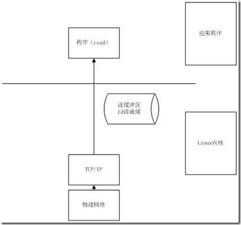
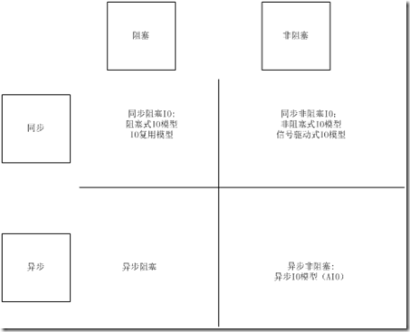
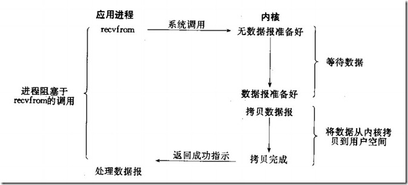
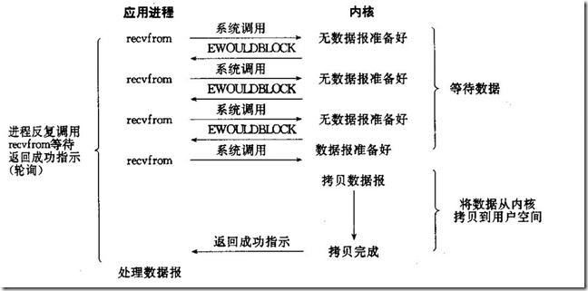
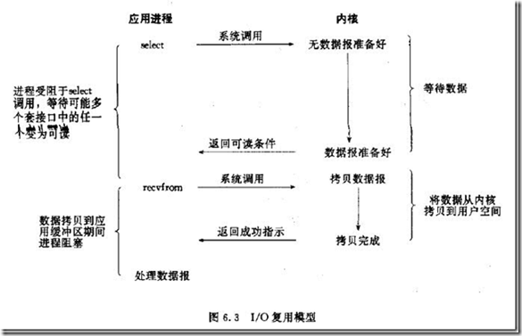
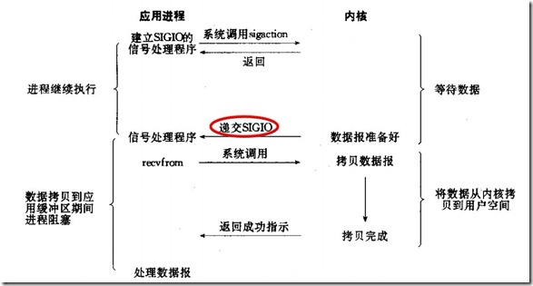
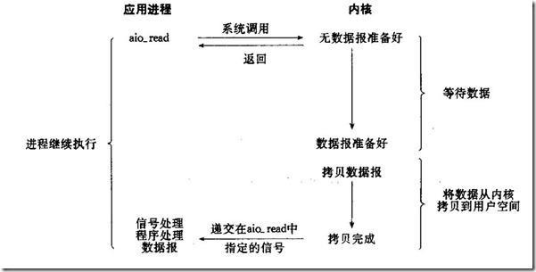
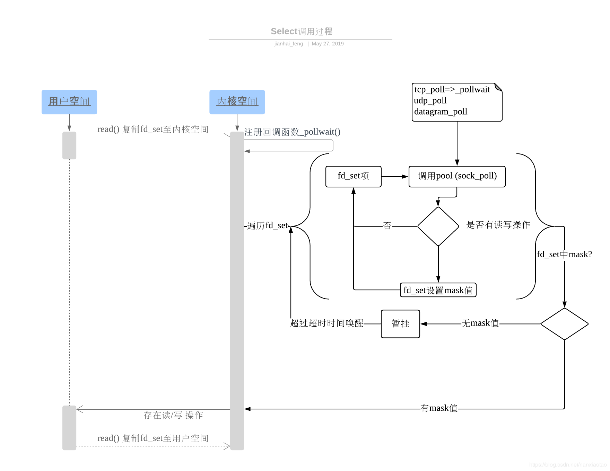

# 操作系统笔记
1. Linux 系统下你关注过哪些内核参数，说说你知道的。
    1. Linux服务器内核网络参数优化
        * 由于TCP协议缺陷被恶意利用Syn-Flood攻击，Linux内核调整这些参数可缓解这类攻击：
            ```
            net.ipv4.tcp_syncookies = 1
            #启用syncookies
            net.ipv4.tcp_max_syn_backlog = 8192
            #SYN队列长度
            net.ipv4.tcp_synack_retries=2
            #SYN ACK重试次数
            ```
        * Linux服务器作为网关或代理时TIME-WAIT较多，可通过以下参数优化调整：
            ```
            net.ipv4.tcp_fin_timeout = 30
            #主动关闭方FIN-WAIT-2超时时间
            net.ipv4.tcp_keepalive_time = 1200
            #TCP发送keepalive消息的频度
            net.ipv4.tcp_tw_reuse = 1
            #开启TIME-WAIT重用
            net.ipv4.tcp_tw_recycle = 1
            #开启TIME-WAIT快速回收
            net.ipv4.ip_local_port_range = 1024 65000
            #向外连接的端口范围
            net.ipv4.tcp_max_tw_buckets = 5000
            #最大TIME-WAIT数量，超过立即清除
            net.ipv4.tcp_syn_retries = 2
            #SYN重试次数
            ```
        * 其它一些参数优化：
            ```
            net.ipv4.tcp_rmem = 4096 87380 4194304
            #TCP接收缓冲大小，对应最小、默认、最大
            net.ipv4.tcp_wmem = 4096 16384 4194304
            #TCP发送缓冲大小，对应最小、默认、最大
            net.core.rmem_max = 16777216
            #最大发送套接字缓冲区大小
            net.core.wmem_max = 16777216
            #最大接收套接字缓冲区大小
            net.core.netdev_max_backlog = 262144
            #当网络接口接收速率比内核处理快时允许发到队列的数据包数目
            net.core.somaxconn = 262144
            #最大连接队列，超过导致连接超时或重传
            ```
2. Linux 下 IO 模型有几种，各自的含义是什么。
    * 阻塞式io，非阻塞io，io复用模型，信号驱动io模型，异步io模型。
    * Linux将所有外部设备都看做一个文件来进行操作。因此，linux对所有外部设备的操作都可以看做是文件的操作。文件的操作当然需要有个标示描述它，这就是文件描述符（file descriptor）。
    1. linux的IO操作如何形象理解呢？
        * 我们说网络socket的read（）是一个IO操作命令，具体流程是这样的：
            1. 应用程序调用read命令，通知内核需要做读取数据操作
            2. 内核创建一个文件描述符
            3. 内核从物理层收到读数据的命令，从网络中获取数据包
            4. 数据包传递到TCP/IP层，解析数据包的头
            5. 内核将数据包缓存在文件描述符的读缓存区（接受缓存区）中，注意这里的读缓存区是在内核中的
            6. 当文件描述符读缓存区数据字节数大于应用程序定义的低水位的时候（read的一个参数），此时文件描述符处于读就绪的状态
            7. 将读缓存区中的数据复制到应用程序（用户区）返回   
               
            * 这里需要说明的是
                1. 每个文件描述符都有自己的读缓冲区和写缓冲区，读缓冲区对应的是read操作，写缓冲区对应的就是write操作了
                2. 读缓冲区和写缓冲区都是在内核区中
    2. 现有的linux IO模型有5种：
        * 阻塞式IO模型，非阻塞式IO模型，IO复用模型，信号驱动式IO模型，异步IO模型;经常弄不清楚的就是阻塞，非阻塞，异步，同步     
          
        * 上图给出的同步异步标准是：数据描述符缓存是由谁来进行读取的？由用户程序读取，则判断为同步；由内核推送，判断为异步
        * 上图给出的阻塞非阻塞标准是：调用的用户进程是否是阻塞的状态
    3.  阻塞式IO模型
           
        * 这个模型也是最容易理解的程序调用和我们基本的程序编写是一致的：

            fd = connect()

            write(fd)

            read(fd)

            close(fd)

            程序的read必须在write之后执行，当write阻塞住了，read就不能执行下去
    4. 非阻塞IO模型    
           
        * 从图中可以看出来，这是一个轮询的过程   
          每次用户询问内核是否有数据报准备好（文件描述符缓冲区是否就绪），当数据报准备好的时候，就进行拷贝数据报的操作。当数据报没有准备好的时候，也不阻塞程序，内核直接返回未准备就绪的信号，等待用户程序的下一次轮询。 
    5. I/O复用模型    
        
        * IO复用模型是多了一个select函数，select函数有一个参数是文件描述符集合，意思就是对这些的文件描述符进行循环监听，当某个文件描述符就绪的时候，就对这个文件描述符进行处理。这种IO模型是属于阻塞的IO。但是由于它可以对多个文件描述符进行阻塞监听，所以它的效率比阻塞IO模型高效。
    6. 信号驱动IO模型   
           
        * 信号驱动IO模型是应用进程告诉内核：当你的数据报准备好的时候，给我发送一个信号哈，并且调用我的信号处理函数来获取数据报。这个模型是由信号进行驱动。
    7. 异步IO模型   
        
        * 异步IO使用的不再是read和write的系统接口了，应用工程序调用aio_XXXX系列的内核接口。当应用程序调用aio_read的时候，内核一方面去取数据报内容返回，另外一方面将程序控制权还给应用进程，应用进程继续处理其他事务。这样应用进程就是一种非阻塞的状态。当内核的数据报就绪的时候，是由内核将数据报拷贝到应用进程中，返回给aio_read中定义好的函数处理程序。
3. Linux中select poll和epoll的区别
    * select的本质是采用32个整数的32位，即32*32= 1024来标识，fd值为1-1024。当fd的值超过1024限制时，就必须修改FD_SETSIZE的大小。这个时候就可以标识32*max值范围的fd。    
    对于单进程多线程，每个线程处理多个fd的情况，select是不适合的。
        1. 所有的线程均是从1-32*max进行扫描，每个线程处理的均是一段fd值，这样做有点浪费    
        2. 1024上限问题，一个处理多个用户的进程，fd值远远大于1024
    * 所以这个时候应该采用poll   
        poll传递的是数组头指针和该数组的长度，只要数组的长度不是很长，性能还是很不错的，因为poll一次在内核中申请4K（一个页的大小来存放fd），尽量控制在4K以内
    * epoll还是poll的一种优化，返回后不需要对所有的fd进行遍历，在内核中维持了fd的列表。select和poll是将这个内核列表维持在用户态，然后传递到内核中。但是只有在2.6的内核才支持。   
    epoll更适合于处理大量的fd ，且活跃fd不是很多的情况，毕竟fd较多还是一个串行的操作
    1. select
        * select最早于1983年出现在4.2BSD中，它通过一个select()系统调用来监视多个文件描述符的数组，当select()返回后，该数组中就绪的文件描述符便会被内核修改标志位，使得进程可以获得这些文件描述符从而进行后续的读写操作。
        * select目前几乎在所有的平台上支持，其良好跨平台支持也是它的一个优点，事实上从现在看来，这也是它所剩不多的优点之一。
        * select的一个缺点在于单个进程能够监视的文件描述符的数量存在最大限制，在Linux上一般为1024，不过可以通过修改宏定义甚至重新编译内核的方式提升这一限制。
        * 另外，select()所维护的存储大量文件描述符的数据结构，随着文件描述符数量的增大，其复制的开销也线性增长。同时，由于网络响应时间的延迟使得大量TCP连接处于非活跃状态，但调用select()会对所有socket进行一次线性扫描，所以这也浪费了一定的开销。   
           
        时间复杂度:O(n)

        * fd_set(监听的端口个数)：32位机默认是1024个，64位机默认是2048。

        * 缺点：   
            1. 单进程可以打开fd有限制；   
            2. 对socket进行扫描时是线性扫描，即采用轮询的方法，效率较低；   
            3. 用户空间和内核空间的复制非常消耗资源；
    2. poll 
        * poll在1986年诞生于System V Release 3，它和select在本质上没有多大差别，但是poll没有最大文件描述符数量的限制。
        * poll和select同样存在一个缺点就是，包含大量文件描述符的数组被整体复制于用户态和内核的地址空间之间，而不论这些文件描述符是否就绪，它的开销随着文件描述符数量的增加而线性增大。
        * 另外，select()和poll()将就绪的文件描述符告诉进程后，如果进程没有对其进行IO操作，那么下次调用select()和poll()的时候将再次报告这些文件描述符，所以它们一般不会丢失就绪的消息，这种方式称为水平触发（Level Triggered）。
        * 其和select不同的地方：采用链表的方式替换原有fd_set数据结构,而使其没有连接数的限制。
    3. epoll
        * 直到Linux2.6才出现了由内核直接支持的实现方法，那就是epoll，它几乎具备了之前所说的一切优点，被公认为Linux2.6下性能最好的多路I/O就绪通知方法。
        * epoll可以同时支持水平触发和边缘触发（Edge Triggered，只告诉进程哪些文件描述符刚刚变为就绪状态，它只说一遍，如果我们没有采取行动，那么它将不会再次告知，这种方式称为边缘触发），理论上边缘触发的性能要更高一些，但是代码实现相当复杂。epoll同样只告知那些就绪的文件描述符，而且当我们调用epoll_wait()获得就绪文件描述符时，返回的不是实际的描述符，而是一个代表就绪描述符数量的值，你只需要去epoll指定的一个数组中依次取得相应数量的文件描述符即可，这里也使用了内存映射（mmap）技术，这样便彻底省掉了这些文件描述符在系统调用时复制的开销。
        * 另一个本质的改进在于epoll采用基于事件的就绪通知方式。在select/poll中，进程只有在调用一定的方法后，内核才对所有监视的文件描述符进行扫描，而epoll事先通过epoll_ctl()来注册一个文件描述符，一旦基于某个文件描述符就绪时，内核会采用类似callback的回调机制，迅速激活这个文件描述符，当进程调用epoll_wait()时便得到通知。   
            
        * epoll的两种工作方式：
            * 1.水平触发（LT）2.边缘触发（ET）    
            * LT模式：若就绪的事件一次没有处理完要做的事件，就会一直去处理。即就会将没有处理完的事件继续放回到就绪队列之中（即那个内核中的链表），一直进行处理。    
            * ET模式：就绪的事件只能处理一次，若没有处理完会在下次的其它事件就绪时再进行处理。而若以后再也没有就绪的事件，那么剩余的那部分数据也会随之而丢失。    
            * 由此可见：ET模式的效率比LT模式的效率要高很多。只是如果使用ET模式，就要保证每次进行数据处理时，要将其处理完，不能造成数据丢失，这样对编写代码的人要求就比较高。    
            * 注意：ET模式只支持非阻塞的读写：为了保证数据的完整性。
        * https://blog.csdn.net/qq546770908/article/details/53082870?depth_1-utm_source=distribute.pc_relevant.none-task&utm_source=distribute.pc_relevant.none-task


