# Mysql 面试笔记
1. 数据库隔离级别有哪些，各自的含义是什么，MYSQL 默认的隔离级别是是什么。
    1. 未提交读(Read Uncommitted)：允许脏读，也就是可能读取到其他会话中未提交事务修改的数据。
    2. 提交读(Read Committed)：只能读取到已经提交的数据。Oracle等多数数据库默认都是该级别 (不重复读)
    3. 可重复读(Repeated Read)：可重复读。在同一个事务内的查询都是事务开始时刻一致的，InnoDB默认级别。在SQL标准中，该隔离级别消除了不可重复读，但是还存在幻象读
    4. 串行读(Serializable)：完全串行化的读，每次读都需要获得表级共享锁，读写相互都会阻塞   
    MYSQL默认是RepeatedRead级别
    * 什么是事务
        * 事务是应用程序中一系列严密的操作，所有操作必须成功完成，否则在每个操作中所作的所有更改都会被撤消。也就是事务具有原子性，一个事务中的一系列的操作要么全部成功，要么一个都不做。
        * 事务的结束有两种，当事务中的所以步骤全部成功执行时，事务提交。如果其中一个步骤失败，将发生回滚操作，撤消撤消之前到事务开始时的所以操作。
    * 事务的四个特性
        * 事务具有四个特征：原子性（ Atomicity ）、一致性（ Consistency ）、隔离性（ Isolation ）和持续性（ Durability ）。这四个特性简称为 ACID 特性。
        1. 原子性。事务是数据库的逻辑工作单位，事务中包含的各操作要么都做，要么都不做
        2. 一致性。事务执行的结果必须是使数据库从一个一致性状态变到另一个一致性状态。因此当数据库只包含成功事务提交的结果时，就说数据库处于一致性状态。如果数据库系统运行中发生故障，有些事务尚未完成就被迫中断，这些未完成事务对数据库所做的修改有一部分已写入物理数据库，这时数据库就处于一种不正确的状态，或者说是 不一致的状态。
        3. 隔离性。一个事务的执行不能其它事务干扰。即一个事务内部的操作及使用的数据对其它并发事务是隔离的，并发执行的各个事务之间不能互相干扰。
        4. 持续性。也称永久性，指一个事务一旦提交，它对数据库中的数据的改变就应该是永久性的。接下来的其它操作或故障不应该对其执行结果有任何影响。
    * Mysql的四种隔离级别
        * `Read uncommitted` ： 读未提交，顾名思义，就是一个事务可以读取另一个未提交事务的数据。
            * 事例：老板要给程序员发工资，程序员的工资是3.6万/月。但是发工资时老板不小心按错了数字，按成3.9万/月，该钱已经打到程序员的户口，但是事务还没有提交，就在这时，程序员去查看自己这个月的工资，发现比往常多了3千元，以为涨工资了非常高兴。但是老板及时发现了不对，马上回滚差点就提交了的事务，将数字改成3.6万再提交。
            * 分析：实际程序员这个月的工资还是3.6万，但是程序员看到的是3.9万。他看到的是老板还没提交事务时的数据。这就是脏读。
        * 那怎么解决脏读呢？Read committed！读提交，能解决脏读问题。
        * `Read committed` ： 读提交，顾名思义，就是一个事务要等另一个事务提交后才能读取数据。
            * 事例：程序员拿着信用卡去享受生活（卡里当然是只有3.6万），当他埋单时（程序员事务开启），收费系统事先检测到他的卡里有3.6万，就在这个时候！！程序员的妻子要把钱全部转出充当家用，并提交。当收费系统准备扣款时，再检测卡里的金额，发现已经没钱了（第二次检测金额当然要等待妻子转出金额事务提交完）。程序员就会很郁闷，明明卡里是有钱的…
            * 分析：这就是读提交，若有事务对数据进行更新（UPDATE）操作时，读操作事务要等待这个更新操作事务提交后才能读取数据，可以解决脏读问题。但在这个事例中，出现了一个事务范围内两个相同的查询却返回了不同数据，这就是不可重复读。
        * 那怎么解决可能的不可重复读问题？Repeatable read ！
        * `Repeatable read` ： 重复读，就是在开始读取数据（事务开启）时，不再允许修改操作。
            * 事例：程序员拿着信用卡去享受生活（卡里当然是只有3.6万），当他买单时（事务开启，不允许其他事务的UPDATE修改操作），收费系统事先检测到他的卡里有3.6万。这个时候他的妻子不能转出金额了。接下来收费系统就可以扣款了。
            * 分析：重复读可以解决不可重复读问题。写到这里，应该明白的一点就是，不可重复读对应的是修改，即UPDATE操作。但是可能还会有幻读问题。因为幻读问题对应的是插入INSERT操作，而不是UPDATE操作。
        * 什么时候会出现幻读？
            * 事例：程序员某一天去消费，花了2千元，然后他的妻子去查看他今天的消费记录（全表扫描FTS，妻子事务开启），看到确实是花了2千元，就在这个时候，程序员花了1万买了一部电脑，即新增INSERT了一条消费记录，并提交。当妻子打印程序员的消费记录清单时（妻子事务提交），发现花了1.2万元，似乎出现了幻觉，这就是幻读。
        * 那怎么解决幻读问题？Serializable！
        * `Serializable` 序列化
            * Serializable 是最高的事务隔离级别，在该级别下，事务串行化顺序执行，可以避免脏读、不可重复读与幻读。但是这种事务隔离级别效率低下，比较耗数据库性能，一般不使用。
        * 值得一提的是：大多数数据库默认的事务隔离级别是Read committed，比如Sql Server , Oracle。Mysql的默认隔离级别是Repeatable read。   
        * 隔离级别 | 脏读 | 不可重复读 | 幻读
          -|-|-|-|
          Read uncommitted | √ | √| √
          Read committed| × | √| √
          Repeatable read | × | × | √
          Serializable | ×  | × | ×
2. MYSQL 有哪些存储引擎，各自优缺点。
    * `MyISAM`、`InnoDB`、`MERGE`、`MEMORY(HEAP)`、`BDB(BerkeleyDB)`等，最常用的是`MyISAM`与`InnoDB`两个引擎 
    1. `InnoDB` 引擎(MySQL5.5以后默认使用)
        * MySQL 5.5 及以后版本中的默认存储引擎，他的优点如下：
            1. 灾难恢复性好
            2. 支持事务
            3. 使用行级锁
            4. 支持外键关联
            5. 支持热备份
        * 对于InnoDB引擎中的表，其数据的物理组织形式是簇表（Cluster Table），主键索引和数据是在一起的，数据按主键的顺序物理分布
        * 实现了缓冲管理，不仅能缓冲索引也能缓冲数据，并且会自动创建散列索引以加快数据的获取支持热备份
    2. MyISAM引擎
        * 特性如下：
            1. 不支持事务
            2. 使用表级锁，并发性差
            3. 主机宕机后，MyISAM表易损坏，灾难恢复性不佳
            4. 可以配合锁，实现操作系统下的复制备份、迁移
            5. 只缓存索引，数据的缓存是利用操作系统缓冲区来实现的。可能引发过多的系统调用且效率不佳
            6. 数据紧凑存储，因此可获得更小的索引和更快的全表扫描性能
    3. 两种存储引擎的大致区别表现在：
        1. InnoDB支持事务，MyISAM不支持，这一点是非常之重要。事务是一种高级的处理方式，如在一些列增删改中只要哪个出错还可以回滚还原，而MyISAM就不可以了。
        2. MyISAM适合查询以及插入为主的应用，InnoDB适合频繁修改以及涉及到安全性较高的应用
        3. InnoDB支持外键，MyISAM不支持
        4. 从MySQL5.5.5以后，InnoDB是默认引擎
        5. InnoDB不支持FULLTEXT类型的索引
        6. InnoDB中不保存表的行数，如select count(*) from table时，InnoDB需要扫描一遍整个表来计算有多少行，但是MyISAM只要简单的读出保存好的行数即可。注意的是，当count(*)语句包含where条件时MyISAM也需要扫描整个表。
        7. 对于自增长的字段，InnoDB中必须包含只有该字段的索引，但是在MyISAM表中可以和其他字段一起建立联合索引。
        8. 清空整个表时，InnoDB是一行一行的删除，效率非常慢。MyISAM则会重建表。
        9. InnoDB支持行锁（某些情况下还是锁整表，如 update table set a=1 where user like '%lee%'
        * 有人说MYISAM只能用于小型应用，其实这只是一种偏见。
        * 如果数据量比较大，这是需要通过升级架构来解决，比如分表分库，读写分离，而不是单纯地依赖存储引擎。现在一般都是选用InnoDB了，主要是MyISAM的全表锁，读写串行问题，并发效率锁表，效率低，MyISAM对于读写密集型应用一般是不会去选用的。
    * 总之：
        1. MyISAM类型不支持事务处理等高级处理，而InnoDB类型支持。
        2. MyISAM类型的表强调的是性能，其执行速度比InnoDB类型更快，但是不提供事务支持，而InnoDB提供事务支持已经外部键等高级数据库功能。
3. 高并发下，如何做到安全的修改同一行数据。
    * 使用悲观锁 悲观锁本质是当前只有一个线程执行操作，结束了唤醒其他线程进行处理。也可以缓存队列中锁定主键。
4. 乐观锁和悲观锁是什么，INNODB 的行级锁有哪 2 种，解释其含义。
    * 乐观锁是设定每次修改都不会冲突，只在提交的时候去检查，悲观锁设定每次修改都会冲突，持有排他锁。
    * 行级锁分为共享锁和排他锁两种 共享锁又称读锁 排他锁又称写锁
    1. 乐观锁
        * 乐观锁（Optimistic Concurrency Control，缩写”OCC”）：是一种并发控制的方法。乐观的认为多用户并发的事务在处理时不会彼此互相影响，各事务能够在使用锁的情况下处理各自的数据。在提交更新数据之前，每个事务会先检查该事务读取数据后，有没有其他事务又修改了该数据。如果其他事务有更新的话，正在提交的事务会进行回滚。不过，当需求多为更新数据时，就会增大数据之间的冲突，也就增大 CPU 的计算开销，此时不建议使用。数据是否修改的标准是：   
        对表中的数据进行操作时，先给表中最新的数据加一个版本(version)字段，每操作一次，将该记录的版本号加1。也就是先查询出该记录，获取 version 字段，修改完数据后准备提交之前，先判断此刻 version 的值是否与刚刚查询出来时的 version 的值相等，如果相等，则说明这段期间，没有其他程序对其进行操作，则可以执行更新，并将 version 字段的值加1；如果更新时发现此刻的 version 值与刚刚获取出来的 version 的值不相等，则说明这段期间已经有其他程序对其进行操作了，则不进行更新操作。
        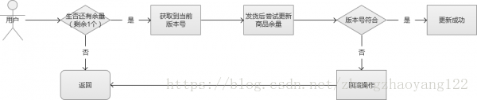
        ```sql
        --1.查询出商品信息
        select (status,version) from t_goods where id=#{id}
        --2.根据商品信息生成订单
        --3.修改商品status为2
        update t_goods
        set status=2,version=version+1
        where id=#{id} and version=#{version};
        ```
    2. 悲观锁
        * 悲观锁（Pessimistic Concurrency Control，缩写”PCC”）：与乐观锁相对应的就是悲观锁。悲观锁就是在操作数据时，认为此操作会出现数据冲突，所以在进行每次操作时都要通过获取锁才能进行对相同数据的操作，这点跟 java 中的 synchronized 很相似，所以悲观锁需要耗费较多的时间。所以悲观锁并发控制主要用于数据争用激烈的环境，以及发生并发冲突时使用锁保护数据的成本要低于回滚事务的成本的环境中。另外与乐观锁相对应的，悲观锁是由数据库自己实现了的，要用的时候，我们直接调用数据库的相关语句就可以了。说到这里，由悲观锁涉及到的另外两个锁概念就出来了，它们就是共享锁与排它锁。共享锁和排它锁是悲观锁的不同的实现，它俩都属于悲观锁的范畴。      
        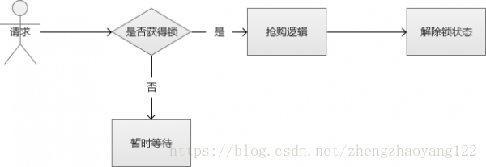
        * 注意：要使用悲观锁，就必须关闭 Mysql 数据库的自动提交属性，因为 MySQL 默认使用 autocommit 模式，也就是说，当你执行一个更新操作后，MySQL会立刻将结果进行提交。关闭设置：set autocommit=0;
        ```sql
        --0.开始事务
        begin;/begin work;/start transaction; (三者选一就可以)
        --1.查询出商品信息
        select status from t_goods where id=1 for update;
        --2.根据商品信息生成订单
        insert into t_orders (id,goods_id) values (null,1);
        --3.修改商品status为2
        update t_goods set status=2;
        --4.提交事务
        commit;/commit work;
        ```
    * InnoDB的标准行级锁有哪2种：
        1. ♬共享锁(读锁)：共享锁指的就是对于多个不同的事务，对同一个资源共享同一个锁，在执行语句后面加上 lock in share mode 就代表对某些资源加上共享锁。
        2. ♬排它锁（写锁）：排它锁与共享锁相对应，就是指对于多个不同的事务，对同一个资源只能有一把锁。在需要执行的语句后面加上 for update 就可以了。对于 update、insert、delete 语句会自动加排它锁。
    * 总结：乐观锁适用于多读的应用类型，这样可以提高吞吐量，像数据库如果提供类似于 write_condition 机制，其实都是提供的乐观锁。如果经常发生冲突，上层应用会不断进行 retry，这样反而降低了性能，所以这种情况下用悲观锁比较合适

5. SQL 优化的一般步骤是什么，怎么看执行计划，如何理解其中各个字段的含义
    * 在开发过程中，虽然感觉优化sql语句很重要，但是往往更加重视的是功能实现，为了使自己以后写Mysql语句效率更高，有必要对Mysql优化做一个小小归纳。
    1. 步骤一、通过show status 命令了解各种sql执行的效率
        * how [session|gobal] status
        * session级别表示统计当前连接的结果。
        * global级别表示统计自数据上次启动至今的结果。
        * 如果不写级别，默认的是session级别
        * eg：SHOW GLOBAL STATUS;
        * 主要参数描述：
            1. Connections：视图连接mysql服务器的次数
            2. Uptime：服务器工作时间
            3. Slow_queries:慢查询的次数
            4. Com_xxx表示每个xxx语句执行的次数
            5. Com_select  执行select次数
            6. Com_insert  执行insert次数，批量插入时候，只累加1次
            7. Com_update 执行Update操作次数
            8. Com_delete 执行删除操作次数
            9. innodb_rows_xxx类型的参数只对innodb存储引擎有效
        * 解析：通过上面一些参数，可以容易了解当前数据库的应用时插入更新为主还是查询为主，以及执行比例。对应更新操作的计数，是对执行次数的计数，不论提交还是回滚都会累加。
    2. 步骤二：定位执行效率较低的sql语句
        * 通过慢查询日志定位哪些是执行效率的sql语句。用--log-slow-queries[=file_name]选项启动，mysqld写一个包含所有执行超过long_query_time秒的sql语句的日志文件。（http://blog.csdn.net/hsd2012/article/details/51141325）
        1. 功能描述
            * 慢查询日志是记录所有执行时间超过参数long_query_time(单位：秒)，的SQL语句日志。为了获得表锁，而等待的时间，不算执行时间。我们可以通过log-slow-queries=[file_name]选项来启动慢查询日志功能。和前面的日志一样，如果没有指定file_name，那么日志目录在datedir目录下，且默认的名字为host_name-slow.log。
        2. 慢查询日志读取
            * 查询慢查询开启状态
            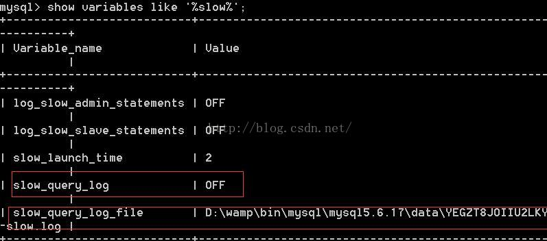
            * 在配置文件中添加如下代码，开启慢查询
                ```
                slow_query_log=ON
                slow_query_log_file=D:/wamp/logs/myslowquery.log
                long_query_time=1.5
                ```
                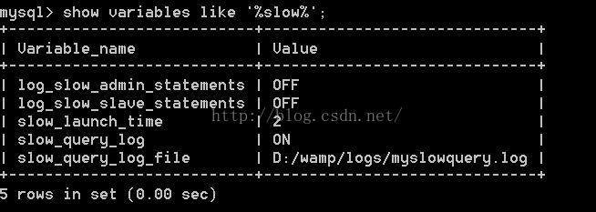
            * 查看慢查询时间设置   
                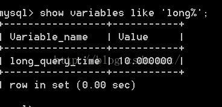
            * 如果修改慢查询时间，可以使用`set long_query_time=1.5`;
                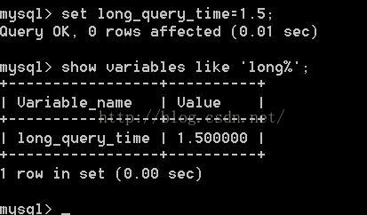
            * 为了便于查看效果，我们将慢查询时间限制改为0.15，然后我们写一个时间超过0.15的sql，最后查看日志，是否记录了该sql语句。设置慢查询时间，以及执行相应的sql语句
                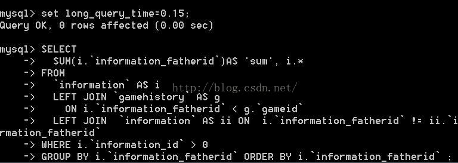   
                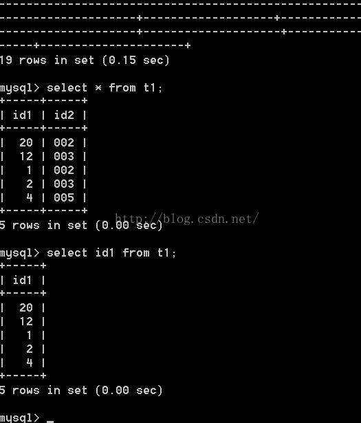
            * 在上面我共执行了3条SQL语句，现在我们再来看一下，慢查询日志如下
            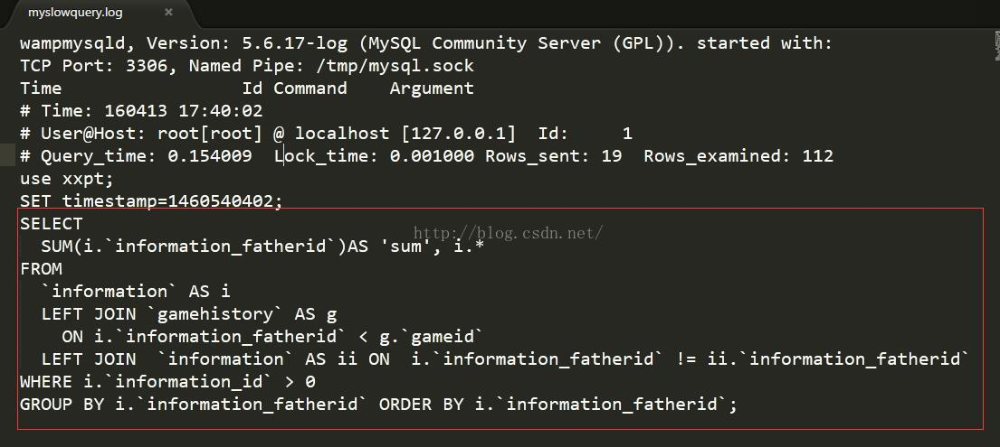
            * 其只是记录了查询其中查询时间比较长的那条sql语句。
    3. 步骤三：通过EXPLAIN分析低效率SQL的执行计划
        * 在步骤二中，我们可以查询到低效率的sql语句，在此我们通过explain或desc可以获取mysql执行select信息。   
        eg: 
            ```sql           
            EXPLAIN 
            SELECT 
            t0.* 
            FROM
            t3 AS t0
            LEFT JOIN `t2` AS t1 
                ON t0.`id1` = t1.`id1` 
            WHERE t0.id1 = 5 ;
            ```
        * 执行结果如下：   
            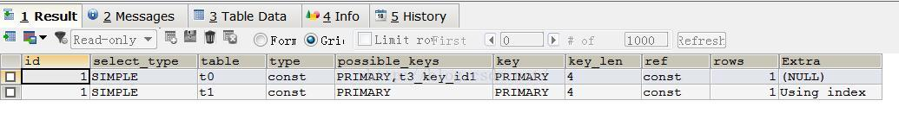
            * 解析：  
                * select_type:表示select类型。常见的取值有SIMPLE（简单表，即不使用连接或者子查询）、PRIMARY（主查询，即外层的查询）、UNION（union中的第二个或者后面的查询语句）、SUBQUERY（子查询中的第一个SELECT）等。
                * talbe：输出结果集的表。
                * type: 表的连接类型。性能由高到底：system（表中仅有一行）、const（表中最多有一个匹配行）、eq_ref、ref、ref_null、index_merge、unique_subquery、index_subquery、range、idnex等
                * possible_keys:查询时，可能使用的索引
                * key:实际使用的索引
                * key_len:索引字段的长度
                * rows：扫描行的数量
                * Extra：执行情况的说明和描述
    4. 步骤四：确定问题并采取相应的优化措施
        * 经过上面的步骤，可以确定问题出现的原因，此时我们可以根据情况，采取相应的措施。常见的措施有
        1. 建立相应的索引  
        2. 优化sql语句   
        3. 分表等。
        * 备注：如果索引正在工作，handler_read_key的值将很高，这个值代表了一个行被索引值读的次数，很低的值表名增加索引得到的性能改善不高，因为索引并不经常使用。handler_read_rnd_next值高则意味着查询运行低效，并且应该建立索引补救。如果正在进行大量的表扫描，handler_read_rnd_next值较高，则通常说明表索引不正确或写入的查询没有利用索引，如下图。
            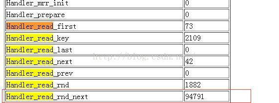
    5. 常见优化语句
        1. 优化Insert语句
            * 如果从同一个客户端插入数据，尽力使用多个字表的insert语句和多行插入，减少单行插入，这种方式大大减少客户端与数据库直接的连接、关闭等消耗。eg：`INSERT INTO t3 VALUES(1,2),(8,5),(6,5),(4,3)`
            * 如果从不同的客户插入很多行，能通过使用inset delayed语句得到更高的速度。
            * 如果进行批量插入，可以增加bulk_insert_buffer_size变量方法，提高速度。
        2. 优化group by语句
            * 默认情况下使用group by col1,col2....会对查询进行相应的排序，如果用户想要避免排序结果的消耗，可以指定order by null 禁止排序。通过查询结果中extra字段可以看出：
                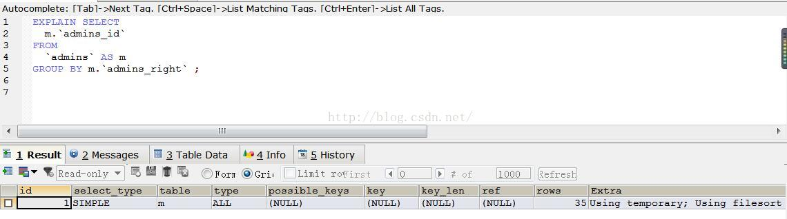
                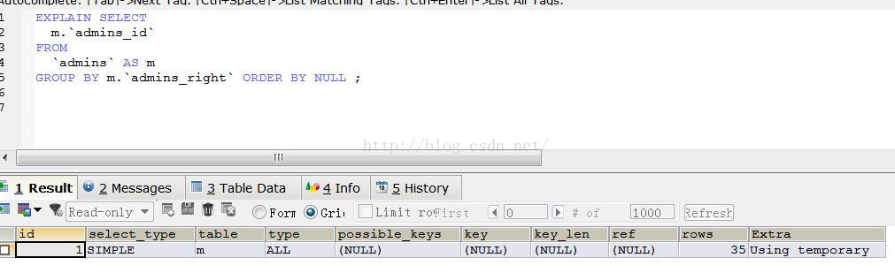
        3. 优化order by语句
            * 在某些情况中，mysql可以使用一个索引来满足order by子句，而不需要额外的排序，where条件和order by使用相同的索引。
        4. 优化含有or语句
            * 对于含有or的查询子句，如果要使用索引，则or之间的每个条件列必须用到索引；否则，应该考虑添加索引。
            * 如果出现OR的一个条件没有索引时，建议使用 union
        5. 什么运算符不走索引，<>,!=

6. 数据库会死锁吗，举一个死锁的例子，mysql 怎么解决死锁。
    * 产生死锁的原因主要是：
        （1）系统资源不足。
        （2） 进程运行推进的顺序不合适。
        （3）资源分配不当等。
    * 如果系统资源充足，进程的资源请求都能够得到满足，死锁出现的可能性就很低，否则就会因争夺有限的资源而陷入死锁。其次，进程运行推进顺序与速度不同，也可能产生死锁。
    * 产生死锁的四个必要条件：   
        （1） 互斥条件：一个资源每次只能被一个进程使用。   
        （2） 请求与保持条件：一个进程因请求资源而阻塞时，对已获得的资源保持不放。   
        （3） 不剥夺条件:进程已获得的资源，在末使用完之前，不能强行剥夺。   
        （4） 循环等待条件:若干进程之间形成一种头尾相接的循环等待资源关系。 
    * 这四个条件是死锁的必要条件，只要系统发生死锁，这些条件必然成立，而只要上述条件之一不满足，就不会发生死锁。
    *  这里提供两个解决数据库死锁的方法：
        1. 重启数据库。
        2. 杀掉抢资源的进程：先查哪些进程在抢资源：   
            `SELECT * FROM INFORMATION_SCHEMA.INNODB_TRX;`   
            `Kill trx_mysql_thread_id;`
7. MySql 的索引原理，索引的类型有哪些，如何创建合理的索引，索引如何优化
    * MySql索引的原理：
        1. 通过不断地缩小想要获取数据的范围来筛选出最终想要的结果，同时把随机的事件变成顺序的事件，也就是说，有了这种索引机制，我们可以总用同一种查找方式来锁定数据。
        2. 索引是通过复杂的算法，提高数据查询性能的手段。从磁盘 io 到内存 io 的转变。MySql 索引原理
        https://blog.csdn.net/u013235478/article/details/50625677
    * MySql索引的类型：
        1. 普通索引 index：加速查找
        2. 唯一索引：①、主键索引：primary key：加速查找+主键唯一约束且不为空。    
                    ②、唯一索引：unique：加速查找+主键唯一约束。
        3. 联合索引：①、primary key(id,name)：联合主键索引。   
                    ②、unique(id,name)：联合唯一索引。   
                    ③、unique(id,name）：联合普通索引。
        4. 全文索引 fulltext：用于搜索很长一篇文章的时候，效果最好。
        5. 空间索引 spatial：了解就好，几乎不用。
    * 创建索引的原则：
        1. 最左前缀匹配原则：非常重要的原则，mysql 会一直向右匹配直到遇到范围查询(>、<、between、like)就停止匹配，比如a = 1 and b = 2 and c > 3 and d = 4 如果建立(a,b,c,d)顺序的索引，d是用不到索引的，如果建立(a,b,d,c)的索引则都可以用到，a,b,d的顺序可以任意调整。
        2. = 和 in 可以乱序，比如 a = 1 and b = 2 and c = 3 建立(a,b,c)索引可以任意顺序，mysql 的查询优化器会帮你优化成索引可以识别的形式。
        3. 尽量选择区分度高的列作为索引，区分度的公式是 count(distinct col)/count(*)，表示字段不重复的比例，比例越大我们扫描的记录数越少，唯一键的区分度是1，而一些状态、性别字段可能在大数据面前区分度就是0，那可能有人会问，这个比例有什么经验值吗？使用场景不同，这个值也很难确定，一般需要 join 的字段我们都要求是0.1以上，即平均1条扫描10条记录。
        4. 索引列不能参与计算，保持列“干净”，比如from_unixtime(create_time) = ’2014-05-29’就不能使用到索引，原因很简单，b+树中存的都是数据表中的字段值，但进行检索时，需要把所有元素都应用函数才能比较，显然成本太大。所以语句应该写成create_time = unix_timestamp(’2014-05-29’)。
        5. 尽量的扩展索引，不要新建索引。比如表中已经有 a 的索引，现在要加(a,b)的索引，那么只需要修改原来的索引即可。
8. 聚集索引和非聚集索引的区别
    * 聚簇”：就是索引和记录紧密在一起。
    * “非聚簇索引”：索引文件和数据文件分开存放，索引文件的叶子页只保存了主键值，要定位记录还要去查找相应的数据块。
    * 聚簇索引：   
    【1】有主键时，根据主键创建聚簇索引。    
    【2】没有主键时，会用一个唯一且不为空的索引列作为主键，称为此表的聚簇索引。   
    【3】如果两项都不满足时，innodb自己创建一个虚拟的聚集索引。
9. select for update 是什么含义，会锁表还是锁行或是其他
    * select for update 语句是我们经常使用手工加锁语句。借助 for update 子句，我们可以在应用程序的层面手工实现数据加锁保护操作。属于并发行锁，这个我们上面在悲观锁的时候也有介绍。
10. 数据库中 BTREE 和 B+tree 区别。
    * B+是btree的变种，本质都是btree，btree+与B-Tree相比，B+Tree有以下不同点：
        1. 每个节点的指针上限为2d而不是2d+1
        2. 内节点不存储data，只存储key；叶子节点不存储指针。
    * Btree 怎么分裂的，什么时候分裂，为什么是平衡的。   
        Key 超过1024才分裂B树为甚会分裂？ 因为随着数据的增多，一个结点的key满了，为了保持B树的特性，就会产生分裂，就向红黑树和AVL树为了保持树的性质需要进行旋转一样！
    * B树即二叉搜索树：
        1. 所有非叶子结点至多拥有两个儿子（Left和Right）；
        2. 所有结点存储一个关键字；
        3. 非叶子结点的左指针指向小于其关键字的子树，右指针指向大于其关键字的子树；
    * B-树是一种多路搜索树（并不是二叉的）
        1. 定义任意非叶子结点最多只有M个儿子；且M>2；
        2. 根结点的儿子数为[2, M]；
        3. 除根结点以外的非叶子结点的儿子数为[M/2, M]；
        4. 每个结点存放至少M/2-1（取上整）和至多M-1个关键字（至少2个关键字）；
        5. 非叶子结点的关键字个数=指向儿子的指针个数-1；
        6. 非叶子结点的关键字：K[1], K[2], …, K[M-1]；且K[i] < K[i+1]；
        7. 非叶子结点的指针：P[1], P[2], …, P[M]；其中P[1]指向关键字小于K[1]的子树，P[M]指向关键字大于K[M-1]的子树，其它P[i]指向关键字属于(K[i-1], K[i])的子树；
        8. 所有叶子结点位于同一层；
        *  B-树的搜索，从根结点开始，对结点内的关键字（有序）序列进行二分查找，如果命中则结束，否则进入查询关键字所属范围的儿子结点；重复，直到所对应的儿子指针为空，或已经是叶子结点；
        * B-树的特性：
            1. 关键字集合分布在整颗树中；
            2. 任何一个关键字出现且只出现在一个结点中；
            3. 搜索有可能在非叶子结点结束；
            4. 其搜索性能等价于在关键字全集内做一次二分查找；
            5. 自动层次控制；
    * B+树是B-树的变体，也是一种多路搜索树：
        1. 其定义基本与B-树同，除了：
        2. 非叶子结点的子树指针与关键字个数相同；
        3. 非叶子结点的子树指针P[i]，指向关键字值属于[K[i], K[i+1])的子树（B-树是开区间）；
        5. 为所有叶子结点增加一个链指针；
        6. 所有关键字都在叶子结点出现；
        * B+的搜索与B-树也基本相同，区别是B+树只有达到叶子结点才命中（B-树可以在非叶子结点命中），其性能也等价于在关键字全集做一次二分查找；
        * B+的特性：
            1. 所有关键字都出现在叶子结点的链表中（稠密索引），且链表中的关键字恰好是有序的；
            2. 不可能在非叶子结点命中；
            3. 非叶子结点相当于是叶子结点的索引（稀疏索引），叶子结点相当于是存储（关键字）数据的数据层；
            4. 更适合文件索引系统；

11. 数据库索引实现原理
    * 数据库性能问题
        1. 磁盘IO性能非常低，严重的影响数据库系统的性能。
        1. 磁盘顺序读写比随机读写的性能高很多。
    * 数据的基本存储结构
        1. 磁盘空间被划分为许多大小相同的块（Block）或者页(Page).
        2. 一个表的这些数据块以链表的方式串联在一起。
        3. 数据是以行（Row）为单位一行一行的存放在磁盘上的块中,如图所示.
        4. 在访问数据时，一次从磁盘中读出或者写入至少一个完整的Block。
            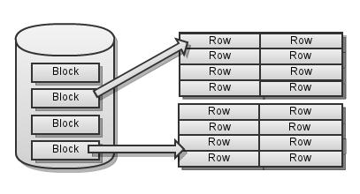
    * 数据基本操作的实现
        * 基本操作包括：INSERT、UPDATE、DELETE、SELECT。
        1. SELECT
            1. 定位数据
            2. 读出数据所在的块，对数据加工
            3. 返回数据给用户
        2. UPDATE、DELETE
            1. 定位数据
            2. 读出数据所在的块，修改数据
            3. 写回磁盘
        3. INSERT
            1. 定位数据要插入的页（如果数据需要排序）
            2. 读出要插入的数据页，插入数据.
            3. 写回磁盘
        * 如何定位数据？
            * 表扫描(Table Scan)
                1. 从磁盘中依次读出所有的数据块，一行一行的进行数据匹配。
                2. 时间复杂度 是O(n)， 如果所有的数据占用了100个块。尽管只查询一行数据，也需要读出所有100个块的数据。
                3. 需要大量的磁盘IO操作，极大的影响了数据定位的性能。
            * 因为数据定位操作是所有数据操作必须的操作，数据定位操作的效率会直接影响所有的数据操作的效率。
            * 因此我们开始思考，如何来减少磁盘的IO？
            * 减少磁盘IO
                A. 减少数据占用的磁盘空间压缩算法、优化数据存储结构
                B. 减少访问数据的总量。读出或写入的数据中，有一部分是数据操作所必须的，这部分称作有效数据。剩余的部分则不是数据操作必须的数据，称为无效数据。例如，查询姓名是‘张三’的记录。那么这条记录是有效记录，其他记录则是无效记录。我们要努力减少无效数据的访问。
        * 索引的产生
            * 键(Key)
                * 首先，我们发现在多数情况下，定位操作并不需要匹配整行数据。而是很规律的只匹配某一个或几个列的值。 例如，图中第1列就可以用来确定一条记录。这些用来确定一条数据的列，统 称为键(Key).
                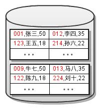
            * Dense Index
                * 根据减少无效数据访问的原则，我们将键的值拿过来存放到独立的块中。并且为每一个键值添加一个指针， 指向原来的数据块。如图所示,    
                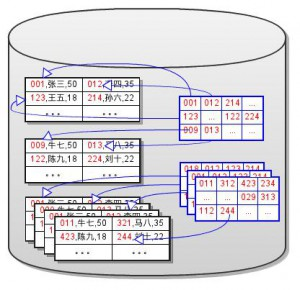
                * 这就是‘索引’的祖先Dense Index. 当进行定位操作时，不再进行表扫描。而是进行索引扫描(Index Scan)，依次读出所有的索引块，进行键值的匹配。当找到匹配的键值后，根据该行的指针直接读取对应的数据块，进行操作。假设一个块中能存储100行数据，10,000,000行的数据需要100,000个块的存储空间。假设键值列（+指针）占用一行数据1/10的空间。那么大约需要10,000个块来存储Dense索引。因此我们用大约1/10的额外存储空间换来了大约全表扫描10倍的定位效率。
        * 索引的进化
            * 在实际的应用中，这样的定位效率仍然不能满足需求。很多人可能已经想到了，通过排序和查找算法来减少IO的访问。因此我们开始尝试对Dense Index进行排序存储,并且期望利用排序查找算法来减少磁盘IO。
            * 折半块查找
                1. 对Dense Index排序
                2. 需要一个数组按顺序存储索引块地址。以块为单位，不存储所有的行的地址。
                3. 这个索引块地址数组，也要存储到磁盘上。将其单独存放在一个块链中，如下图所示。
                4. 折半查找的时间复杂度是O(log 2(N))。在上面的列子中，dense索引总共有10,000个块。假设1个块能存储2000个指针，需要5个块来存储这个数组。通过折半块查找，我们最多只需要读取  
                5（数组块）+ 14（索引块log 2(10000)）+1（数据块）=20个块。   
                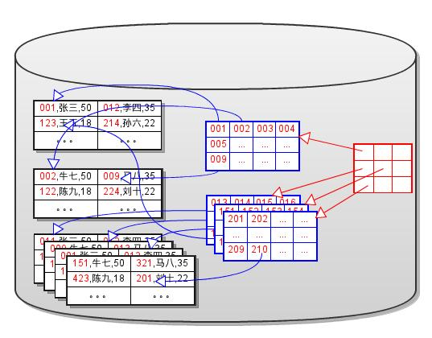
            * Sparse Index
                * 实现基于块的折半查找时发现，读出每个块后只需要和第一行的键值匹配，就可以决定下一个块的位置（方向）。 因此有效数据是每个块（最后一个块除外）的第一行的数据。还是根据减少无效数据IO的原则，将每一个块的第一行的数据单独拿出来，和索引数组的地址放到一起。这样就可以直接在这个数组上进行折半查找了。如下图所示，这个数组就进化成了Sparse Index。   
                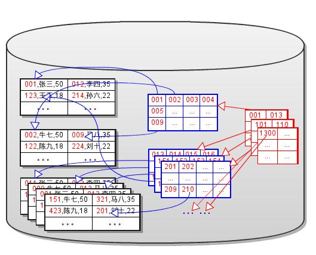
                * 因为Sparse Index和Dense Index的存储结构是相同的，所以占用的空间也相同。大约需要10个块来存储10000个Dense Index块的地址和首行键值。通过Sparse索引，仅需要读取10(Sparse块)+1(Dense块)+1(数据块)=12个块.
            * 多层Sparse Index
                * 因为Sparse Index本身是有序的，所以可以为Sparse Index再建sparse Index。通过这个方法，一层一层的建立 Sparse Indexes,直到最上层的Sparse Index只占用一个块为止,如下图所示.   
                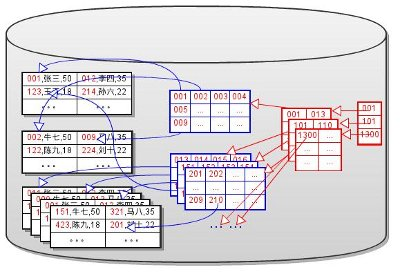
                1. 这个最上层的Sparse Index称作整个索引树的根(root).
                2. 每次进行定位操作时，都从根开始查找。
                3. 每层索引只需要读出一个块。
                4. 最底层的Dense Index或数据称作叶子(leaf).
                5. 每次查找都必须要搜索到叶子节点，才能定位到数据。
                6. 索引的层数称作索引树的高度(height).
                7. 索引的IO性能和索引树的高度密切相关。索引树越高，磁盘IO越多。
                * 在我们的例子中的Sparse Index，只有10个块，因此我们只需要再建立一个Sparse Index.通过两层Sparse Index和一层Dense Index查找时，只需读取1+1+1+1=4个块。
            * Dense Index和Sparse Index的区别
                1. Dense Index包含所有数据的键值，但是Sparse Index仅包含部分键值。Sparse Index占用更少的磁盘空间。
                2. Dense Index指向的数据可以是无序的，但是Sparse Index的数据必须是有序的。
                3. Sparse Index 可以用来做索引的索引，但是Dense Index不可以。
                4. 在数据是有序的时候，Sparse Index更有效。因此Dense Index仅用于无序的数据。
                5. 索引扫描(Index Scan)实际上是对Dense Index层进行遍历。
            *  簇索引(Clustered Index)和辅助索引(Secondary Index)
                * 如果数据本身是基于某个Key来排序的，那么可以直接在数据上建立sparse索引，而不需要建立一个dense索引层(可以认为数据就是dense索引层)。 如下图所示：      
                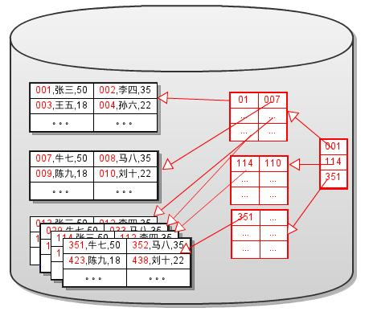
                * 这个索引就是我们常说的“Clustered Index”,而用来排序数据的键叫做主键Primary Key.
                    1. 一个表只能有一个Clustered Index,因为数据只能根据一个键排序.
                    2. 用其他的键来建立索引树时，必须要先建立一个dense索引层，在dense索引层上对此键的值进行排序。这样的索引树称作Secondary Index.
                    3. 一个表上可以有多个Secondary Index.
                    4. 对簇索引进行遍历，实际上就是对数据进行遍历。因此簇索引的遍历效率比辅组索引低。如SELECT count(*) 操作，使用辅组索引遍历的效率更高。
            * 范围搜索(Range Search)
                * 由于键值是有序的，因此可以进行范围查找。只需要将数据块、Dense Index块分别以双向链表的方式进行连接， 就可以实现高效的范围查找。如下图所示：   
                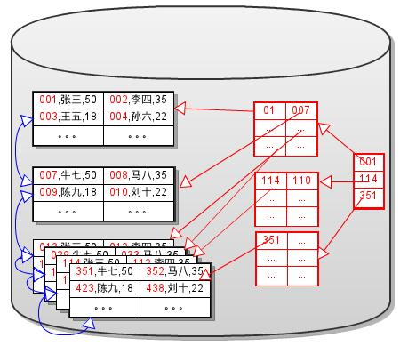
                * 后选择合适的方向，在数据块（或Dense Index块）链中进行遍历。   C. 直到数据不满足另一个边界值，结束范围查找。 是不是看着这个索引树很眼熟？换个角度看看这个图吧！    
                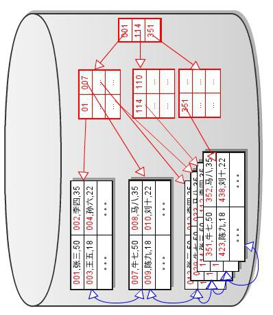
                * 这分明就是传说中的B+Tree.    
                    - 索引上的操作   
                    A. 插入键值   
                    B. 删除键值   
                    C. 分裂一个节点   
                    D. 合并两个节点
        * Sparse Index中的数据指针
            * 在“由浅入深理解索引的实现(1)”中提到，Sparse Index中的每个键值都有一个指针指向所在的数据页。这样每个B+Tree都有指针指向数据页。如图Fig.10所示：    
            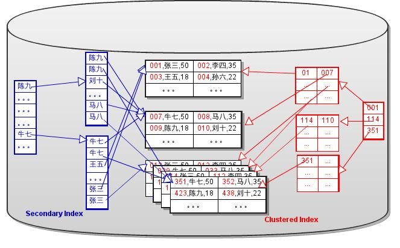   
            * 如果数据页进行了拆分或合并操作，那么所有的B+Tree都需要修改相应的页指针。特别是Secondary B+Tree（辅助索引对应的B+Tree), 要对很多个不连续的页进行修改。同时也需要对这些页加锁，这会降低并发性。  
            *  为了降低难度和增加更新(分裂和合并B+Tree节点)的性能，InnoDB 将 Secondary B+Tree中的指针替换成了主键的键值。如图Fig.11所示：   
            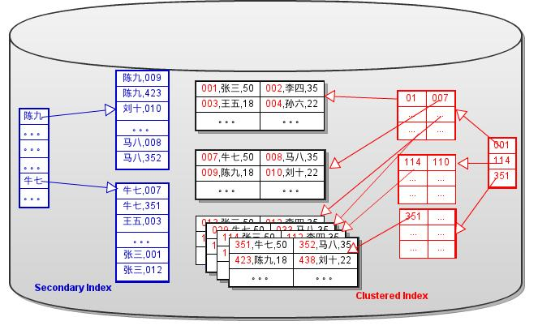
            * 这样就去除了Secondary B+Tree对数据页的依赖，而数据就变成了Clustered B+Tree(簇索引对应的B+Tree)独占的了。对数据页的拆分及合并操作，仅影响Clustered B+Tree. 因此InnoDB的数据文件中存储的实际上就是多个孤立B+Tree。
            *  一个有趣的问题，当用户显式的把主键定义到了二级索引中时，还需要额外的主键来做二级索引的数据吗(即存储2份主键)? 很显然是不需要的。InnoDB在创建二级索引的时候，会判断主键的字段是否已经被包含在了要创建的索引中。
            1. 用主键查询
                * 直接在Clustered B+Tree上查询。
            2. 用辅助索引查询
                * 在Secondary B+Tree上查询到主键。
                * 用主键在Clustered B+Tree
            * 可以看出，在使用主键值替换页指针后，辅助索引的查询效率降低了。
                1. 尽量使用主键来查询数据(索引遍历操作除外).
                2. 可以通过缓存来弥补性能，因此所有的键列，都应该尽量的小。
            1. - INSERT
                1. 在Clustered B+Tree上插入数据
                2. 在所有其他Secondary B+Tree上插入主键。
            2. - DELETE
                1. 在Clustered B+Tree上删除数据。
                2. 在所有其他Secondary B+Tree上删除主键。
            3. - UPDATE 非键列
                1. 在Clustered B+Tree上更新数据。
            4. - UPDATE 主键列
                1. 在Clustered B+Tree删除原有的记录(只是标记为DELETED,并不真正删除)。
                2. 在Clustered B+Tree插入新的记录。
                3. 在每一个Secondary B+Tree上删除原有的数据。(有疑问，看下一节。)
                4. 在每一个Secondary B+Tree上插入原有的数据。
            5. - UPDATE 辅助索引的键值
                1. 在Clustered B+Tree上更新数据。
                2. 在每一个Secondary B+Tree上删除原有的主键。
                3. 在每一个Secondary B+Tree上插入原有的主键。
            6. 更新键列时，需要更新多个页，效率比较低。
                1. 尽量不用对主键列进行UPDATE操作。
                2. 更新很多时，尽量少建索引。
            7. 05 – 非唯一键索引
                * 教科书上的B+Tree操作，通常都假设”键值是唯一的“。但是在实际的应用中Secondary Index是允许键值重复的。在极端的情况下，所有的键值都一样，该如何来处理呢？InnoDB 的 Secondary B+Tree中，主键也是此键的一部分。Secondary Key = 用户定义的KEY + 主键。如图Fig.12所示：   
                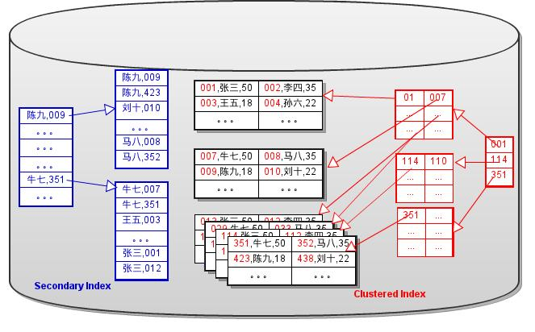
                * 注意主键不仅做为数据出现在叶子节点，同时也作为键的一部分出现非叶子节点。对于非唯一键来说，因为主键是唯一的，Secondary Key也是唯一的。当然，在插入数据时，还是会根据用户定义的Key，来判断唯一性。按理说，如果辅助索引是唯一的(并且所有字段不能为空)，就不需要这样做。可是，InnoDB对所有的Secondary B+Tree都这样创建。
12. Mysql 怎么优化 table scan 的。
    1. 对查询进行优化，应尽量避免全表扫描，首先应考虑在 where 及 order by涉及的列上建立索引。
    2. 应尽量避免在 where 子句中使用 !=或<> 操作符，否则将引擎放弃使用索引而进行全表扫描。
    3. 应尽量避免在 where 子句中对字段进行 null 值 判断，否则将导致引擎放弃使用索引而进行全表扫描，如：  `select id from t where num is null`   可以在num上设置默认值0，确保表中num列没有null值，然后这样查询：`select id from t where num=0`
    4. 应尽量避免在 where 子句中使用 or 来连接条件，否则将导致引擎放弃使用索引而进行全表扫描，如：`select id from t where num=10 or num=20`可以这样查询：`select id from t where num=10``union all select id from t where num=20`
    5. 下面的查询也将导致全表扫描：`select id from t where name like '%abc%'`对于 like '..%' (不以 % 开头)，可以应用 colunm上的index
    6. in 和 not in 也要慎用，否则会导致全表扫描，如：`select id from t where num in(1,2,3)`对于连续的数值，能用 between 就不要用 in 了：`select id from t where num between 1 and 3`
    7. 如果在 where 子句中使用参数，也会导致全表扫描。因为SQL只有在运行时才会解析局部变量，但优化程序不能将访问计划的选择推迟到运行时;它必须在编译时进行选择。然而，如果在编译时建立访问计划，变量的值还是未知的，因而无法作为索引选择的输入项。如下面语句将进行全表扫描：   `select id from t where num=@num`   可以改为强制查询使用索引：   `select id from t with(index(索引名)) where num=@num`
    8. 应尽量避免在 where 子句中对字段进行表达式操作，这将导致引擎放弃使用索引而进行全表扫描。如： `select id from t where num/2=100`   应改为:   `select id from t where num=100*2`

    9. 应尽量避免在where子句中对字段进行函数操作，这将导致引擎放弃使用索引而进行全表扫描。如：`select id from t where substring(name,1,3)='abc'--name以abc开头的id`   `select id from t where datediff(day,createdate,'2005-11-30')=0--'2005-11-30'生成的id`   应改为:    `select id from t where name like 'abc%'`    `select id from t where createdate>='2005-11-30' and createdate<'2005-12-1'`

    10. 不要在 where 子句中的“=”【左边】进行函数、算术运算或其他表达式运算，否则系统将可能无法正确使用索引。

    11. 在使用索引字段作为条件时，如果该索引是【复合索引】，那么必须使用到该索引中的【第一个字段】作为条件时才能保证系统使用该索引，否则该索引将不会被使用。并且应【尽可能】的让字段顺序与索引顺序相一致。（字段顺序也可以不与索引顺序一致，但是一定要包含【第一个字段】。）

    12. 不要写一些没有意义的查询，如需要生成一个空表结构：
        ```
        select col1,col2 into #t from t where 1=0  

        这类代码不会返回任何结果集，但是会消耗系统资源的，应改成这样：

        create table #t(...)
        ```
    13. 很多时候用 exists 代替 in 是一个好的选择：
        ```
        select num from a where num in(select num from b)

        用下面的语句替换：

        select num from a where exists(select 1 from b where num=a.num)
        ```

    14. 并不是所有索引对查询都有效，SQL是根据表中数据来进行查询优化的，当索引列有大量数据重复时，SQL查询可能不会去利用索引，如一表中有字段sex，male、female几乎各一半，那么即使在sex上建了索引也对查询效率起不了作用。

    15. 索引并不是越多越好，索引固然可以提高相应的 select 的效率，但同时也降低了 insert 及 update 的效率，因为 insert 或 update 时有可能会重建索引，所以怎样建索引需要慎重考虑，视具体情况而定。一个表的索引数最好不要超过6个，若太多则应考虑一些不常使用到的列上建的索引是否有必要。

    16. 应尽可能的避免更新 clustered 索引数据列，因为 clustered 索引数据列的顺序就是表记录的物理存储顺序，一旦该列值改变将导致整个表记录的顺序的调整，会耗费相当大的资源。若应用系统需要频繁更新 clustered 索引数据列，那么需要考虑是否应将该索引建为 clustered 索引。

    17. 尽量使用数字型字段，若只含数值信息的字段尽量不要设计为字符型，这会降低查询和连接的性能，并会增加存储开销。这是因为引擎在处理查询和连接时会逐个比较字符串中每一个字符，而对于数字型而言只需要比较一次就够了。

    18. 尽可能的使用 varchar/nvarchar 代替 char/nchar ，因为首先变长字段存储空间小，可以节省存储空间，其次对于查询来说，在一个相对较小的字段内搜索效率显然要高些。

    19. 任何地方都不要使用 select * from t ，用具体的字段列表代替“*”，不要返回用不到的任何字段。

    20. 尽量使用表变量来代替临时表。如果表变量包含大量数据，请注意索引非常有限(只有主键索引)。

    21. 避免频繁创建和删除临时表，以减少系统表资源的消耗。

    22. 临时表并不是不可使用，适当地使用它们可以使某些例程更有效，例如，当需要重复引用大型表或常用表中的某个数据集时。但是，对于一次性事件，最好使用导出表。

    23. 在新建临时表时，如果一次性插入数据量很大，那么可以使用 select into 代替 create table，避免造成大量 log ，以提高速度;如果数据量不大，为了缓和系统表的资源，应先create table，然后insert。

    24. 如果使用到了临时表，在存储过程的最后务必将所有的临时表显式删除，先 truncate table ，然后 drop table ，这样可以避免系统表的较长时间锁定。

    25. 尽量避免使用游标，因为游标的效率较差，如果游标操作的数据超过1万行，那么就应该考虑改写。

    26. 使用基于游标的方法或临时表方法之前，应先寻找基于集的解决方案来解决问题，基于集的方法通常更有效。

    27. 与临时表一样，游标并不是不可使用。对小型数据集使用 FAST_FORWARD 游标通常要优于其他逐行处理方法，尤其是在必须引用几个表才能获得所需的数据时。在结果集中包括“合计”的例程通常要比使用游标执行的速度快。如果开发时间允许，基于游标的方法和基于集的方法都可以尝试一下，看哪一种方法的效果更好。

    28. 在所有的存储过程和触发器的开始处设置 SET NOCOUNT ON ，在结束时设置 SET NOCOUNT OFF 。无需在执行存储过程和触发器的每个语句后向客户端发送 DONE_IN_PROC 消息。

    29. 尽量避免向客户端返回大数据量，若数据量过大，应该考虑相应需求是否合理。

    30. 尽量避免大事务操作，提高系统并发能力。
13. 如何写 sql 能够有效的使用到复合索引。
    * 由于复合索引的组合索引，类似多个木板拼接在一起，如果中间断了就无法用了，所以要能用到复合索引，首先开头(第一列)要用上，比如index(a,b) 这种，我们可以select table tname where a=XX 用到第一列索引 如果想用第二列 可以 and b=XX 或者and b like‘TTT%’
14. mysql 中 in 和 exists 区别。
    * mysql中的in语句是把外表和内表作hash 连接，而exists语句是对外表作loop循环，每次loop循环再对内表进行查询。一直大家都认为exists比in语句的效率要高，这种说法其实是不准确的。这个是要区分环境的。
    * 如果查询的两个表大小相当，那么用in和exists差别不大。如果两个表中一个较小，一个是大表，则子查询表大的用exists，子查询表小的用in：not in 和not exists如果查询语句使用了not in 那么内外表都进行全表扫描，没有用到索引；而not extsts 的子查询依然能用到表上的索引。所以无论那个表大，用not exists都比not in要快。
        1. EXISTS只返回TRUE或FALSE，不会返回UNKNOWN。

        2. IN当遇到包含NULL的情况，那么就会返回UNKNOWN。
15. 数据库自增主键可能的问题。
    * 在分库分表时可能会生成重复主键 利用自增比例达到唯一 自增1 2,3 等
    1. 设置主键自增为何不可取
    这样的话，数据库本身是单点，不可拆库，因为id会重复。

    2. 依赖数据库自增机制达到全局ID唯一
    使用如下语句：
    REPLACE INTO Tickets64 (stub) VALUES ('a'); 
    SELECT LAST_INSERT_ID();
    这样可以保证全局ID唯一，但这个Tickets64表依旧是个单点。

    3. 依赖数据库自增机制达到全局ID唯一并消除单点
    在2的基础上，部署两个（多个）数据库实例，
    设置自增步长为2（多个则为实例数），即auto-increment-increment = 2
    设置auto-increment-offset分别为1,2.....
    这样第一台数据库服务器的自增id为 1 3 5 7 9
    第二台为2 4 6 8 10

    4. 解决每次请求全局ID都读库写库压力过大的问题
    比如第一次启动业务服务，会请求一个唯一id为3559
    如果是2、3的方法，则id为3559，这样每次都请求数据库，对数据库压力比较大
    可以用3559 * 65536（举个例子，并不一定是65536）+ 内存自增变量来作为id
    当内存自增变量到达65535时，从数据库重新获取一个自增id
    这样即使有多台业务服务器，id也不会重复：
    第一台 3559 * 65536 + 1,2,3.....65535
    第二台 3560 * 65536 + 1,2,3.....65535
    然后第一台到65535了，换一个数据库自增id，这时候可能是3561 * 65536 + 1,2,3....
        


         
            


